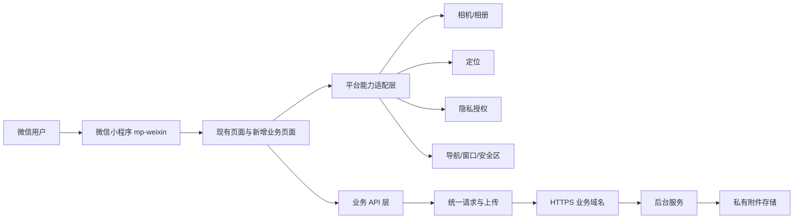
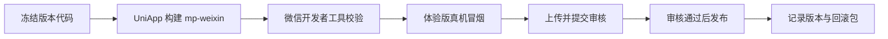

# 微信小程序适配与发布基线

> 目标平台：微信小程序 `mp-weixin`  
> 客户端工程：`workOrder-app-ui`  
> 技术栈：UniApp + Vue 2 + uView  
> 适用里程碑：M0、2026-10-07 第一版、2026-10-31 正式交付

## 1. 平台结论

移动端正式交付形态为微信小程序。现有 UniApp 工程继续复用，不重写原生小程序；已有页面保持现有视觉样式，缺失页面仍按产品方案中的视觉基线补齐。H5 只作为开发预览辅助手段，不作为第一版和正式版的移动端交付物。

第一版继续使用现有账号、密码和图形验证码登录，不新增微信手机号快捷登录、OpenID 账号绑定或微信支付。后续如需微信身份体系，必须新增独立需求并补充账号合并、解绑和审计规则。

## 2. 客户端架构



页面不得直接调用 `window`、`document`、`localStorage` 或 `sessionStorage`。平台差异通过 UniApp API、条件编译或平台能力适配层处理；工单状态和权限仍由后台返回的 `status`、`version` 和 `allowedActions` 决定。

## 3. 工程边界

```text
workOrder-app-ui/
├─ api/                         # 业务接口，不包含页面状态判断
├─ pages/                       # 页面与页面级交互
├─ store/                       # 登录用户、字典、筛选和详情快照
├─ utils/
│  ├─ request.js               # 统一请求、401、超时和业务错误
│  ├─ upload.js                # 统一附件上传、进度和失败处理
│  ├─ auth.js                  # Token 存取
│  └─ platform/                # 隐私、定位、相机、窗口等平台能力
├─ manifest.json               # mp-weixin 能力声明
└─ pages.json                  # 页面、分包、导航和窗口配置
```

- 页面只调用 `api` 和 `utils/platform` 暴露的稳定接口。
- `api` 层不得回退到 Mock，也不得返回模拟成功。
- 平台能力拒绝授权时返回可识别结果，由页面提供重试、打开设置或手工填写的恢复路径。
- AppID、生产域名和密钥不写入客户文档；仓库只保留可替换配置，生产值由发布环境注入并由管理员保管。

## 4. 登录与会话

1. 小程序启动后读取本地 Token；有有效 Token 时进入角色首页，无 Token 时进入 M00 登录。
2. M00 使用账号、密码和图形验证码调用后台登录接口，成功后获取用户、角色、权限和数据范围。
3. Token 由 `uni.setStorageSync` 保存，请求和上传统一携带 `Authorization: Bearer <token>`。
4. 后台返回 401 时仅弹出一次登录失效提示，清理本地会话并重进 M00；不得跳转到不存在的页面。
5. 退出登录必须清理 Token、用户、权限、字典缓存和页面暂存数据。
6. 微信昵称、头像、手机号和 OpenID 不作为第一版登录前置条件。

## 5. 网络、域名与附件

| 配置项 | 上线要求 | 验证方式 |
|---|---|---|
| `request` 合法域名 | 后台 API 使用生产 HTTPS 域名，不使用 IP、localhost 或测试开关绕过 | 开发者工具开启域名校验，真机登录和列表请求成功 |
| `uploadFile` 合法域名 | 附件上传只访问受控 HTTPS 域名 | 真机上传到场、完工和报修图片 |
| `downloadFile` 合法域名 | 缩略图、预览和受控下载域名已登记 | 真机预览有权限附件，越权访问失败 |
| 业务域名 | 仅 M30 `web-view` 使用；域名需完成平台校验 | 真机打开协议页并可正常返回 |
| TLS 证书 | 证书链完整、未过期、域名匹配 | 开发者工具和真机均不开启“不校验合法域名” |

附件上传遵循以下规则：

- 页面先选择文件，再由统一上传模块提交；业务接口只接收已经上传成功的附件标识。
- 单文件大小、数量、扩展名和图片压缩规则由前后端共同校验。
- 上传显示单项进度；失败项可单独重试，不清空其他成功附件和表单内容。
- 后台只返回经鉴权的预览地址或短时地址，不向页面暴露长期公开对象地址。
- 同一批上传限制并发数，避免小程序网络任务拥塞。

## 6. 隐私与设备权限

| 场景 | 触发时机 | 拒绝后的处理 |
|---|---|---|
| 报修/到场/完工照片 | 用户点击选择或拍照时 | 保留表单，说明照片用途，允许重新触发；必填证据未满足时禁止提交 |
| 到场位置 | 用户点击“获取当前位置”时 | 显示用途说明，可打开设置重新授权；是否允许手工选点按验收口径执行 |
| 拨打电话 | 用户点击明确的联系电话时 | 不预取通讯录，不后台发起呼叫 |
| 协议网页 | 用户主动打开协议时 | 业务域名不可用时进入 M31 文本内容页，不跳转任意外链 |

- 微信公众平台中的《小程序用户隐私保护指引》必须与实际调用的相机、相册、位置等能力一致。
- 权限在用户触发对应功能时申请，不在启动页一次性索取全部权限。
- 用户拒绝授权后不得循环弹窗；页面应解释影响并提供重新授权路径。
- 位置信息、手机号、地址、故障描述和现场照片按敏感信息处理，不写入前端日志和埋点明文。
- `manifest.json` 只声明实际使用的隐私能力；新增能力必须同步代码、平台指引和测试用例。

## 7. 页面、导航与分包

- M00、M01、M02、M11 和通用错误页放主包；报修、派单、维修处理、确认评价、账户帮助按业务场景分包。
- 主包只保留启动必需组件和资源，避免同时打入重复的 uView/uni-ui 资源。
- 首页/工作台/我的继续使用现有三栏 TabBar；业务详情使用小程序系统返回和现有页面头部样式。
- 自定义导航页面同时处理状态栏、胶囊按钮和安全区；底部固定按钮不得被 Home Indicator 或系统手势区遮挡。
- 页面路径、分享路径和消息进入路径统一经过登录与权限校验；无权或工单已变化时进入最新可访问页面。
- M30 只加载已登记业务域名；帮助、协议等可静态交付内容优先使用 M31，减少 `web-view` 审核依赖。

## 8. UI 与 UX 平台规则

- 现有页面颜色、圆角、卡片、字号、图标和信息层级保持不变，只做小程序运行所需的安全区、导航栏和控件兼容。
- 输入框避让软键盘，验证码和底部主按钮在常见机型上保持可见。
- 选择照片、获取位置和上传附件均在用户动作后发生，页面明确展示进行中、成功、失败和重试状态。
- 小程序从后台回到前台时刷新当前工单版本；如果 `version` 已变化，清除过期动作并重新获取 `allowedActions`。
- 网络中断时保留未提交内容；恢复后由用户主动重试，不自动重复执行派单、完工、确认或评价。
- 页面返回后保留列表分段、筛选和滚动位置；从分享或消息直接进入详情时建立独立返回路径。

## 9. 构建与发布流程



1. 使用固定 HBuilderX/UniApp 编译版本构建 `mp-weixin`，记录工具版本和构建号。
2. 导入微信开发者工具，开启 ES6 转换、代码压缩、合法域名和 HTTPS 校验。
3. 执行代码质量、包体积、分包、隐私接口和权限提示检查，编译告警不得影响主流程。
4. 发布体验版，至少在一台 iOS 和一台 Android 真机完成三角色主链路冒烟。
5. 核对服务类目、隐私保护指引、用户协议、业务域名、服务器域名和审核演示账号。
6. 上传代码时记录小程序版本号、后端版本、数据库脚本版本和变更摘要。
7. 正式发布前保留上一可用小程序代码版本和后端回滚包；数据库只做向前兼容变更。

## 10. M0 与 M1 验收

### 10.1 M0 基线

- 明确正式移动端为微信小程序 `mp-weixin`，H5 不作为生产交付物。
- 现有工程中所有 DOM/H5 专用调用已隔离，不阻断小程序编译和启动。
- 登录、请求、上传、401、页面导航和 Token 存储的小程序路径已锁定。
- AppID 管理员、服务器域名、业务域名、隐私指引和审核账号的责任人已登记。
- 开发者工具、HBuilderX/UniApp 和基础库版本已形成可复现记录。

### 10.2 2026-10-07 第一版

- 生成可导入微信开发者工具的 `mp-weixin` 构建产物，无阻断编译错误。
- 开启合法域名校验后，账号登录、列表、详情、状态动作和附件上传均访问真实测试服务。
- iOS、Android 各至少一台真机完成“提交 → 派单 → 接单 → 到场 → 处理 → 完工 → 确认 → 评价”。
- 相机/相册、位置和协议页面分别验证同意、拒绝、重新授权或降级路径。
- 小程序切后台、网络中断、重复点击、Token 失效和状态冲突不会产生重复业务记录。
- 体验版构建号、后台版本、数据库版本、测试账号和录屏证据可追溯。

## 11. 发布前待提供信息

| 信息 | 用途 | 最晚确认时间 |
|---|---|---|
| 小程序主体与管理员 | 开发者工具上传、体验版和审核发布 | M1 联调前 |
| 生产 AppID 的受控配置方式 | 构建正式包 | M1 联调前 |
| 测试/生产 API 域名 | `request` 与 `uploadFile` 合法域名 | 接口联调前 |
| 附件预览域名 | `downloadFile` 合法域名 | 附件联调前 |
| 协议页业务域名及校验文件 | M30 `web-view` | 提审前 |
| 隐私保护指引内容 | 相机、相册、位置等能力审核 | 体验版验收前 |
| 审核演示账号 | 微信审核人员验证核心功能 | 提审前 |

平台配置入口和接口要求在每次提审前以微信开放文档为准：

- [小程序网络](https://developers.weixin.qq.com/miniprogram/dev/framework/ability/network.html)
- [小程序用户隐私保护](https://developers.weixin.qq.com/miniprogram/dev/framework/user-privacy/)
- [`web-view` 组件](https://developers.weixin.qq.com/miniprogram/dev/component/web-view.html)

