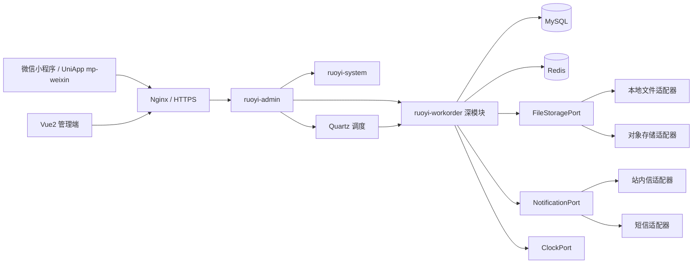
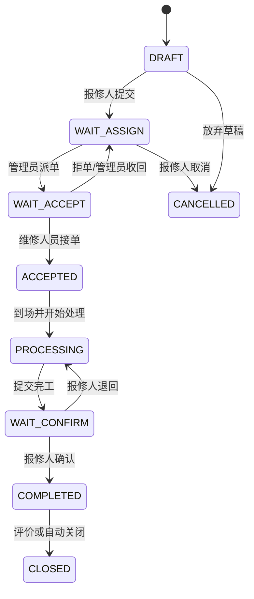
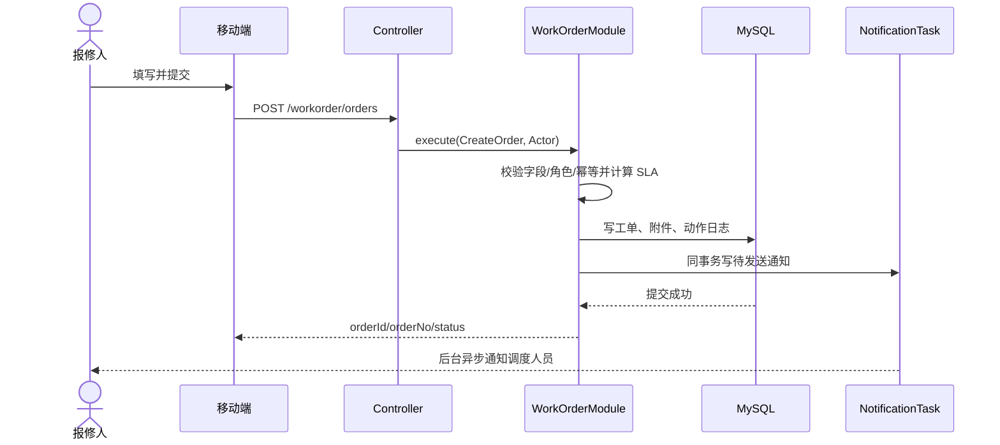
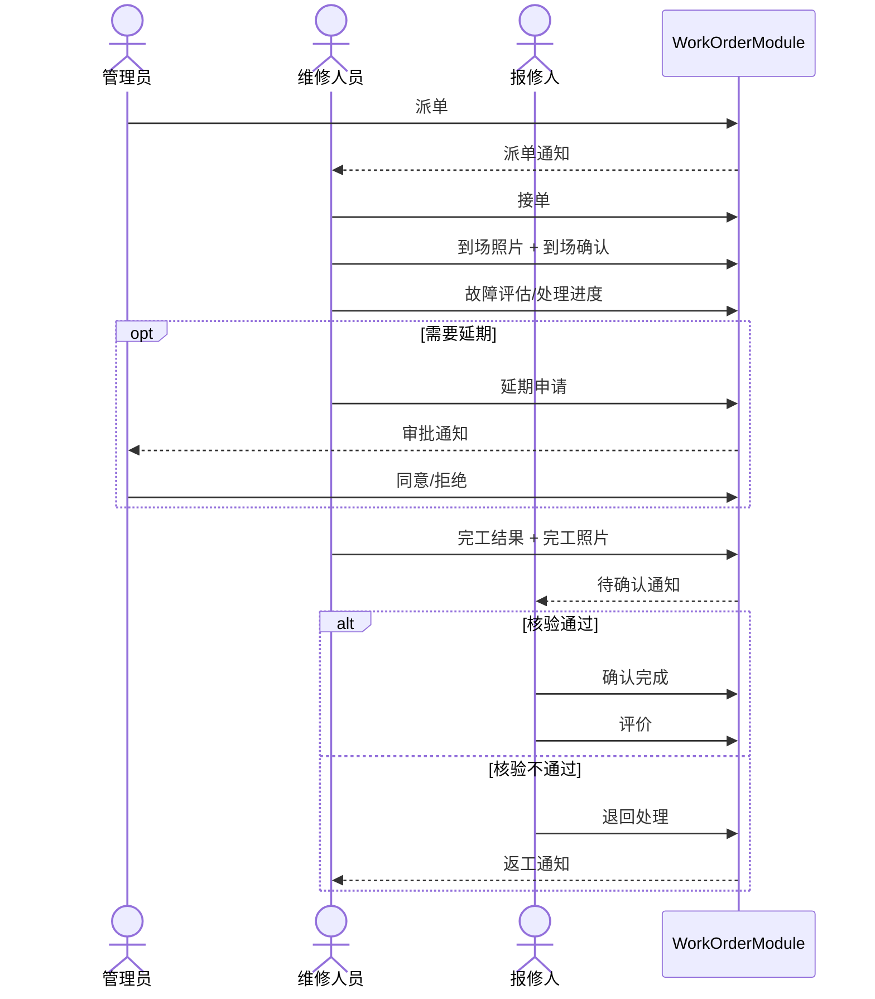
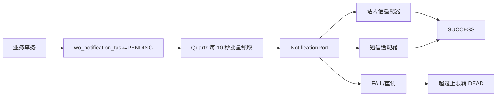
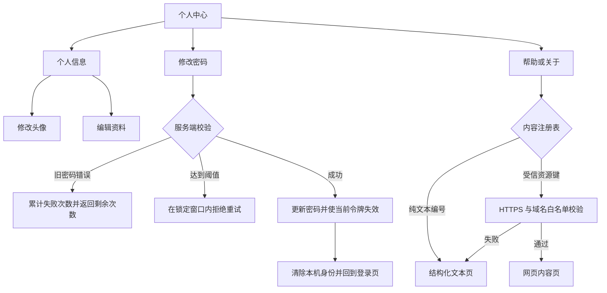

# 医院后勤工单系统技术实现方案

> 版本：V1.0（实施基线）  
> 日期：2026-09-14  
> 适用范围：微信小程序、PC 管理端、后台服务、数据库、缓存、通知与文件存储  
> 配套文件：[数据库建表脚本](sql/workorder-schema.sql)
> 小程序基线：[微信小程序适配与发布基线](微信小程序适配与发布基线.md)

## 1. 方案结论

在现有若依 3.9.0 技术栈上采用“模块化单体”落地，不拆微服务。新增 `ruoyi-workorder` Maven 模块承载完整工单域；移动端继续使用 UniApp，并以微信小程序 `mp-weixin` 作为正式交付目标；PC 端继续使用 Vue 2 + Element UI，后端继续使用 Spring Boot + MyBatis + MySQL + Redis + Quartz。

工单状态迁移、角色动作、SLA 计算、操作日志和通知任务必须由一个深模块统一控制。Controller 只完成鉴权、参数校验和返回值转换，禁止在 Controller、定时任务、Mapper 或前端中各自复制状态判断。短信、文件存储等外部依赖通过可替换适配器接入；数据库 Mapper 属于模块内部实现，不对 Controller 暴露。

## 2. 当前基线与改造边界

### 2.1 当前工程状态

| 子工程 | 当前状态 | 本期处理 |
|---|---|---|
| `workOrder-app-ui` | 已有登录、首页、申请、派单、处理、评价等移动页面；具备 `mp-weixin` 配置，但仍有 H5 专用调用、Mock 和外部示例配置 | 原样保留既有视觉，完成微信小程序适配，替换 Mock 为真实接口，补齐状态页和角色流程 |
| `workOrder-ui` | 若依 PC 框架及系统管理页面已存在；无工单业务页面 | 在原菜单、表格、表单、抽屉风格中新增工单模块 |
| `workOrder-service` | 若依后端底座可用；无工单模块、表、接口 | 新增 `ruoyi-workorder`，接入权限、日志、Quartz、Redis |
| 数据库 | 只有若依系统表 | 第一版新建 9 张核心 `wo_*` 表，复用 `sys_user/sys_dept`；延期和通知表在后续增量脚本中增加 |

### 2.2 本期范围

- 报修人：提交、查询、取消、查看进度、确认完工、评价。
- 调度/管理员：工单池、派单、改派、人员状态、延期审批、配置、绩效和通知管理。
- 维修人员：接单、到场、评估、过程更新、延期申请、完工提交。
- 系统：SLA、超时预警、站内信/短信、附件、审计、统计。

### 2.3 明确不做

- 本期不拆分微服务，不引入工作流引擎，不引入消息中间件。
- 不改若依用户、角色、部门、菜单、字典的基础模型。
- 不允许前端直接决定合法状态迁移或 SLA 截止时间。
- 第三方短信供应商、对象存储品牌和生产网络拓扑保持适配器可配置，方案不绑定某一家供应商。

## 3. 总体架构



### 3.1 部署拓扑

- 测试环境：Nginx、前端静态资源、单实例 Spring Boot、MySQL、Redis、本地文件适配器。
- 生产环境一期：APP01 部署 Nginx、前端静态资源和单实例 Spring Boot；DB01 部署单实例 MySQL；REDIS01 部署单实例 Redis；FILE01 保存附件、日志归档和备份。
- Quartz 一期只由 APP01 执行，使用 JDBC JobStore 保存任务状态；任务实现仍保留数据库条件更新，防止重试产生重复处理。
- 所有环境参数放入环境变量或独立配置中心；仓库不得保留真实数据库密码、JWT 密钥、短信密钥。

## 4. 工程结构

```text
workOrder-service/
├─ pom.xml                         # 增加 ruoyi-workorder module
├─ ruoyi-admin/
│  └─ .../controller/workorder/   # 薄 Controller
├─ ruoyi-workorder/
│  ├─ pom.xml
│  └─ src/main/java/.../workorder/
│     ├─ application/             # 用例接口、命令、查询、DTO
│     ├─ domain/                  # 聚合、值对象、规则、状态机
│     ├─ infrastructure/
│     │  ├─ persistence/          # MyBatis Mapper 与 PO 转换
│     │  ├─ notification/         # 站内信/短信适配器
│     │  ├─ storage/              # 本地/对象存储适配器
│     │  └─ scheduler/            # SLA 扫描入口
│     └─ support/                 # 异常、序列号、幂等
└─ ruoyi-system/                  # 复用用户、角色、部门

workOrder-ui/src/
├─ api/workorder/
├─ views/workorder/
│  ├─ order/
│  ├─ dispatch/
│  ├─ engineer/
│  ├─ config/
│  ├─ performance/
│  └─ message/
└─ store/modules/workorder.js

workOrder-app-ui/
├─ api/workorder/
├─ pages/order/                   # 工单业务页面
├─ store/modules/workorder.js
└─ utils/workorder-status.js      # 仅展示映射，不包含迁移规则
```

## 5. 深模块设计

### 5.1 一句话职责与排除项

`WorkOrderModule` 负责在一个事务接口内执行合法的工单命令，并统一产生新状态、SLA、审计日志和待发送通知；它不负责 HTTP、页面展示、供应商 SDK 和用户目录维护。

### 5.2 调用者与典型场景

| 调用者 | 场景 | 使用接口 |
|---|---|---|
| 移动端 Controller | 报修、接单、到场、完工、确认、评价 | `execute(Command, Actor)` |
| PC Controller | 派单、改派、延期审批 | `execute(Command, Actor)` |
| Quartz | SLA 预警与超时标记 | `runSlaScan(now, cursor)` |
| 查询 Controller | 列表、详情、统计 | `query(Query, Actor)` |

### 5.3 对外接口

```java
public interface WorkOrderCommandGateway {
    CommandResult execute(WorkOrderCommand command, Actor actor);
}

public interface WorkOrderQueryGateway {
    PageResult<OrderSummaryView> page(OrderPageQuery query, Actor actor);
    OrderDetailView detail(Long orderId, Actor actor);
    DashboardView dashboard(DashboardQuery query, Actor actor);
}

public interface WorkOrderSlaGateway {
    SlaScanResult scan(Instant now, Long afterId, int limit);
}
```

接口的非类型约束：

- `execute` 必须携带登录主体 `Actor` 和客户端幂等键。
- 同一幂等键、同一用户、同一命令重复调用必须返回首次结果，不重复写日志或发通知。
- 命令成功时，业务数据、状态变更、动作日志、通知任务在同一数据库事务提交。
- 非法状态返回业务错误 `WO_STATE_CONFLICT`，权限不足返回 `WO_FORBIDDEN`，版本冲突返回 `WO_VERSION_CONFLICT`。
- 查询接口必须在模块内执行数据范围校验；只有菜单权限不足以防止越权查看其他人的工单。

### 5.4 模块隐藏的知识

- 每个角色在每个状态可执行的动作。
- 状态迁移表、迁移前置条件、字段必填规则。
- SLA 起算、暂停、延期和超时算法。
- 派单与改派如何更新当前处理人和历史记录。
- 动作日志文案、通知事件、收件人计算。
- 乐观锁、幂等和事务一致性。

### 5.5 依赖分类和接缝

| 依赖 | 分类 | 处理方式 |
|---|---|---|
| 状态规则、SLA 计算 | 进程内 | 直接置于深模块内部，纯函数行为测试 |
| MySQL | 本地可替换 | MyBatis 为内部实现；集成测试使用测试库，不向外暴露 Repository 接口 |
| Redis | 本地可替换 | 只做缓存/限流，不作为状态事实源；测试可禁用或使用内存替代 |
| 短信供应商 | 真实外部 | `NotificationPort`，生产短信适配器 + 测试内存适配器 |
| 文件/对象存储 | 真实外部 | `FileStoragePort`，本地适配器 + 对象存储适配器 |
| 系统时间 | 易变依赖 | `ClockPort`，系统时钟适配器 + 固定时钟测试适配器 |

### 5.6 方案比较

| 方案 | 优点 | 缺点 | 结论 |
|---|---|---|---|
| A：Controller 分别调用多个 Service | 初期代码直观 | 状态、日志、通知编排泄漏到多个调用点，极易不一致 | 不采用 |
| B：引入工作流引擎 | 流程可视化、扩展强 | 本期流程稳定，学习和运维成本高，若依集成复杂 | 暂不采用 |
| C：命令网关 + 内部状态机 | 对外接口小，规则集中，易测试和渐进迁移 | 需要严格约束模块内部职责 | 采用 |

## 6. 领域模型与状态控制

### 6.1 核心聚合

`WorkOrder` 为一致性聚合，包含工单主状态、当前处理人、SLA 截止时间、版本号。附件、派单记录、过程记录、延期申请、评价是关联实体；动作日志与通知任务是事务副产物。

### 6.2 主状态

| 状态码 | 中文 | 含义 |
|---|---|---|
| `DRAFT` | 草稿 | 尚未提交，不进入调度池 |
| `WAIT_ASSIGN` | 待派单 | 已提交，等待管理员派单 |
| `WAIT_ACCEPT` | 待接单 | 已派给维修人员，等待接单 |
| `ACCEPTED` | 已接单 | 已接单但未确认到场 |
| `PROCESSING` | 处理中 | 已到场或已提交评估，正在处理 |
| `WAIT_CONFIRM` | 待确认 | 维修人员提交完工，等待报修人确认 |
| `COMPLETED` | 已完成 | 报修人确认完成，可评价 |
| `CLOSED` | 已关闭 | 已评价或到期自动关闭 |
| `CANCELLED` | 已取消 | 满足取消条件后终止 |

`overdue_flag`、`warning_flag`、`delay_pending_flag` 是正交状态，禁止通过增加“处理中且超时”等组合枚举污染主状态。

### 6.3 状态图



### 6.4 动作权限与前置条件

| 动作 | 允许角色 | 允许源状态 | 目标状态 | 关键条件 |
|---|---|---|---|---|
| `SUBMIT` | 报修人 | DRAFT/无 | WAIT_ASSIGN | 类型、位置、说明必填；紧急规则校验附件 |
| `CANCEL` | 报修人/管理员 | WAIT_ASSIGN | CANCELLED | 报修人只能取消本人且未派单工单 |
| `ASSIGN` | 管理员 | WAIT_ASSIGN | WAIT_ACCEPT | 人员有效且可接单；写派单记录 |
| `REASSIGN` | 管理员 | WAIT_ACCEPT/ACCEPTED/PROCESSING | WAIT_ACCEPT | 必填改派原因；原人员收到通知 |
| `ACCEPT` | 当前处理人 | WAIT_ACCEPT | ACCEPTED | 当前处理人匹配，未超出版本 |
| `ARRIVE` | 当前处理人 | ACCEPTED | PROCESSING | 到场照片必填；记录到场时间 |
| `ASSESS` | 当前处理人 | PROCESSING | PROCESSING | 原因、方案、预计时间必填 |
| `PROGRESS` | 当前处理人 | PROCESSING | PROCESSING | 内容或附件至少一项 |
| `REQUEST_DELAY` | 当前处理人 | PROCESSING | PROCESSING | 新截止时间晚于当前截止；同一时刻仅一条待审 |
| `APPROVE_DELAY` | 管理员 | PROCESSING | PROCESSING | 申请必须待审；更新 SLA 截止时间 |
| `FINISH` | 当前处理人 | PROCESSING | WAIT_CONFIRM | 处理结果、完工照片必填 |
| `CONFIRM` | 报修人 | WAIT_CONFIRM | COMPLETED | 仅工单创建人可确认 |
| `RETURN` | 报修人/管理员 | WAIT_CONFIRM | PROCESSING | 退回原因必填 |
| `EVALUATE` | 报修人 | COMPLETED | CLOSED | 1–5 星，限一次 |

### 6.5 并发控制

状态更新统一使用乐观锁：

```sql
UPDATE wo_order
SET status = #{targetStatus}, version = version + 1, update_time = NOW()
WHERE id = #{id} AND status = #{sourceStatus} AND version = #{version};
```

影响行数不为 1 时返回版本冲突，前端刷新详情并提示“工单状态已变化”。禁止先查询后无条件更新。

## 7. 核心流程

### 7.1 报修至派单



### 7.2 派单至完工



### 7.3 通知事务外发



任务先按到期时间查询候选编号，再使用带状态和锁过期条件的更新领取；同一任务只有一个执行节点能把状态改为 `PROCESSING`。执行节点异常退出后，超过 5 分钟的处理锁可被下一轮回收。失败采用 1、5、15、60 分钟退避，第 5 次失败转为 `DEAD`；人工重试会清除失败信息并重新进入 `PENDING`。

当前 F02 启用 `IN_APP` 站内信适配器。站内消息以 `task_id` 唯一，即使进程在“消息落库后、任务置成功前”中断，重试也不会重复生成消息。短信模板和供应商适配器暂不启用；真实短信联调时新增渠道适配器，不修改工单状态逻辑。

任务状态控制：

| 当前状态 | 触发条件 | 下一状态 | 约束 |
|---|---|---|---|
| `PENDING` | 到达首次发送时间并领取成功 | `PROCESSING` | 条件更新保证单节点领取 |
| `RETRY` | 到达下次重试时间并领取成功 | `PROCESSING` | 保留历史重试次数 |
| `PROCESSING` | 渠道发送成功 | `SUCCESS` | 站内信先以任务编号幂等落库 |
| `PROCESSING` | 发送失败且未达上限 | `RETRY` | 计算下一次退避时间 |
| `PROCESSING` | 第 5 次失败 | `DEAD` | 等待授权管理员人工重试 |
| `PROCESSING` | 锁超过 5 分钟 | `PROCESSING` | 由新执行节点重新领取 |
| `DEAD`、`RETRY` | 人工重试 | `PENDING` | 重置计数并立即进入待发送 |

## 8. 接口设计

统一前缀 `/workorder`，响应继续使用若依 `AjaxResult`/`TableDataInfo`，但业务错误码放入 `code` 和 `msg`，列表统一分页参数 `pageNum/pageSize`。

### 8.1 报修人接口

| 方法 | 路径 | 权限 | 说明 |
|---|---|---|---|
| POST | `/orders` | `workorder:order:add` | 创建并提交工单，Header 带 `Idempotency-Key` |
| GET | `/orders/my` | 登录 | 我的工单，只返回本人数据 |
| GET | `/orders/{id}` | `workorder:order:query` + 数据范围 | 工单详情与时间线 |
| POST | `/attachments` | `workorder:attachment:upload` | 上传附件并返回受控附件标识 |
| GET | `/attachments/{id}` | `workorder:attachment:download` + 数据范围 | 鉴权预览或下载附件 |
| DELETE | `/attachments/{id}` | `workorder:attachment:upload` + 上传人本人 | 删除尚未绑定工单的暂存附件 |
| POST | `/orders/{id}/cancel` | `workorder:order:cancel` | 取消 |
| POST | `/orders/{id}/confirm` | `workorder:order:confirm` | 确认完工 |
| POST | `/orders/{id}/return` | `workorder:order:return` | 退回处理 |
| POST | `/orders/{id}/evaluation` | `workorder:evaluation:add` | 评价 |
| GET | `/orders/{id}/evaluation` | `workorder:evaluation:query` + 数据范围 | 查看评价 |

### 8.2 维修人员接口

| 方法 | 路径 | 权限 | 说明 |
|---|---|---|---|
| GET | `/engineer/orders` | `workorder:order:assigned:list` | 当前人员本人负责或处理过的工单 |
| POST | `/orders/{id}/accept` | `workorder:order:accept` | 接单 |
| POST | `/orders/{id}/arrive` | `workorder:order:arrive` | 到场确认 |
| POST | `/orders/{id}/assessment` | `workorder:order:assess` | 提交评估 |
| POST | `/orders/{id}/progress` | `workorder:order:progress` | 更新过程 |
| POST | `/orders/{id}/delay-requests` | `workorder:delay:add` | 延期申请，必须携带 `Idempotency-Key` |
| GET | `/orders/{id}/delay-requests/latest` | 延期相关权限 + 数据范围 | 查询最新延期记录 |
| POST | `/orders/{id}/finish` | `workorder:order:finish` | 提交完工 |
| PUT | `/engineer/status` | `workorder:engineer:status` | 更新空闲/忙碌/离线 |

### 8.3 管理端接口

| 方法 | 路径 | 权限 | 说明 |
|---|---|---|---|
| GET | `/admin/orders` | `workorder:order:list` | 工单池，多条件分页 |
| POST | `/orders/{id}/assign` | `workorder:order:assign` | 派单 |
| POST | `/orders/{id}/reassign` | `workorder:order:reassign` | 改派 |
| GET | `/admin/engineers` | `workorder:engineer:list` | 人员状态与负载 |
| GET | `/admin/delay-requests` | `workorder:delay:list` | 延期申请分页列表 |
| POST | `/delay-requests/{id}/approve` | `workorder:delay:approve` | 同意延期 |
| POST | `/delay-requests/{id}/reject` | `workorder:delay:approve` | 拒绝延期 |
| GET | `/admin/dashboard` | `workorder:dashboard:view` | 管理驾驶舱 |
| GET | `/admin/performance` | `workorder:performance:view` | 绩效统计 |
| GET | `/categories` | `workorder:order:add` 或 `workorder:category:list` | 报修可用分类列表 |
| GET | `/categories/{id}` | `workorder:category:query` | 分类详情与引用状态 |
| POST | `/categories` | `workorder:category:add` | 新增分类 |
| PUT | `/categories/{id}` | `workorder:category:edit` | 编辑、启停及引用保护 |
| GET | `/sla-rules`、`/sla-rules/{id}` | `workorder:sla:list/query` | SLA 列表与详情 |
| POST | `/sla-rules` | `workorder:sla:add` | 新增 SLA 规则 |
| PUT | `/sla-rules/{id}` | `workorder:sla:edit` | 编辑、启用或停用 SLA 规则 |
| CRUD | `/notification-templates` | `workorder:message:template` | 模板配置 |
| GET | `/notification-tasks` | `workorder:message:record` | 发送记录 |
| PUT | `/notification-tasks/{id}/retry` | `workorder:message:retry` | 失败或终止任务人工重试 |
| GET | `/sms/account` | `workorder:sms:view` | 余额快照与发送统计 |

### 8.4 站内消息接口

| 方法 | 路径 | 权限 | 说明 |
|---|---|---|---|
| GET | `/notifications` | `workorder:notification:list` | 本人消息分页，可按分类和已读状态筛选 |
| GET | `/notifications/unread-count` | `workorder:notification:list` | 返回全部、工单、审批和系统未读数 |
| PUT | `/notifications/{id}/read` | `workorder:notification:read` | 仅将本人消息标记已读，重复调用保持成功 |
| PUT | `/notifications/read-all` | `workorder:notification:read` | 将全部或指定分类消息标记已读 |

消息列表只按当前登录用户编号查询，不接受客户端传入收件人编号。点击消息时，客户端先确认业务详情可打开，再调用单条已读接口；详情不存在或无权访问时停留在列表，不把消息错误标记为已读。

### 8.5 创建命令示例

```json
{
  "categoryId": 1,
  "location": "二层公共区域",
  "urgencyLevel": 1,
  "impactScope": 2,
  "description": "设备运行异常",
  "possibleCause": "启动后出现异响",
  "sourceType": 1,
  "attachmentIds": [101, 102]
}
```

请求头必须携带 `Idempotency-Key`，长度 8～64，仅允许字母、数字、点、下划线、冒号和短横线。同一登录用户使用同一幂等键重试时返回同一工单。申请人 ID、姓名、联系电话和科室均取登录态快照，客户端不得提交或覆盖。

返回：

```json
{
  "code": 200,
  "data": {
    "id": 10012,
    "orderNo": "WO7D24A6B8D8E41F4A3C52B8710A31E2",
    "status": "WAIT_ASSIGN",
    "version": 0,
    "idempotentReplay": false
  }
}
```

## 9. 关键代码逻辑

```java
@Transactional
public CommandResult execute(FinishOrder cmd, Actor actor) {
    IdempotencyRecord cached = idempotency.find(actor.id(), cmd.key());
    if (cached != null) return cached.result();

    WorkOrder order = loader.loadForUpdate(cmd.orderId());
    policy.requireCurrentEngineer(order, actor);
    transition.requireAllowed(order.status(), Action.FINISH);
    validation.requireFinishEvidence(cmd.result(), cmd.attachmentIds());

    OrderChange change = order.finish(cmd, clock.now());
    repository.apply(change, order.version());
    actionLog.append(change.toLog(actor));
    notificationOutbox.append(change.toNotifications());

    CommandResult result = CommandResult.from(change);
    idempotency.save(actor.id(), cmd.key(), result);
    return result;
}
```

约束：

- 领域对象返回 `OrderChange`，副作用由模块内部事务编排；Controller 不自行拼通知。
- `order.finish` 只包含确定性规则；供应商调用不进入数据库事务。
- 附件先临时上传，提交工单后绑定；未绑定临时文件定时清理。
- 工单号由数据库序列/Redis 原子序列生成，格式只用于展示，数据库主键仍使用 `BIGINT`。

## 10. 数据库设计

核心 DDL 见 [03_workorder_core_schema.sql](../../workOrder-service/sql/03_workorder_core_schema.sql)，字典、菜单、角色授权、基础数据和增量能力按 `04` 至 `11` 脚本顺序执行。下表同时保留完整项目规划；尚未开发的后续表继续标注“第一版后”。

| 表 | 作用 | 关键约束 |
|---|---|---|
| `wo_order` | 工单主表 | `order_no` 唯一；`status + version` 乐观锁；保存 SLA 截止时间 |
| `wo_category` | 分类 | 编码唯一，可停用但不可物理删除已引用分类 |
| `wo_sla_rule` | SLA 规则 | 按分类、紧急度、有效期匹配 |
| `wo_attachment` | 附件 | 记录业务类型、对象键、哈希和上传者 |
| `wo_assignment` | 派单历史 | 每次派单/改派单独留痕 |
| `wo_action_log` | 不可变动作日志 | 保存前后状态、动作人、来源和备注 |
| `wo_process_record` | 处理记录 | 到场、评估、进度、完工等结构化记录 |
| `wo_delay_request` | 延期申请 | 生成列唯一索引保证同一工单最多一条待审申请 |
| `wo_evaluation` | 评价 | `order_id` 唯一，防重复评价 |
| `wo_engineer_status` | 人员状态 | `engineer_id` 唯一，保存负载与心跳 |
| `wo_notification_template` | 通知模板 | 渠道 + 事件编码唯一；F02 首批启用站内信模板 |
| `wo_notification_task` | 事务通知任务 | 事件键 + 渠道 + 收件人唯一，状态驱动重试 |
| `wo_notification_message` | 站内消息 | 任务编号唯一，保存每个用户的已读状态和业务跳转快照 |
| `wo_sms_account_snapshot` | 短信余额快照（第一版后） | 用于后台展示和告警，不存明文密钥 |

索引原则：列表查询以 `status、category_id、current_engineer_id、creator_id、create_time` 为主；统计查询按日期建立组合索引。上线后依据慢查询而非猜测继续加索引。

## 11. SLA 与定时任务

- 提交时从分类、紧急度和生效时间匹配一条规则，快照响应/完成截止时间写入工单。
- 规则后续修改只影响新工单，避免历史截止时间漂移。
- 每分钟扫描 `WAIT_ASSIGN/WAIT_ACCEPT/ACCEPTED/PROCESSING`，按当前阶段截止时间计算临近或超时；`WAIT_CONFIRM` 已完成维修，不再计算完成 SLA。
- 预警和超时只更新正交标志并写动作日志，不强改主状态。
- 延期审批通过后保存旧截止、新截止、审批人和理由；拒绝不改变截止时间。
- 自动关闭任务每天扫描已完成且超过评价窗口的工单，转为 `CLOSED`；窗口由 `WORKORDER_AUTO_CLOSE_DAYS` 配置，默认 7 天。

## 12. 前端状态管理与交互控制

### 12.1 移动端

- 正式发布目标为微信小程序 `mp-weixin`；H5 仅用于开发预览，不作为生产移动端入口。
- 页面禁止直接依赖 `window`、`document` 和浏览器存储；统一使用 UniApp API、条件编译和平台能力适配层。
- Vuex 只保存登录用户、字典、列表筛选条件和当前详情快照，不缓存为事实源。
- 页面按钮由后端详情中的 `allowedActions` 渲染；前端映射仅负责文案和颜色。
- 提交按钮点击后立即禁用并显示加载；请求携带 UUID 幂等键，成功前禁止重复提交。
- 409 状态/版本冲突时重新拉取详情，提示“工单已被其他操作更新”。
- 列表采用下拉刷新和分页，返回页面时按 `updatedAt` 决定是否刷新。
- 相机、相册和位置权限在用户触发对应功能时申请；拒绝后保留表单并提供重试或打开设置路径。
- API、上传、下载和 `web-view` 只访问微信公众平台已登记的 HTTPS 域名，开发和验收不得关闭域名校验。
- 页面按业务场景分包，主包只保留登录、三栏入口和启动必需资源。

#### 12.1.1 账户、帮助与通用状态

个人中心继续复用系统用户资料接口，移动端只允许修改昵称、手机号、邮箱、性别、头像和本人密码；账号、岗位、角色、组织和创建时间始终只读。资料页在每次重新显示时拉取最新数据，手机号默认脱敏；编辑页保存失败时保留输入，未保存退出必须确认。

| 能力 | 实现边界 | 失败处理 |
|---|---|---|
| 个人资料 | `GET/PUT /system/user/profile`，服务端合并当前登录用户后校验可编辑字段 | 加载失败保留页面结构并允许重试；更新失败不清空表单 |
| 头像 | `POST /system/user/profile/avatar`，客户端方形裁剪后上传 | 选择取消不改变头像；生成或上传失败保留原头像并允许重新提交 |
| 修改密码 | `PUT /system/user/profile/updatePwd`，前后端均校验 8–20 位且包含字母和数字 | 旧密码连续错误达到阈值后按配置锁定；成功后服务端令牌失效并回到登录页 |
| 检查更新 | `App.onLaunch` 初始化 `UpdateManager`，设置页读取微信启动检查结果 | 不调用不存在的主动检查接口；不支持该能力的平台明确提示 |
| 清理缓存 | 只删除缓存管理器登记的非业务键 | 不调用全量清理，不删除令牌、用户身份、草稿或工单数据 |
| 帮助与协议 | 页面只传内容编号或受信资源键，注册表解析正文与地址 | 不接收 query 中的任意正文和任意 URL；缺失内容进入明确错误态 |

帮助正文使用结构化纯文本注册表，不使用 `v-html`。网页内容只允许注册表中配置的 HTTPS 地址，并再次校验域名白名单；未授权地址不创建 `web-view`。协议地址未配置或网页加载失败时，回退到本地纯文本内容。

服务网站、客服邮箱和客服电话分别通过 `VUE_APP_SERVICE_SITE_URL`、`VUE_APP_SERVICE_EMAIL`、`VUE_APP_SERVICE_PHONE` 注入。联系方式为空时不展示不可用入口；服务网站仍需经过受信内容注册表和 HTTPS 主机校验。

通用状态由 `AppPageState` 统一承接，页面只传有限状态码和必要的业务文案。支持加载中、无内容、搜索无结果、加载失败、网络不可用、无权限和功能禁用；无权限不能伪装为空数据，错误态必须提供唯一且可执行的下一步动作。



### 12.2 PC 端

- 列表筛选条件写入路由 query，详情返回后可恢复列表现场。
- 派单、改派和延期审批使用抽屉/对话框；提交前二次确认，成功后局部刷新行。
- 数据权限由后端保障；前端权限指令只控制显示，不作为安全控制。

### 12.3 展示状态映射

```javascript
export const statusMeta = {
  WAIT_ASSIGN:  { text: '待派单', color: 'purple' },
  WAIT_ACCEPT:  { text: '待接单', color: 'blue' },
  ACCEPTED:     { text: '已接单', color: 'cyan' },
  PROCESSING:   { text: '处理中', color: 'teal' },
  WAIT_CONFIRM: { text: '待确认', color: 'orange' },
  COMPLETED:    { text: '已完成', color: 'green' },
  CLOSED:       { text: '已关闭', color: 'gray' },
  CANCELLED:    { text: '已取消', color: 'gray' }
}
```

## 13. 权限与安全

- 复用若依 JWT、菜单权限、角色和部门数据范围。
- Controller 使用 `@PreAuthorize("@ss.hasPermi('workorder:order:assign')")`；模块内部再校验工单归属和当前处理人。
- 附件下载必须通过业务鉴权后生成短时签名地址，禁止公开对象 URL。
- 手机号、地址、故障描述按敏感信息处理；日志中手机号脱敏，不打印 JWT、密钥和完整请求体。
- 短信/对象存储密钥只放环境变量或密钥管理系统；数据库仅保存配置引用和掩码。
- 动作日志禁止物理删除；后台导出记录操作人、时间、查询条件。
- Swagger 仅在开发/测试环境开启；生产关闭匿名访问。

## 14. 日志记录与性能

### 14.1 日志记录

- 接口访问日志记录 traceId、请求路径、响应状态、耗时和错误码。
- 状态命令记录工单、动作、前后状态、操作人、结果和幂等命中情况。
- 通知任务记录待发送数量、失败原因和重试次数。
- SLA 与 Quartz 任务记录每次扫描数量、耗时、失败和重复领取数。
- 一期日志在各服务器滚动保存，并按日归档到 FILE01，不建设集中监控平台。

### 14.2 性能目标

| 场景 | 目标 |
|---|---|
| 普通列表查询 | P95 < 500 ms（20 条/页） |
| 工单详情 | P95 < 400 ms |
| 状态命令 | P95 < 600 ms，不含异步短信发送 |
| 首页统计 | P95 < 800 ms，可缓存 30–60 秒 |
| 附件上传 | 20 MB/文件以内，超时和重试可配置 |

## 15. 测试策略

以深模块接口作为行为测试面，测试不依赖 Controller 和内部类名。

### 15.1 必测行为

- 每一条合法状态迁移成功并产生正确日志和通知任务。
- 每一条非法迁移、越权动作和缺失证据均被拒绝。
- 同一幂等键重放不产生重复工单、派单、评价或短信。
- 两个并发接单/完工请求只有一个成功。
- SLA 规则匹配、预警、超时、延期审批和自动关闭时间准确。
- 外部短信失败不回滚已完成的业务事务，任务按策略重试。
- 数据范围：报修人只能看本人；维修人只能看本人负责；管理员按授权部门查看。

### 15.2 测试层次

| 层次 | 内容 |
|---|---|
| 领域测试 | 状态机、SLA、必填规则，固定时钟，无数据库 |
| 模块集成测试 | 测试 MySQL + 内存通知/存储适配器，经 Gateway 调用 |
| 接口测试 | 鉴权、参数、错误码、分页、数据权限 |
| 前端测试 | 按钮可见性、表单校验、重复提交、冲突刷新 |
| 小程序平台测试 | 开发者工具编译、包体/分包、合法域名、隐私权限、前后台切换、iOS/Android 真机 |
| E2E | 微信小程序完成报修→派单→接单→到场→完工→确认→评价主链路 |

## 16. 实施步骤与迁移

### 阶段 1：基础域（1–2 周）

- 执行 DDL，新增 Maven 模块、菜单、权限和字典。
- 落地工单创建、列表、详情、状态机、日志与附件。
- 把移动端提交页、我的工单接入真实接口。

### 阶段 2：调度与处理（1–2 周）

- 落地派单/改派、人员状态、接单、到场、评估、进度、完工。
- PC 工单列表/详情/派单页面接入。
- 完成并发、权限和主流程 E2E。

### 阶段 3：闭环与 SLA（1 周）

- 完工确认、退回、评价、延期审批、SLA 扫描、自动关闭。
- 上线通知任务和站内信，短信先在测试账号验证。

### 阶段 4：统计与运营（1 周）

- 驾驶舱、绩效、分类/SLA、消息模板、短信账户。
- 压测、灰度、日志归档和运维手册。

现有 Mock 的迁移采用“按页面替换”：新接口验收一个页面后删除该页面 Mock；不得保留生产环境自动回退 Mock 的逻辑。

## 17. 上线与回滚

- 数据库变更只新增表和索引，先执行 DDL，再发布后端，再发布前端。
- 每个阶段使用功能开关控制菜单与入口；回滚前端/后端时保留新表，不做破坏性降级。
- 通知适配器初次上线使用“站内信启用、短信影子模式”，确认任务和收件人正确后再启用真实短信。
- 灰度期间检查状态冲突、通知失败、SLA 扫描耗时和慢查询日志。

## 18. 验收标准

- 三角色完整主链路可在测试环境真实闭环，所有状态与权限符合第 6 章。
- 页面不存在 Mock、随机数、`setTimeout` 模拟成功或 `example.com` 上传地址。
- 并发与重放测试通过，无重复派单、重复评价、重复通知。
- 所有动作可通过 `wo_action_log` 审计到动作人、时间、前后状态和原因。
- 生产配置中无默认 JWT 密钥、测试 Redis 地址、明文供应商密钥，Swagger 已关闭。
- 关键接口达到第 14.2 节性能目标，Quartz 和通知任务重试不产生重复执行。

## 19. 待确认或上线前可调配置项

1. 短信供应商及模板报备规则。
2. 对象存储类型、单文件大小和保留周期。
3. SLA 是否按自然时间还是工作日历计算。
4. 报修人确认/评价的自动关闭天数当前默认 7 天，上线前可通过环境变量调整。
5. 维修人员是否允许拒单，以及拒单是否需要管理员审批。
6. 管理员数据范围是全院、院区还是部门。

以上均已设计成配置或适配器，不影响先完成核心工单闭环。

## 20. 生产环境资源配置

生产环境一期按约 400 名用户、短时峰值 120 人、持续 50 QPS 和突发 100 QPS 配置，使用 APP、MySQL、单实例 Redis、文件/日志/备份共 4 台服务器。不建设中间件主从和监控平台，故障通过重启或备份恢复处理。完整节点规格、网络端口、日志归档、备份恢复和扩容规则见：[生产环境服务器资源配置](生产环境服务器资源配置.md)。
