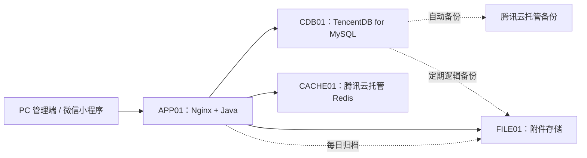

# 医院后勤工单系统生产环境服务器资源配置

> 版本：V1.2（托管数据库版）  
> 日期：2026-09-15  
> 适用规模：约 400 名用户，日常并发 40–80，短时峰值 120

## 1. 一期部署结论

一期采用 2 台 CVM 和 2 项腾讯云托管数据服务完成生产部署，不配置自建中间件主从和独立监控服务器：

- APP01：Nginx、PC 静态页面和 Java 后端。
- FILE01：工单附件、日志归档和数据库备份。
- CDB01：TencentDB for MySQL 8.0，使用托管双节点实例。
- CACHE01：腾讯云分布式缓存数据库 Redis 7.0，使用标准架构。

APP01 和 FILE01 保持单实例，不自建 MySQL、Redis 主从，也不实现应用侧切换逻辑。数据库与缓存的副本、备份和故障切换由腾讯云托管产品负责，应用只使用云服务提供的内网连接地址。该配置适合一期减少数据库运维风险并快速上线；后续只有在并发、数据量或连续性要求提高时再增加应用节点。

## 2. 容量基线

| 项目 | 一期口径 |
|---|---:|
| 注册用户 | 约 400 人 |
| 日活用户 | 200–300 人 |
| 日常并发 | 40–80 人 |
| 短时峰值并发 | 120 人 |
| 持续请求 | 50 QPS |
| 5 分钟突发请求 | 100 QPS |
| 同时上传附件 | 20 路 |
| 工单量 | 按 100 单/日预留 |
| 附件增长 | 约 400–500 GB/年 |
| 日志增长 | 约 1–2 GB/日 |

微信小程序不得按秒轮询。首页统计缓存 30–60 秒，列表按 20 条分页，图片使用压缩图或缩略图，避免 400 个用户同时刷新形成无效压力。小程序代码由微信平台分发，生产服务器只承载 HTTPS API、PC 静态资源和经鉴权的附件访问。

如果实际出现 200 人以上持续同时操作，或持续请求超过 50 QPS，应先增加 APP02，而不是继续提高单机线程数。

## 3. 简化部署拓扑



客户端只访问 APP01 的 HTTPS 地址。TencentDB、托管 Redis 和文件服务器只允许 APP01 所在 VPC 与授权运维地址访问，不向普通办公网或互联网开放。

## 4. 服务器资源清单

| 资源 | 数量 | CPU / 内存 | 磁盘 | 部署内容 |
|---|---:|---|---|---|
| APP01 | 1 | 8 vCPU / 16 GB | 200 GB SSD | Nginx、PC 前端、Java 后端、本地滚动日志 |
| FILE01 | 1 | 4 vCPU / 8 GB | 4 TB 可用容量 | 附件、导出文件、日志归档、数据库备份 |
| CDB01 | 1 | 4 vCPU / 8 GB | 500 GB SSD | TencentDB for MySQL 8.0 双节点托管实例，可在线升配 |
| CACHE01 | 1 | 4 GB 内存 | 托管 | Redis 7.0 标准架构，1 主 1 副本 |

一期自管 CVM 合计：12 vCPU、24 GB 内存、约 4.2 TB 云硬盘；数据库和缓存资源由腾讯云托管。

FILE01 的 4 TB 容量建议划分为：

- 2 TB：工单图片和附件。
- 500 GB：应用、Nginx、MySQL 和 Redis 日志归档。
- 1 TB：MySQL 全量备份和 Binlog。
- 500 GB：导出文件、临时文件和增长余量。

FILE01 使用腾讯云高性能云硬盘或更高等级存储。TencentDB 使用 SSD 存储，不使用自建数据库数据盘。

## 5. APP01 配置

### 5.1 部署内容

- Nginx 提供 HTTPS 入口、PC 静态资源和 `/api/` 反向代理。
- Java 后端使用当前工程的 Java 8、Spring Boot 2.5 和内嵌 Tomcat。
- 应用通过内网连接 MySQL、Redis 和 FILE01。
- 应用进程使用 systemd 或容器 `restart: unless-stopped` 自动重启。
- 附件不长期保存在 APP01，本地只允许保存上传临时文件和滚动日志。

### 5.2 Java 参数

```text
-Xms6g -Xmx8g
-XX:+UseG1GC
-XX:MaxGCPauseMillis=200
-XX:+HeapDumpOnOutOfMemoryError
-XX:HeapDumpPath=/data/dump
-Duser.timezone=Asia/Shanghai
```

APP01 的 16 GB 内存中，Java Heap 使用 8 GB，其余留给 Nginx、Metaspace、直接内存、线程栈、系统缓存和临时上传。

### 5.3 Tomcat 与数据库连接池

| 参数 | 生产值 |
|---|---:|
| Tomcat 最大线程 | 300 |
| Tomcat 最小空闲线程 | 30 |
| Tomcat 等待队列 | 500 |
| Druid initialSize | 10 |
| Druid minIdle | 10 |
| Druid maxActive | 50 |
| Druid maxWait | 3,000 ms |
| 数据库连接超时 | 5 秒 |
| 数据库响应超时 | 15 秒 |

当前配置中的 800 个 Tomcat 线程和 60 秒数据库连接等待时间需要调整。连接池满时应快速失败并保留错误日志，不能让所有请求长时间堆积。

### 5.4 Nginx 参数

| 参数 | 建议值 |
|---|---:|
| worker_processes | auto |
| worker_connections | 4096/worker |
| keepalive_timeout | 65 秒 |
| 普通接口超时 | 30 秒 |
| 附件上传超时 | 120 秒 |
| client_max_body_size | 100 MB |

HTTP 强制跳转 HTTPS。登录、验证码、导出和短信测试接口需要限流。静态文件启用压缩和文件指纹缓存，HTML 使用短缓存。

## 6. CDB01 配置

### 6.1 购买规格

| 配置项 | 生产值 |
|---|---|
| 产品 | TencentDB for MySQL |
| 地域和网络 | 与 APP01 相同地域、相同 VPC |
| 数据库版本 | MySQL 8.0 |
| 架构 | 双节点托管实例，不购买只读实例 |
| 规格 | 4 vCPU / 8 GB，压测不达标时在线升配至 8 vCPU / 16 GB |
| 存储 | 500 GB SSD，可在线扩容 |
| 字符集 | utf8mb4 |
| 时区 | `+08:00` |
| 最大连接数 | 不低于 150 |
| 自动备份 | 每日备份，保留 7 天以上 |
| Binlog | 开启，保留 30 天或按恢复目标配置 |

本项目不在 CVM 上安装 MySQL，不维护主从复制，也不编写主从切换脚本。腾讯云负责托管实例底层副本和故障切换；应用只连接 CDB 提供的内网读写地址。

应用账号、备份账号和运维账号必须分开。应用账号只拥有 `workorder` 业务库的查询和数据变更权限，不能使用 root 连接。

工单附件只在数据库保存对象键、原始名称、大小、摘要和业务关系，不保存图片 BLOB。

### 6.2 连接与恢复

- APP01 与 CDB01 必须处于同一地域和可互通 VPC，安全组只允许 APP01 访问 3306。
- 应用通过 `DB_URL`、`DB_USERNAME`、`DB_PASSWORD` 注入连接信息，不把云数据库账号写入仓库。
- Druid 连接池初始值 10、最小空闲 10、最大活动连接 50、等待 3 秒。
- 开启慢 SQL 采集，超过 1 秒的 SQL 进入优化清单。
- 一期恢复目标为 RPO 不超过 15 分钟、RTO 不超过 2 小时。
- 每日云备份由 TencentDB 保存；每周额外导出一次加密逻辑备份到 FILE01，避免只有同一产品内备份。

## 7. CACHE01 配置

### 7.1 购买规格

| 配置项 | 生产值 |
|---|---|
| 产品 | 腾讯云分布式缓存数据库，兼容 Redis |
| Redis 版本 | 7.0 |
| 地域和网络 | 与 APP01 相同地域、相同 VPC |
| 架构 | 标准架构，1 主 1 副本 |
| 容量 | 单节点 4 GB |
| 淘汰策略 | noeviction |
| 持久化和备份 | 使用托管服务默认持久化并开启自动备份 |
| 应用连接池 max-active | 32 |
| 应用连接池 max-idle | 16 |
| 应用连接池 min-idle | 4 |
| 应用连接等待 | 1 秒 |

本项目不在 CVM 上安装 Redis，不维护 Sentinel、Cluster 或主从切换脚本。托管服务负责副本和节点故障处理，应用只使用缓存实例提供的内网连接地址。

Redis 只保存登录令牌、验证码、限流计数、短期幂等键和可重建缓存，工单事实状态全部保存在 MySQL。即使 Redis 数据被清空，也只允许用户重新登录或缓存重建，不能造成工单事实数据丢失。

### 7.2 安全与恢复

- 安全组只允许 APP01 访问 6379，不开公网地址。
- 设置独立强密码，通过 `REDIS_HOST`、`REDIS_PORT`、`REDIS_PASSWORD` 注入应用。
- 开启自动备份并至少保留 7 天；恢复目标为 1 小时以内。
- 连接数、内存使用率和慢查询使用腾讯云实例自带指标查看，不单独建设监控服务器。

## 8. FILE01 与附件存储

FILE01 可使用单实例 MinIO、企业 NAS 或已有文件存储。接口统一通过文件存储适配器调用，应用代码不直接依赖本地绝对路径。

- 对象键由环境、日期、工单 ID 和随机文件 ID 组成。
- 上传前校验文件后缀、MIME、文件头和大小。
- 单文件建议不超过 20 MB；单次请求总量不超过 100 MB。
- 下载前校验工单数据权限，再返回短时下载地址或受控文件流。
- 临时上传文件 24 小时未绑定工单时自动清理。
- 导出文件 24 小时后删除，导出人、条件和下载记录进入审计。
- 附件区与数据库备份区使用不同目录和权限，应用账号无权删除数据库备份。

FILE01 是一期单点。应使用磁盘冗余，并至少每周将数据库备份和重要附件复制到另一块离线磁盘或已有备份系统，避免 FILE01 整机损坏时同时丢失原文件和备份。

## 9. 日志存储

一期不配置监控服务器和集中日志检索平台。

### 9.1 本地日志

| 日志 | 本地位置 | 本地保留 |
|---|---|---:|
| Java INFO/ERROR | APP01 | 30 天 |
| 用户操作日志 | APP01，同时写业务审计表 | 30 天 |
| Nginx access/error | APP01 | 30 天 |
| MySQL 错误/慢 SQL | TencentDB 控制台，重要记录导出到 FILE01 | 30 天以上 |
| Redis 运行记录 | 托管 Redis 控制台 | 按云服务保留策略 |

日志按天并按大小滚动，单文件建议不超过 200 MB，历史文件压缩保存。APP01 至少预留 100 GB 日志和故障转储空间。

### 9.2 日志归档

- 每日凌晨将前一日日志压缩后复制到 FILE01。
- 文件目录按照系统、服务器和日期组织，例如 `logs/app01/2026/09/15/`。
- 普通运行日志归档保留 180 天。
- 登录、权限变更、导出、派单、改派、关闭和删除等审计记录至少保留 1 年。
- 日志归档失败不得删除本地文件，下一次任务继续补传。
- 日志中禁止记录密码、JWT、验证码、密钥、完整手机号和附件签名地址。

所有请求生成 `traceId`，Nginx 和 Java 日志同时记录，出现问题时可以通过服务器日志文件关联请求链路。

## 10. 数据备份

| 数据 | 备份方式 | 保留周期 |
|---|---|---:|
| MySQL 自动备份 | TencentDB 每日自动备份 | 7 天以上 |
| MySQL 周逻辑备份 | 每周导出到 FILE01 | 8 周 |
| MySQL 月逻辑备份 | 每月导出到 FILE01 | 12 个月 |
| MySQL Binlog | TencentDB 托管保存 | 30 天或按恢复目标配置 |
| Redis 自动备份 | 托管 Redis 自动备份 | 7 天以上 |
| 工单附件 | 每日快照或增量备份 | 按业务保留周期 |
| 配置和部署包 | 每次发布后备份 | 保留最近 10 个版本 |

每月检查备份文件完整性，每季度至少执行一次 MySQL 恢复演练。备份文件必须加密并限制访问，业务应用无权删除。

## 11. 网络与安全

### 11.1 端口

| 来源 | 目标 | 端口 | 用途 |
|---|---|---:|---|
| 用户端 | APP01 | 443 | HTTPS 业务入口 |
| APP01 | CDB01 内网地址 | 3306 | TencentDB for MySQL |
| APP01 | CACHE01 内网地址 | 6379 | 托管 Redis |
| APP01 | FILE01 | 443/9000 | 附件访问 |
| APP01/授权备份任务 | FILE01 | 受控文件传输端口 | 日志与逻辑备份归档 |
| 运维终端 | 各服务器 | 22 | 仅堡垒机或授权运维地址 |

内网使用 1 Gbps 网络。客户端入口带宽建议不低于 100 Mbps；大量跨院区上传照片时建议 200 Mbps。

### 11.2 安全要求

- 使用 TLS 1.2 及以上，证书到期前完成续期。
- 生产密码和密钥通过环境变量或密钥文件注入，不写入仓库、镜像和普通配置文件。
- 生产关闭 Swagger、Druid 匿名管理页、DevTools 和 Debug 日志。
- TencentDB 禁止 root 作为应用账号；托管 Redis 设置强密码，两个服务均只允许 APP01 的内网地址访问。
- 服务器禁止普通办公网直接 SSH，使用堡垒机、密钥登录和最小权限账号。
- Java、Nginx、MySQL、Redis 和文件服务不使用 root 账号运行。
- 服务器统一时区和 NTP，工单状态、审计和备份时间保持一致。

## 12. 发布与恢复

### 12.1 发布

1. 备份数据库和当前部署包。
2. 执行向前兼容的数据库脚本。
3. 停止 APP01 接收新请求。
4. 发布 Java 包和 PC 静态资源。
5. 启动应用并完成健康检查。
6. 验证登录、创建、派单、接单、完工、确认和评价主流程。

一期为单应用实例，正常发布会产生短时维护窗口，建议在低峰期执行并提前公告。

### 12.2 故障恢复

| 故障 | 处理方式 | 目标恢复时间 |
|---|---|---:|
| Java/Nginx 进程异常 | 自动重启，失败后人工检查 | 30 分钟 |
| APP01 主机故障 | 重建服务器并部署最近发布包 | 2 小时 |
| CDB01 故障 | 由托管服务切换；失败时通过自动备份和 Binlog 恢复 | 2 小时 |
| CACHE01 故障 | 由托管服务处理；必要时从自动备份恢复，用户重新登录 | 1 小时 |
| FILE01 故障 | 修复存储或从外部备份恢复 | 4–8 小时 |

## 13. 当前配置上线前整改

| 当前配置 | 一期生产要求 |
|---|---|
| Docker Compose 中自建 MySQL、Redis | 只用于本地开发，生产连接 CDB01 和 CACHE01 |
| 本地环境使用 root 或示例密码 | 在托管服务中创建最小权限账号并使用独立强密码 |
| MySQL/Redis 本地端口直接映射 | 生产只使用 VPC 内网连接地址和安全组白名单 |
| `SWAGGER_ENABLED=true` | 生产设为 false |
| Druid 管理页弱口令 | 生产关闭或仅允许运维地址访问 |
| `com.ruoyi: debug` | 生产改为 INFO |
| DevTools 开启 | 生产关闭 |
| Tomcat 最大线程 800 | 调整为 300 |
| Druid `maxWait=60000` | 调整为 3000 ms |
| Redis 连接池 `max-active=8` | 调整为 32 |
| 本地上传目录 | 改为 FILE01 存储适配器 |
| JWT 示例密钥 | 替换为至少 256 位随机密钥 |

## 14. 上线验收

- 120 并发、持续 50 QPS 运行 30 分钟，5xx 错误率低于 0.5%。
- 100 QPS 突发运行 5 分钟，应用无崩溃、数据库连接池无长期耗尽。
- 列表 P95 小于 500 ms，详情 P95 小于 400 ms，状态命令 P95 小于 600 ms。
- 20 路并发上传 5–10 MB 文件，不影响工单状态操作。
- 重启 Redis 后工单数据完整，用户重新登录后可继续操作。
- 从全量备份和 Binlog 恢复一份测试数据库，指定工单及操作日志完整。
- APP01 和 FILE01 重启后服务能够自动启动；CDB01、CACHE01 连接恢复后应用连接池能够自动重连。
- 日志按天滚动并能归档到 FILE01，敏感字段完成脱敏。

## 15. 后续扩容条件

满足以下任一条件时再增加资源：

- 持续并发超过 120 人或持续请求超过 50 QPS：增加 APP02，并在前面增加负载均衡。
- 数据库 CPU 长期超过 60% 或数据量超过 300 GB：升级 CDB01 的计算或存储规格。
- Redis 内存超过 70%：检查无过期时间的键并提升 CACHE01 容量。
- 附件存储达到 70%：扩容 FILE01 或迁移到独立对象存储。
- 日志需要跨服务器快速检索时，再单独规划日志平台。

一期不提前建设上述能力，资源清单以第 4 章的 2 台 CVM 和 2 项托管数据服务为准。
