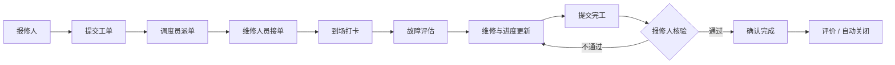
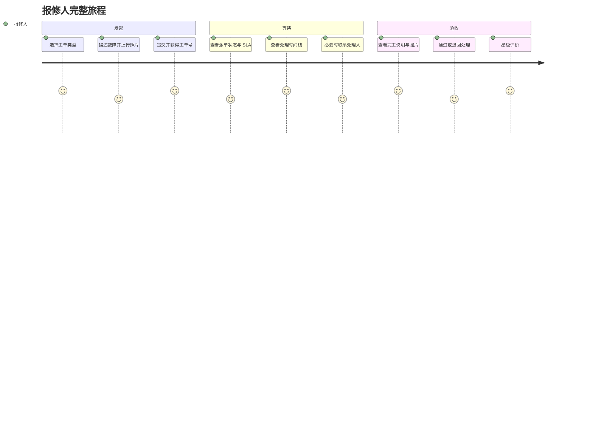
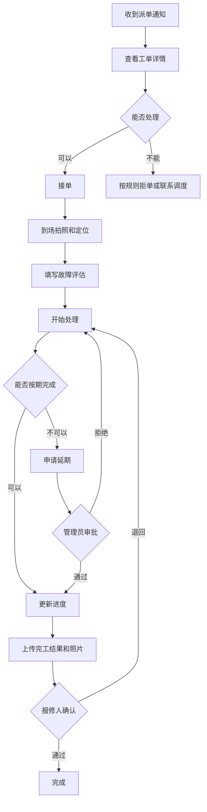
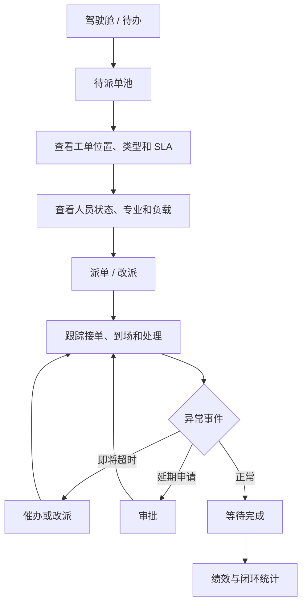
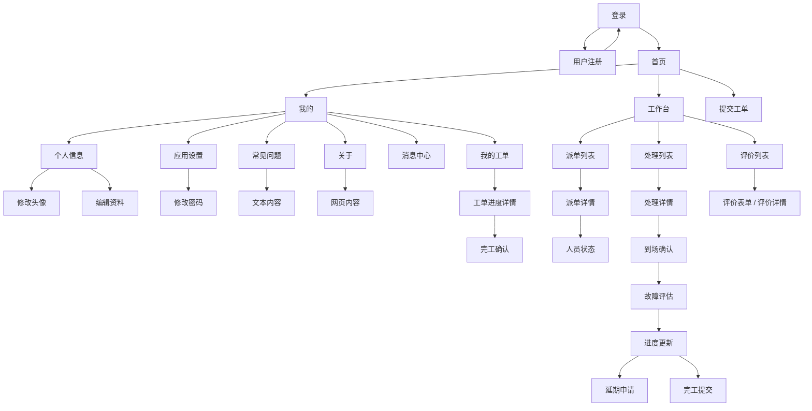
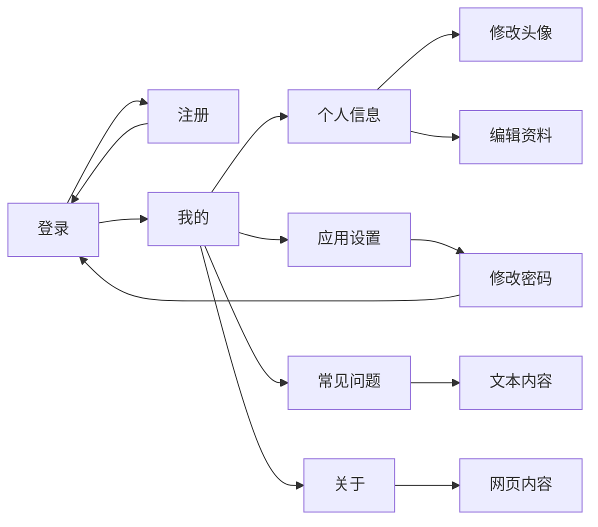
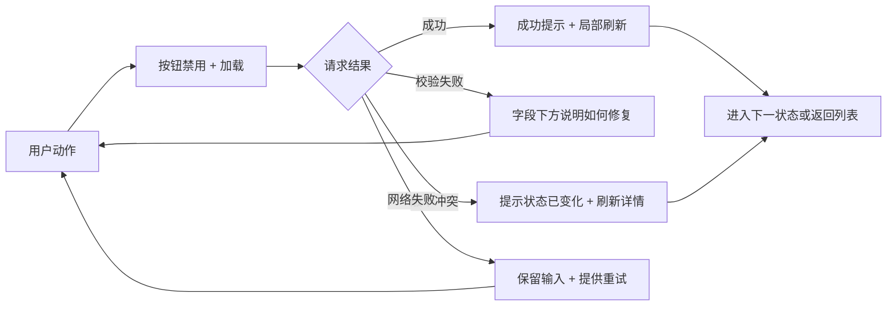

# UX 用户体验流程图

## 1. 角色与核心闭环

```mermaid
flowchart LR
    U["报修人"] --> A["提交工单"]
    A --> D["调度员派单"]
    D --> E["维修人员接单"]
    E --> F["到场打卡"]
    F --> G["故障评估"]
    G --> H["维修与进度更新"]
    H --> I["提交完工"]
    I --> J{"报修人核验"}
    J -->|"通过"| K["确认完成"]
    J -->|"不通过"| H
    K --> L["评价 / 自动关闭"]
```

## 2. 报修人旅程

```mermaid
journey
    title 报修人完整旅程
    section 发起
      选择工单类型: 5: 报修人
      描述故障并上传照片: 4: 报修人
      提交并获得工单号: 5: 报修人
    section 等待
      查看派单状态与 SLA: 4: 报修人
      查看处理时间线: 5: 报修人
      必要时联系处理人: 4: 报修人
    section 验收
      查看完工说明与照片: 5: 报修人
      通过或退回处理: 4: 报修人
      星级评价: 5: 报修人
```

## 3. 维修人员旅程

```mermaid
flowchart TD
    A["收到派单通知"] --> B["查看工单详情"]
    B --> C{"能否处理"}
    C -->|"可以"| D["接单"]
    C -->|"不能"| E["按规则拒单或联系调度"]
    D --> F["到场拍照和定位"]
    F --> G["填写故障评估"]
    G --> H["开始处理"]
    H --> I{"能否按期完成"}
    I -->|"可以"| J["更新进度"]
    I -->|"不可以"| K["申请延期"]
    K --> L{"管理员审批"}
    L -->|"通过"| J
    L -->|"拒绝"| H
    J --> M["上传完工结果和照片"]
    M --> N{"报修人确认"}
    N -->|"通过"| O["完成"]
    N -->|"退回"| H
```

## 4. 管理员工作流

```mermaid
flowchart TD
    A["驾驶舱 / 待办"] --> B["待派单池"]
    B --> C["查看工单位置、类型和 SLA"]
    C --> D["查看人员状态、专业和负载"]
    D --> E["派单 / 改派"]
    E --> F["跟踪接单、到场和处理"]
    F --> G{"异常事件"}
    G -->|"即将超时"| H["催办或改派"]
    G -->|"延期申请"| I["审批"]
    G -->|"正常"| J["等待完成"]
    H --> F
    I --> F
    J --> K["绩效与闭环统计"]
```

## 5. 页面导航结构

```mermaid
flowchart TD
    L["登录"] --> R["用户注册"]
    R --> L
    L --> H["首页"]
    H --> W["工作台"]
    H --> M["我的"]
    H --> S["提交工单"]
    W --> A["派单列表"]
    W --> P["处理列表"]
    W --> E["评价列表"]
    M --> O["我的工单"]
    M --> N["消息中心"]
    M --> PI["个人信息"]
    PI --> AV["修改头像"]
    PI --> PE["编辑资料"]
    M --> ST["应用设置"]
    ST --> PW["修改密码"]
    M --> HP["常见问题"]
    HP --> TX["文本内容"]
    M --> AB["关于"]
    AB --> WV["网页内容"]
    O --> OD["工单进度详情"]
    OD --> C["完工确认"]
    A --> AD["派单详情"]
    AD --> ES["人员状态"]
    P --> PD["处理详情"]
    PD --> AR["到场确认"]
    AR --> AS["故障评估"]
    AS --> PR["进度更新"]
    PR --> DR["延期申请"]
    PR --> FS["完工提交"]
    E --> EF["评价表单 / 评价详情"]
```

## 6. 账户与帮助闭环

```mermaid
flowchart LR
    A["登录"] --> B["注册"] --> A
    A --> C["我的"]
    C --> D["个人信息"]
    D --> E["修改头像"]
    D --> F["编辑资料"]
    C --> G["应用设置"]
    G --> H["修改密码"] --> A
    C --> I["常见问题"] --> J["文本内容"]
    C --> K["关于"] --> L["网页内容"]
```

## 7. 异常与反馈闭环

```mermaid
flowchart LR
    ACTION["用户动作"] --> LOADING["按钮禁用 + 加载"]
    LOADING --> RESULT{"请求结果"}
    RESULT -->|"成功"| SUCCESS["成功提示 + 局部刷新"]
    RESULT -->|"校验失败"| VALIDATE["字段下方说明如何修复"]
    RESULT -->|"版本冲突"| CONFLICT["提示状态已变化 + 刷新详情"]
    RESULT -->|"网络失败"| RETRY["保留输入 + 提供重试"]
    SUCCESS --> NEXT["进入下一状态或返回列表"]
    VALIDATE --> ACTION
    CONFLICT --> NEXT
    RETRY --> ACTION
```
