# 医院后勤工单系统产品设计方案

> 版本：V1.0（完整原型基线）  
> 日期：2026-09-14  
> 覆盖：微信小程序、PC 管理端、UI 原型、UX 流程、交互逻辑、页面状态和验收规则

## 1. 产品目标

以“报修有入口、派单有依据、处理有过程、完工有核验、全程可追溯”为核心，构建报修人、调度管理员、维修人员三角色闭环。产品优先保证工单状态清楚、下一步动作明确、异常可恢复，再提供驾驶舱和绩效运营能力。

移动端以微信小程序交付，并与 PC 端使用统一的视觉规范、状态名称和交互反馈，确保不同角色在工单流转过程中获得一致的信息和操作体验。

## 2. 用户与权限

| 角色 | 核心目标 | 高频任务 | 不能执行 |
|---|---|---|---|
| 报修人 | 快速提交并知道处理到哪一步 | 提交、查询、联系、确认、评价 | 派单、接单、审批延期 |
| 维修人员 | 清楚下一单、时限和处理证据 | 接单、到场、评估、进度、延期、完工 | 修改他人工单、代替报修人确认 |
| 调度/管理员 | 平衡人员负载，控制超时和质量 | 派单、改派、催办、延期审批、配置、统计 | 篡改历史日志和评价 |

## 3. 视觉基线

### 3.1 移动端视觉规范

- 背景：浅灰蓝 `#F3F6F9`，内容卡片白色。
- 主蓝：`#2A62ED / #2A7FF0`；派单紫：`#7A24DF`；处理青：`#2FC8C3`；评价橙：`#FF9800`。
- 成功：绿色；警告/执行中：橙色；超时/错误：红色；关闭：中性灰。
- 卡片：使用 6–14px 圆角和轻阴影，工单卡片左侧使用 4–5px 状态色条。
- 信息：工单编号在首行，时间靠右；标签用短文案，不使用只有颜色没有文字的状态。
- 导航：首页/工作台/我的三栏底部导航；业务详情使用系统导航栏返回。
- 微信小程序保留现有视觉，不调整颜色、卡片和信息层级；仅适配状态栏、胶囊按钮、底部安全区、软键盘和系统授权弹窗。

移动端页面总览：

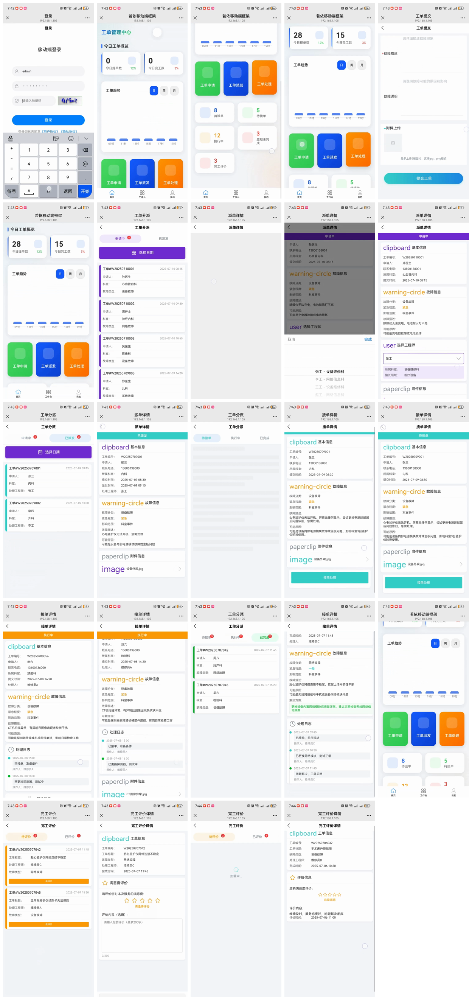

### 3.2 PC 端视觉规范

- 复用若依深色左侧栏、白色顶部栏、浅灰工作区和 Element UI 控件。
- 主操作使用 `#409EFF`，成功 `#67C23A`，警告 `#E6A23C`，危险 `#F56C6C`。
- 列表采用“查询条件卡 + 操作区 + 表格 + 分页”；详情采用“主信息 + 侧边 SLA/附件”；编辑采用抽屉或对话框。
- 不引入大圆角、渐变玻璃、悬浮 Dock 等与现有后台不一致的视觉语言。

## 4. 信息架构

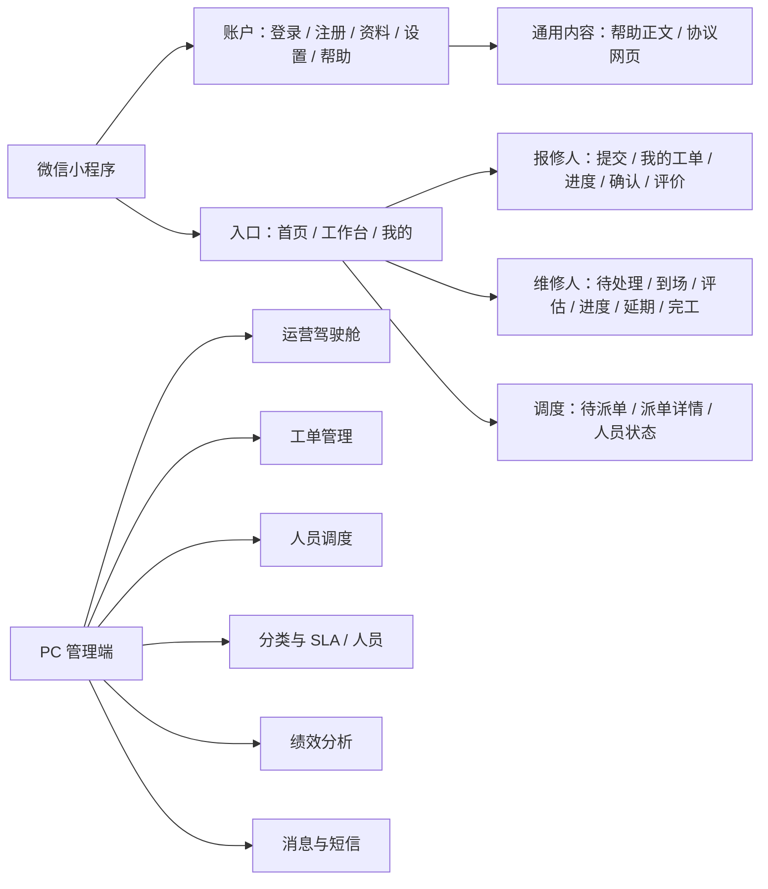
```mermaid
flowchart LR
    APP["微信小程序"] --> ACCOUNT["账户：登录 / 注册 / 资料 / 设置 / 帮助"]
    APP --> ENTRY["入口：首页 / 工作台 / 我的"]
    ENTRY --> REPORTER["报修人：提交 / 我的工单 / 进度 / 确认 / 评价"]
    ENTRY --> ENGINEER["维修人：待处理 / 到场 / 评估 / 进度 / 延期 / 完工"]
    ENTRY --> DISPATCH["调度：待派单 / 派单详情 / 人员状态"]
    ACCOUNT --> CONTENT["通用内容：帮助正文 / 协议网页"]
    PC["PC 管理端"] --> DASH["运营驾驶舱"]
    PC --> ORDER["工单管理"]
    PC --> RESOURCE["人员调度"]
    PC --> CONFIG["分类与 SLA / 人员"]
    PC --> ANALYTICS["绩效分析"]
    PC --> MESSAGE["消息与短信"]
```

完整角色旅程、导航和异常闭环见：[UX 用户体验流程图](ux/用户体验流程图.md)。

## 5. 移动端页面原型清单

### 5.1 入口与工作台

| 编号 | 页面 | UI 图 | 核心交互 |
|---|---|---|---|
| M00 | 登录 | [查看 UI](ui/mobile/01-入口与工作台/m00-login-existing.png) | 账号、密码、验证码；错误保留账号并聚焦错误字段 |
| M22 | 用户注册 | [查看 UI](ui/mobile/01-入口与工作台/m22-register-prototype.png) | 账号、密码、确认密码和验证码校验；注册成功返回登录 |
| M01 | 首页看板 | [查看 UI](ui/mobile/01-入口与工作台/m01-dashboard-existing.png) | 点击统计进入带状态筛选的列表；快捷入口按角色显示 |
| M02 | 工作台 | [查看 UI](ui/mobile/01-入口与工作台/m02-workbench-prototype.png) | 常用工作、待办、最近工单；红点展示待办数 |

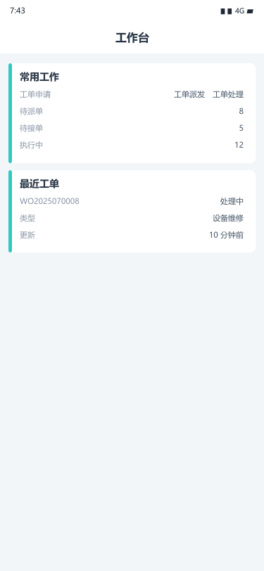

### 5.2 报修与进度

| 编号 | 页面 | UI 图 | 核心交互 |
|---|---|---|---|
| M03 | 工单提交 | [查看 UI](ui/mobile/02-报修与进度/m03-submit-existing.png) | 必填校验、图片上传、提交幂等；成功进入工单详情 |
| M12 | 我的工单 | [查看 UI](ui/mobile/02-报修与进度/m12-my-orders-prototype.png) | 状态标签、搜索、分页、下拉刷新 |
| M13 | 工单进度 | [查看 UI](ui/mobile/02-报修与进度/m13-progress-prototype.png) | 显示当前状态、SLA、处理人和完整时间线；允许联系处理人 |

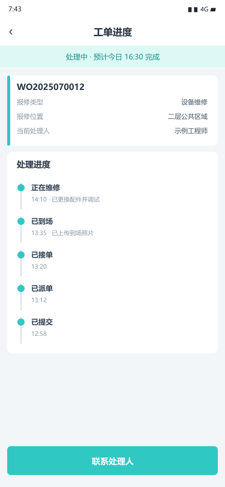

### 5.3 派单调度

| 编号 | 页面 | UI 图 | 核心交互 |
|---|---|---|---|
| M04 | 派单列表 | [查看 UI](ui/mobile/03-派单调度/m04-assign-list-existing.png) | 申请中/已派分段，日期筛选，点击卡片看详情 |
| M05 | 派单详情 | [查看 UI](ui/mobile/03-派单调度/m05-assign-detail-existing.png) | 选择处理人员、查看基本信息和附件、确认派单 |
| M19 | 人员状态 | [查看 UI](ui/mobile/03-派单调度/m19-engineers-prototype.png) | 按状态/专业筛选；显示负载；一键电话；从工单进入时可直接选人 |

### 5.4 维修处理

| 编号 | 页面 | UI 图 | 核心交互 |
|---|---|---|---|
| M06 | 处理列表 | [查看 UI](ui/mobile/04-维修处理/m06-handle-list-existing.png) | 待处理/执行中/已完成分段；状态色条与工单状态一致 |
| M07 | 处理详情 | [查看 UI](ui/mobile/04-维修处理/m07-handle-detail-existing.png) | 根据当前状态显示接单、到场、进度、完工 |
| M15 | 到场确认 | [查看 UI](ui/mobile/04-维修处理/m15-arrival-prototype.png) | 拍现场照片、获取位置、系统记录时间；无照片不能提交 |
| M16 | 故障评估 | [查看 UI](ui/mobile/04-维修处理/m16-assessment-prototype.png) | 原因、方案、预计时间；有配件时展开材料字段 |
| M17 | 延期申请 | [查看 UI](ui/mobile/04-维修处理/m17-delay-prototype.png) | 明示当前截止、剩余时间和“审批前继续计时” |
| M18 | 完工提交 | [查看 UI](ui/mobile/04-维修处理/m18-finish-prototype.png) | 结果、完工照片必填；提交后进入待确认 |

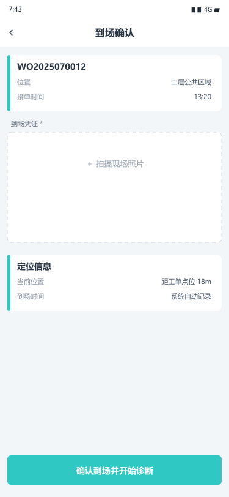

### 5.5 完工确认与评价

| 编号 | 页面 | UI 图 | 核心交互 |
|---|---|---|---|
| M14 | 完工确认 | [查看 UI](ui/mobile/05-完工确认与评价/m14-confirm-prototype.png) | 查看结果/照片；确认或退回；退回必须填写原因 |
| M08 | 评价列表 | [查看 UI](ui/mobile/05-完工确认与评价/m08-evaluation-list-existing.png) | 待评价/已评价分段 |
| M09 | 评价表单 | [查看 UI](ui/mobile/05-完工确认与评价/m09-evaluation-form-existing.png) | 星级、文本；一次提交，不允许重复评价 |
| M10 | 评价详情 | [查看 UI](ui/mobile/05-完工确认与评价/m10-evaluation-detail-existing.png) | 只读展示评价结果和完成信息 |

### 5.6 个人与消息

| 编号 | 页面 | UI 图 | 核心交互 |
|---|---|---|---|
| M11 | 我的 | [查看 UI](ui/mobile/06-个人与消息/m11-profile-prototype.png) | 个人资料、密码、消息、设置、退出登录 |
| M20 | 消息中心 | [查看 UI](ui/mobile/06-个人与消息/m20-notifications-prototype.png) | 全部/工单/审批/系统；进入业务详情后标已读 |
| M23 | 修改头像 | [查看 UI](ui/mobile/06-个人与消息/m23-avatar-prototype.png) | 选择、裁剪并保存头像；失败时保留裁剪状态 |
| M24 | 个人信息 | [查看 UI](ui/mobile/06-个人与消息/m24-profile-info-prototype.png) | 查看账号、联系方式、岗位、角色和创建日期 |
| M25 | 编辑资料 | [查看 UI](ui/mobile/06-个人与消息/m25-profile-edit-prototype.png) | 修改昵称、手机号、邮箱和性别；保存后刷新个人信息 |
| M26 | 修改密码 | [查看 UI](ui/mobile/06-个人与消息/m26-password-prototype.png) | 校验旧密码和新密码强度；成功后重新登录 |
| M27 | 应用设置 | [查看 UI](ui/mobile/06-个人与消息/m27-settings-prototype.png) | 修改密码、检查更新、清理缓存和退出登录 |
| M28 | 常见问题 | [查看 UI](ui/mobile/06-个人与消息/m28-help-prototype.png) | 按主题查看帮助条目，点击进入帮助正文 |
| M29 | 关于 | [查看 UI](ui/mobile/06-个人与消息/m29-about-prototype.png) | 查看版本、服务信息、用户协议和隐私政策 |

### 5.7 通用状态与内容

| 编号 | 页面 | UI 图 | 核心交互 |
|---|---|---|---|
| M21 | 空状态 | [查看 UI](ui/mobile/07-通用状态/m21-empty-state-prototype.png) | 空状态说明原因，并提供唯一下一步主动作 |
| M30 | 网页内容 | [查看 UI](ui/mobile/08-通用内容/m30-webview-prototype.png) | 在应用内加载受信任网页；外链打开前确认 |
| M31 | 文本内容 | [查看 UI](ui/mobile/08-通用内容/m31-textview-prototype.png) | 展示帮助、说明等正文，并提供返回和联系入口 |

## 6. PC 管理端页面原型清单

PC 管理端使用统一的后台导航、查询、表格、详情和弹窗交互。

| 编号 | 场景 | 原型图 | 核心交互 |
|---|---|---|---|
| P01 | 运营驾驶舱 | [PNG](ui/pc/01-运营驾驶舱/p01-dashboard-prototype.png) / [SVG](ui/pc/01-运营驾驶舱/p01-dashboard-prototype.svg) | 指标卡可下钻；图表筛选与列表条件联动 |
| P02 | 工单列表 | [PNG](ui/pc/02-工单管理/p02-order-list-prototype.png) / [SVG](ui/pc/02-工单管理/p02-order-list-prototype.svg) | 查询条件入 URL；批量导出；单行操作按权限和状态显示 |
| P03 | 工单详情 | [PNG](ui/pc/02-工单管理/p03-order-detail-prototype.png) / [SVG](ui/pc/02-工单管理/p03-order-detail-prototype.svg) | 主信息、SLA、附件、时间线；可催办/改派 |
| P04 | 派单抽屉 | [PNG](ui/pc/02-工单管理/p04-dispatch-prototype.png) / [SVG](ui/pc/02-工单管理/p04-dispatch-prototype.svg) | 选人员/班组、展示推荐依据、二次确认 |
| P05 | 人员状态 | [PNG](ui/pc/03-人员调度/p05-engineers-prototype.png) / [SVG](ui/pc/03-人员调度/p05-engineers-prototype.svg) | 负载、专业、状态、及时率；联系与派单 |
| P06 | 分类与 SLA | [PNG](ui/pc/04-基础配置/p06-sla-config-prototype.png) / [SVG](ui/pc/04-基础配置/p06-sla-config-prototype.svg) | 配置响应/完成时限；历史工单规则快照不回写 |
| P07 | 报修人员管理 | [PNG](ui/pc/04-基础配置/p07-users-prototype.png) / [SVG](ui/pc/04-基础配置/p07-users-prototype.svg) | 复用若依用户能力，扩展报修统计和组织筛选 |
| P08 | 绩效分析 | [PNG](ui/pc/05-统计分析/p08-performance-prototype.png) / [SVG](ui/pc/05-统计分析/p08-performance-prototype.svg) | 日期/组织/人员筛选，指标口径提示，导出 |
| P09 | 消息管理 | [PNG](ui/pc/06-消息与短信/p09-messages-prototype.png) / [SVG](ui/pc/06-消息与短信/p09-messages-prototype.svg) | 模板、发送记录、失败重试；变量预览 |
| P10 | 短信账户 | [PNG](ui/pc/06-消息与短信/p10-sms-prototype.png) / [SVG](ui/pc/06-消息与短信/p10-sms-prototype.svg) | 余额、告警、供应商配置掩码、发送记录 |
| P11 | 延期审批 | [PNG](ui/pc/02-工单管理/p11-delay-approval-prototype.png) / [SVG](ui/pc/02-工单管理/p11-delay-approval-prototype.svg) | 按状态和关键字筛选；同意二次确认；拒绝原因必填 |
| P12 | SLA 规则 | [PNG](ui/pc/04-基础配置/p12-sla-rules-prototype.png) / [SVG](ui/pc/04-基础配置/p12-sla-rules-prototype.svg) | 规则筛选、新增、编辑、启停和截止时间预览 |

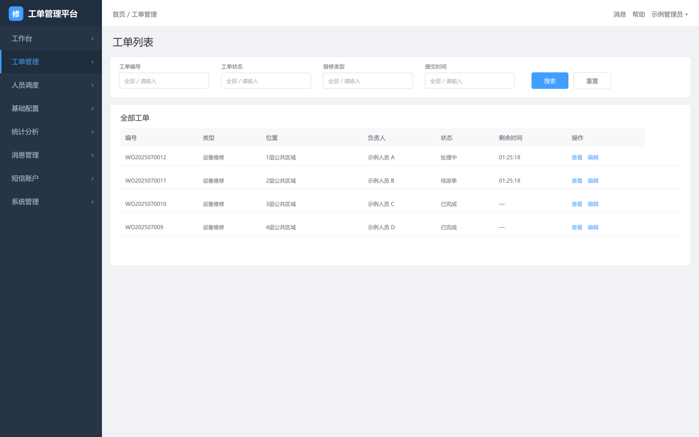

## 7. 核心交互逻辑

### 7.1 提交类动作

- 点击后按钮立即禁用并展示“提交中”，避免重复操作。
- 校验错误显示在字段下方，说明“哪里错、为什么、如何修复”，不只 Toast“参数错误”。
- 网络失败保留表单和已上传文件，提供重试；成功只提示一次并进入详情。
- 派单、改派、退回、延期审批、完工确认是有业务后果的动作，提交前二次确认。

### 7.2 列表与详情

- 默认列表展示角色最需要处理的状态；分段标签带数量。
- 点击卡片任意非按钮区域进入详情；电话、催办等次动作不触发详情跳转。
- 返回列表保留筛选、滚动位置和分页；执行成功后只刷新对应行。
- 工单状态使用“文字 + 颜色”，倒计时低于预警阈值时再增加警告图标。

### 7.3 附件

- 上传前可预览、删除和重拍；单张显示上传进度与失败重试。
- 到场和完工证据必须现场拍摄时，由产品配置是否允许相册选择。
- 查看附件使用全屏预览，显示上传阶段和时间，不暴露原始存储地址。

### 7.4 电话与消息

- 一键电话必须先显示掩码号码和人员姓名，用户确认后调用系统拨号。
- 消息点击进入对应工单/审批详情，并在成功打开后标记已读。
- 失败短信不影响工单操作成功；后台消息记录显示失败原因和重试状态。

## 8. 页面状态规范

每个列表和表单至少实现以下状态：

| 状态 | 设计要求 |
|---|---|
| 初始加载 | 骨架屏保持页面结构，不使用全屏空白转圈 |
| 下拉刷新 | 保留已有内容，顶部展示刷新反馈 |
| 空数据 | 说明为什么为空，提供与场景一致的唯一主动作 |
| 字段校验 | 字段下方红色提示，输入后及时清除 |
| 提交中 | 主按钮禁用、文案变化，禁止重复请求 |
| 成功 | Toast + 页面状态/列表局部刷新，不弹多层对话框 |
| 网络失败 | 保留用户输入，提供重试；可返回时不阻塞导航 |
| 权限不足 | 说明无权限并返回可访问页面，不展示不可执行按钮 |
| 状态冲突 | 告知“工单已被更新”，刷新详情并重算可用动作 |
| 已关闭 | 详情可读、动作禁用，明确关闭原因和时间 |

## 9. 响应式与可访问性

- 移动端基准宽度 375px，适配 320–430px；底部按钮避开安全区。
- 可点击区域不小于 44×44px；重要操作有明确文字，不只用图标。
- PC 端基准 1440×900，最低支持 1280px；表格过宽时固定操作列并横向滚动。
- 状态含义不只依赖颜色；文本和背景满足清晰对比。
- 表单字段有可见标签，必填标记与校验信息可被辅助技术识别。

### 9.1 微信小程序交互约束

| 场景 | 页面行为 | 异常恢复 |
|---|---|---|
| 启动与登录 | 有有效会话时进入角色首页；无会话时进入 M00；第一版继续使用账号、密码和图形验证码 | 会话过期只提示一次，清理会话后回到 M00，保留可重新输入的账号 |
| 自定义首页 | 页面内容避开状态栏和胶囊按钮，现有首页视觉保持不变 | 无法取得窗口信息时使用平台安全区默认值，不遮挡标题和入口 |
| 拍照/选图 | M03、M15、M18 在用户点击后调用相机或相册，展示已选数量、缩略图和上传进度 | 拒绝权限时说明用途并保留表单，可重新授权；必填证据不足时不提交 |
| 到场定位 | M15 在用户点击后获取位置并展示位置摘要和获取时间 | 拒绝或失败时明确提示，可打开设置重试；不得伪造定位成功 |
| 拨打电话 | M13、M19 点击明确的电话号码后调用系统拨号确认 | 号码缺失时禁用入口并说明原因，不读取通讯录 |
| 协议与帮助 | M30 只打开已登记业务域名；可静态交付的协议和帮助优先使用 M31 | 域名或网络不可用时进入 M31 文本内容，不尝试任意外链 |
| 前后台切换 | 从后台回到前台时刷新当前工单版本和可执行动作 | 状态已变化时提示并刷新详情，不继续提交旧动作 |
| 网络中断 | 保留表单、已选附件和筛选现场 | 用户主动重试；派单、完工、确认和评价不得自动重复提交 |
| 页面返回 | 详情返回列表时保留分段、筛选和滚动位置 | 从消息、分享或扫码直达时返回角色首页，不进入无权限页面 |

### 9.2 小程序页面适配要求

- M00 不增加微信头像、手机号或 OpenID 强制授权；账号密码登录的布局和样式保持现状。
- M01/M02/M11 的三栏 TabBar 保持现状，点击区域和底部间距适配小程序安全区。
- M03/M15/M18 的附件组件统一展示选择、压缩、上传、成功、失败和单项重试状态。
- M15 在照片和位置均满足当前验收规则后才允许提交；取消系统授权弹窗不清空已填内容。
- M30 不接收任意 URL；协议、帮助和说明内容无法使用 `web-view` 时由 M31 承接。
- 所有页面在微信开发者工具、iOS 微信和 Android 微信中保持相同的信息层级、状态文案和主动作。

## 10. UI 交付文件

- [移动端交互页面](prototypes/mobile/index.html)：可按页面编号查看移动端界面。
- [PC 端可交互 HTML](prototypes/pc/index.html)：使用 `?screen=p02` 等参数可单独查看业务页。
- 移动端和 PC 端页面均提供 PNG 图片，便于文档评审和交付确认。

## 11. 产品验收标准

- 本清单中的 32 个移动端页面/状态和 10 个 PC 页面均有可查看原型图。
- 当前页面与移动端页面总览中的视觉基线一致，页面样式保持统一。
- 三角色能完成报修到评价的 UX 闭环，且每一步下一主动作明确。
- 所有提交动作具有加载、成功、校验失败、网络失败和重复点击保护。
- 按后端 `allowedActions` 控制按钮；刷新后不会出现与工单状态矛盾的动作。
- PC 表格筛选、分页、详情、抽屉、导出和权限行为符合若依现有交互。
- 页面文案、状态名称和技术方案中的状态码映射一致。
- 微信小程序体验版在开启合法域名校验的情况下通过编译，并在 iOS、Android 真机完成主流程和权限拒绝场景。
- 相机、相册、位置和协议页的实际行为与微信公众平台隐私保护指引一致。

## 12. 待确认项

以下决策不影响现阶段原型和核心开发，但应在视觉验收前确认：

1. 到场照片是否禁止从相册选择。
2. 是否允许维修人员拒单，以及拒单入口是否展示。
3. 报修人确认时是否必须勾选现场核验项。
4. 评价是否匿名、评价窗口和自动关闭天数。
5. PC 驾驶舱的最终指标口径和默认时间范围。
6. 一键电话是否记录拨号动作审计。

---

## 13. 客户阅读版：完整业务闭环

### 13.1 一张图理解完整闭环

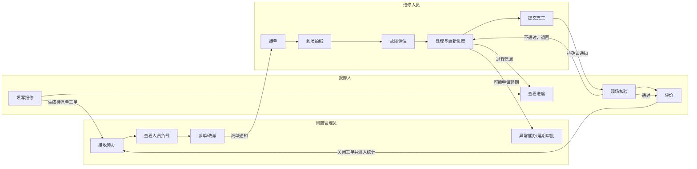
```mermaid
flowchart LR
    subgraph R["报修人"]
      R1["填写报修"] --> R2["查看进度"]
      R3["现场核验"] --> R4["评价"]
    end
    subgraph A["调度管理员"]
      A1["接收待办"] --> A2["查看人员负载"] --> A3["派单/改派"]
      A4["异常催办/延期审批"]
    end
    subgraph E["维修人员"]
      E1["接单"] --> E2["到场拍照"] --> E3["故障评估"] --> E4["处理与更新进度"] --> E5["提交完工"]
    end
    R1 -->|"生成待派单工单"| A1
    A3 -->|"派单通知"| E1
    E4 -->|"过程信息"| R2
    E4 -->|"可能申请延期"| A4
    E5 -->|"待确认通知"| R3
    R3 -->|"不通过，退回"| E4
    R3 -->|"通过"| R4
    R4 -->|"关闭工单并进入统计"| A1
```

### 13.2 工单生命周期与用户下一步

| 用户看到的状态 | 状态含义 | 此时谁需要行动 | 页面主动作 | 动作完成后 |
|---|---|---|---|---|
| 待派单 | 报修已提交，尚未指定维修人员 | 调度管理员 | 派单 | 转为“待接单”，通知维修人员 |
| 待接单 | 已指定维修人员，等待响应 | 维修人员 | 接单 | 转为“已接单”，开始计算到场时长 |
| 已接单 | 维修人员已确认，尚未到场 | 维修人员 | 到场确认 | 上传现场证据后转为“处理中” |
| 处理中 | 已到场，正在诊断或维修 | 维修人员 | 更新进度 / 提交完工 | 进度对报修人可见；完工后转“待确认” |
| 延期审批中 | 维修人员申请延长截止时间 | 调度管理员 | 同意 / 拒绝 | 同意后更新截止时间；拒绝后维持原时限 |
| 待确认 | 维修人员已提交处理结果 | 报修人 | 确认完工 / 退回 | 通过后“已完成”；退回后重新“处理中” |
| 已完成 | 报修人已确认，可评价 | 报修人 | 评价 | 评价后“已关闭” |
| 已关闭 | 业务闭环完成 | 无 | 查看记录 | 进入统计和审计，只读 |
| 已取消 | 派单前被取消 | 无 | 查看原因 | 只读，不再进入调度 |

### 13.3 六条业务闭环

#### 闭环 A：正常报修

1. 报修人登录后从首页“工单申请”进入 M03。
2. 填写类型、位置、故障说明和附件，提交成功后立即得到工单号。
3. 系统进入“待派单”，首页待办和 PC 待派单池同步增加一条。
4. 调度员在 P02/P04 派单，维修人员收到 M20 消息。
5. 维修人员依次接单、到场、评估、处理和完工。
6. 报修人在 M14 核验，通过后在 M09 评价，工单关闭。

闭环标志：报修、派单、到场、处理、确认、评价都有时间、操作人和证据记录。

#### 闭环 B：完工退回

1. 报修人在 M14 查看完工说明和照片。
2. 现场仍有问题时选择“退回处理”，必须填写原因。
3. 工单从“待确认”返回“处理中”，维修人员收到返工消息。
4. 维修人员在 M07 查看退回原因，再次更新进度并提交完工。
5. 报修人重新核验，直到确认通过。

闭环标志：每次提交和退回形成独立处理记录，不能覆盖第一次完工信息。

#### 闭环 C：超时与改派

1. 系统接近 SLA 阈值时，在 M01/P01 显示预警并通知管理员。
2. 管理员进入 P03 查看停留环节、剩余时间和维修人员负载。
3. 管理员可催办；人员无法继续处理时，通过 P04 改派并填写原因。
4. 原处理人收到撤回消息，新处理人收到派单消息，报修人进度页同步显示改派节点。

闭环标志：超时是工单的风险标记，不会把“处理中”强行改成另一主状态。

#### 闭环 D：延期审批

1. 维修人员在 M17 看见原截止时间和剩余时长，提交新时间、原因和佐证。
2. 申请期间仍按原截止时间计时，避免申请本身自动停止 SLA。
3. 管理员从消息、P03 或 P11 进入审批：同意时展示“旧时间 → 新时间”，拒绝时必须填写原因。
4. 审批结果通知维修人员，并写入报修人的 M13 时间线。

闭环标志：申请、审批、原截止、新截止和原因均可审计。

#### 闭环 E：通知失败

1. 工单业务动作先成功落库，页面正常提示操作成功。
2. 短信失败不回滚工单，P09 显示失败原因和重试状态。
3. 系统自动重试；达到上限后转人工处理，站内消息仍保留。

闭环标志：业务成功与外部短信稳定性解耦，但每条通知最终有明确成功或失败结果。

#### 闭环 F：评价与运营改进

1. 报修人对已完成工单进行星级和文字评价。
2. 评价完成后工单关闭，不能重复评价。
3. P08 汇总及时率、满意度、返工率等指标。
4. 管理员依据低分原因调整分类规则、人员安排和消息模板。

闭环标志：评价不只是展示，而是进入人员绩效和服务改进统计。

## 14. 移动端逐页 UI 与 UX 使用说明

### 14.1 M00 登录

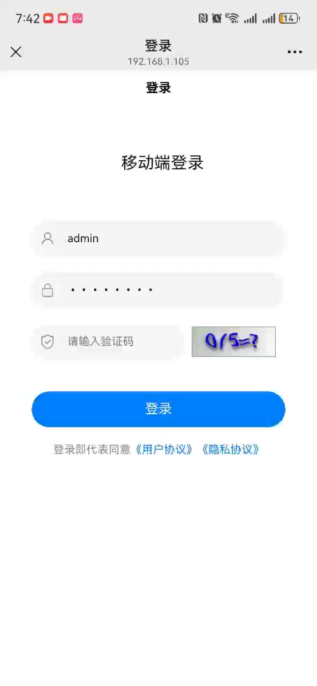

**使用者与入口**：所有角色首次打开应用或登录失效时进入。

**页面区域**：上方品牌/标题，中部账号、密码、验证码输入区，下方登录按钮和协议/帮助入口。密码默认隐藏，验证码可点击刷新。

**使用步骤**：输入账号和密码 → 输入验证码 → 点击“登录”。登录成功后，系统根据角色进入 M01 首页，并加载其菜单权限和待办数量。

**校验与异常**：账号为空、密码为空、验证码为空分别在对应输入框下提示；密码错误时保留账号、清空密码；连续失败达到阈值后短时限制；网络失败保留所有非敏感输入并允许重试。登录按钮在请求期间禁用。

**离开页面**：成功进入 M01；点击帮助进入常见问题；登录失败停留本页。

### 14.2 M01 首页看板

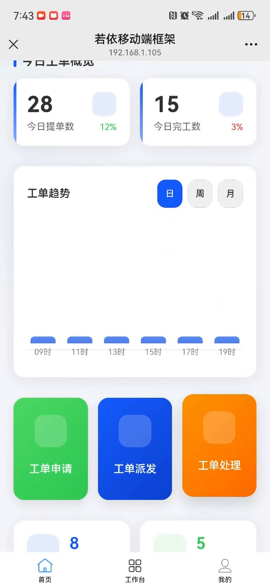

**使用者与目标**：登录后的所有角色，用一屏知道“今天发生了什么、我现在要做什么”。

**页面区域**：今日申报/完成统计、工单趋势、工单申请/派发/处理快捷入口、各状态数量、底部首页/工作台/我的导航。

**交互逻辑**：点击统计数字进入对应筛选后的列表；点击趋势的日/周/月切换时间范围；快捷入口根据权限显示，无派单权限的用户不展示“工单派发”；下拉刷新同时刷新统计、趋势和待办。

**数据状态**：首次加载使用骨架屏；局部统计失败时保留其他区块并显示“点击重试”，不让整页不可用；所有数字来自真实接口，不使用随机数或模拟延时。

**流程去向**：工单申请 → M03；工单派发 → M04；工单处理 → M06；底部导航 → M02/M11。

### 14.3 M02 工作台

**使用者与目标**：需要集中处理待办的调度员和维修人员；普通报修人看到与自己有关的申请、待确认和待评价入口。

**页面区域**：常用工作快捷区、待办数量、超时预警、最近工单。页面延续首页白卡片和蓝/紫/青/橙状态色。

**交互逻辑**：待办卡点击后带入对应状态筛选；最近工单只展示 3–5 条，点击进入详情；红点只表示未处理数量，进入列表不自动清零，完成业务动作后才减少。

**角色差异**：管理员显示待派单、延期审批、超时预警；维修人员显示待接单、执行中、退回处理；报修人显示处理中、待确认、待评价。

### 14.4 M03 工单提交

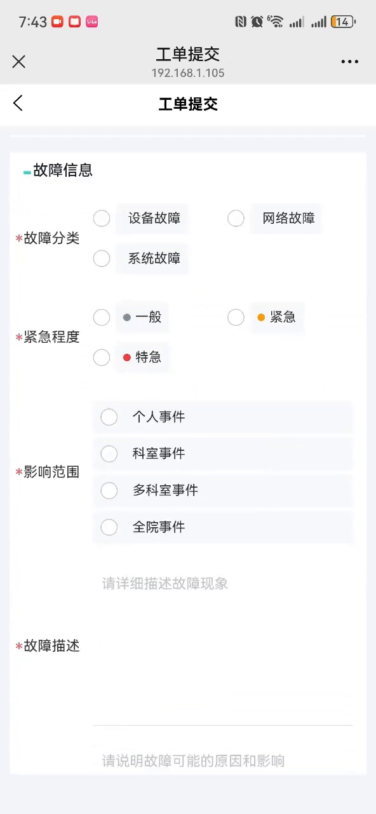

**使用者与入口**：报修人从 M01/M02 进入。

**页面内容**：报修类型、位置、联系电话、紧急程度、故障说明、附件。联系电话默认带入个人资料；位置可从常用地点选择，也可手输；附件显示张数、上传进度和删除操作。

**使用步骤**：选择类型 → 确认位置和电话 → 描述故障 → 上传照片 → 点击“提交工单” → 二次确认关键信息 → 成功页显示工单号并进入 M13。

**规则**：类型、位置、联系电话、故障说明必填；联系电话格式校验；故障说明限制 500 字；普通工单附件可选，紧急类别是否强制照片由分类规则决定；一次最多 9 张，每张大小由配置控制。

**异常恢复**：单张上传失败只重试该张；提交失败保留表单和已上传文件；重复点击使用同一幂等键，不产生重复工单；成功后清除草稿。

### 14.5 M12 我的工单

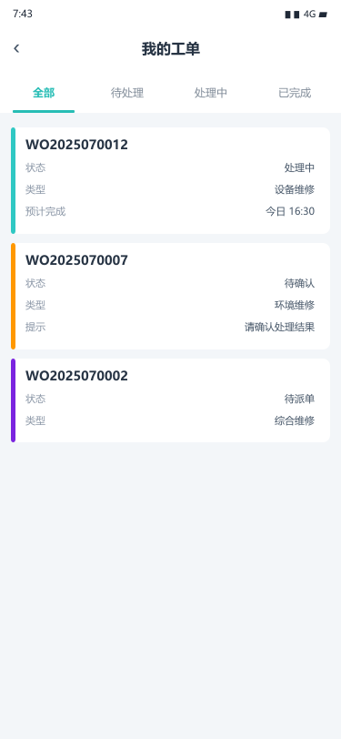

**使用者与入口**：报修人从“我的”或首页统计进入，用于查找自己提交的全部工单。

**页面区域**：全部/待处理/处理中/已完成分段、工单号/故障关键字搜索、工单卡片。卡片显示编号、类型、位置、当前状态、处理人和预计完成时间。

**交互逻辑**：切换分段立即刷新列表；搜索采用提交搜索，不在每输入一个字时请求；下拉刷新，触底加载下一页；点击卡片进入 M13。

**空状态**：对应分段无数据时使用 M21；从空状态可直接进入 M03。加载失败保留旧列表并提供重试。

### 14.6 M13 工单进度详情

**使用者与目标**：报修人了解工单当前由谁处理、是否超时、发生过哪些动作。

**页面区域**：顶部当前状态和预计完成时间；基本信息卡；从新到旧的处理时间线；联系处理人；状态允许时显示取消、确认完工或评价入口。

**时间线内容**：提交、派单、改派、接单、到场、评估、进度、延期申请/审批、完工提交、退回、确认和评价。每个节点显示动作、时间、操作角色和说明，附件可点开预览。

**动作逻辑**：待派单时可取消；处理中可联系当前处理人；待确认时进入 M14；已完成未评价时进入 M09；已关闭只读。

**冲突处理**：用户停留期间状态变化时，动作提交返回冲突，页面自动刷新并说明“工单已由其他人更新”。

### 14.7 M04 派单列表

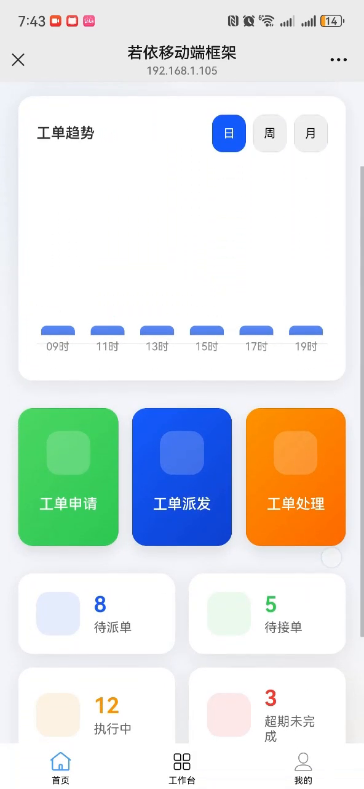

**使用者与入口**：调度管理员从首页“工单派发”或工作台待办进入。

**页面区域**：申请中/已派分段、日期筛选、工单卡片。申请中突出剩余响应时间和紧急程度；已派显示当前处理人和接单状态。

**使用逻辑**：默认“申请中”，按提交时间从早到晚并优先紧急/即将超时；选择日期只影响当前分段；点击申请中卡片进入 M05；点击已派卡片进入只读详情，可按权限改派。

**异常**：列表刷新时某工单已被其他管理员派出，应从申请中移除并提示“状态已更新”，不能继续打开派单面板。

### 14.8 M05 派单详情

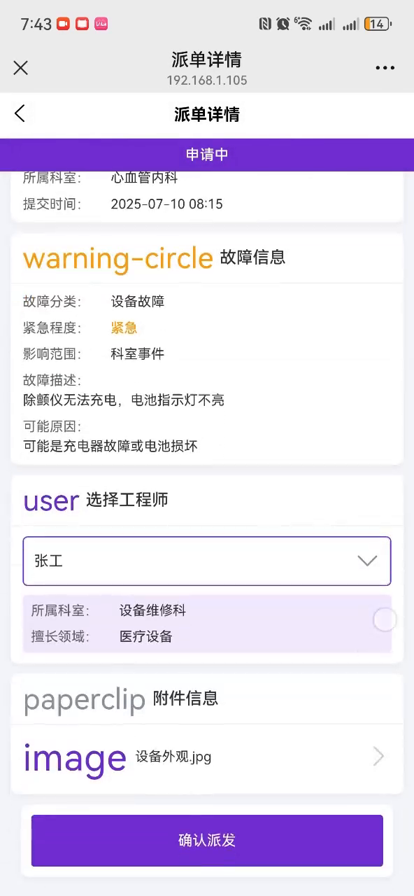

**使用者与目标**：管理员看清故障、位置、附件和时限后选择合适人员。

**页面区域**：状态条、基本信息、故障信息、附件、处理人员选择、时限与派单按钮。页面以紫色作为派单主题色。

**使用步骤**：查看工单 → 查看附件 → 点击人员选择 → 进入 M19 或底部选择器 → 确认人员和完成时限 → 点击派单 → 二次确认 → 返回 M04 已派分段。

**规则**：处理人员必选；默认时限来自 SLA，可在权限允许范围内调整；已离线、停用或超负荷人员需要警告；派单成功同时通知维修人员和报修人。

**改派**：已派工单进入时按钮改为“改派”，必须填写原因；原人员、新人员和报修人都会收到状态变化。

### 14.9 M19 人员状态

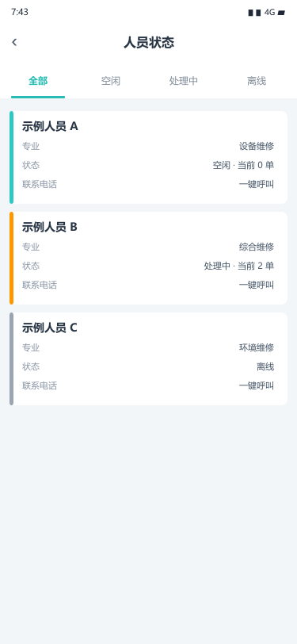

**使用者与入口**：管理员可独立查看，也可从 M05 选择处理人时进入。

**页面区域**：全部/空闲/处理中/离线分段、姓名或专业搜索、人员卡片。卡片展示专业、当前工单数、状态和一键电话。

**交互逻辑**：从派单进入时，点击人员卡选中并返回 M05；独立进入时，点击卡片查看该人员当前工单；电话按钮先显示掩码号码与姓名，确认后调用系统拨号。

**选择提示**：空闲人员优先；处理中人员显示负载；离线人员默认不可选；人员状态更新时间过久时标记“状态可能已过期”。

### 14.10 M06 维修处理列表

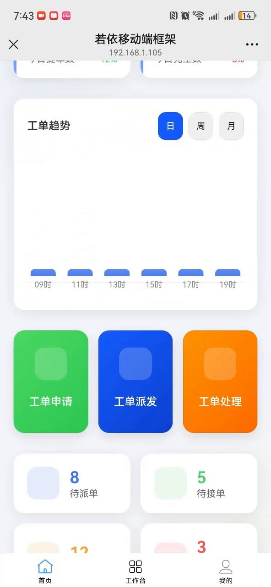

**使用者与入口**：维修人员从首页“工单处理”或工作台进入。

**页面区域**：待处理/执行中/已完成分段，工单卡片使用现有青色、绿色和状态左边线。

**排序**：待处理按接单截止时间升序；执行中按完成截止时间升序；退回工单置顶并标明退回原因；已完成按完成时间倒序。

**交互逻辑**：点击卡片进入 M07；下拉刷新；数量在完成接单、完工等动作后实时更新。

### 14.11 M07 维修处理详情

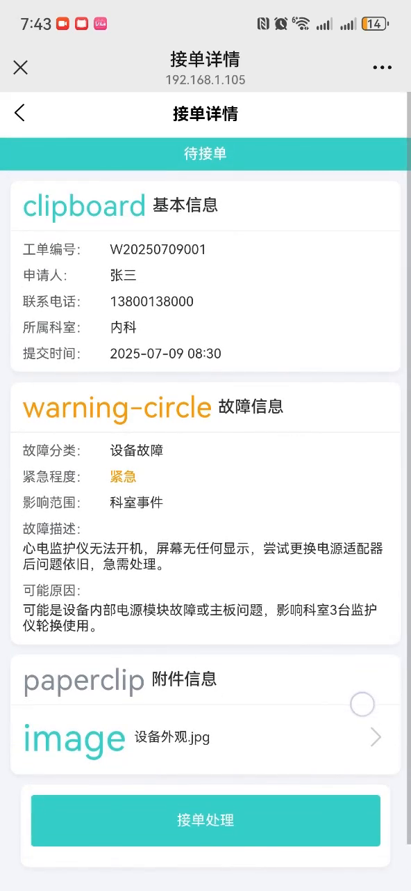

**使用者与目标**：维修人员在一页掌握故障信息、证据、SLA 和可执行动作。

**页面区域**：状态、基本信息、故障信息、附件、处理日志、底部主按钮。底部动作随状态变化：待接单“接单”、已接单“到场确认”、处理中“更新进度/提交完工”、被退回“继续处理”。

**规则**：只有当前处理人看到业务动作；其他人员只读或无权访问；按钮由后端返回的允许动作决定。接单前二次确认，成功后本页更新，不需要返回列表再进入。

### 14.12 M15 到场确认

**使用者与入口**：当前维修人员在 M07 接单后点击“到场确认”。

**页面区域**：工单位置和接单时间、现场照片、当前位置和到场时间、确认按钮。

**使用步骤**：拍摄现场照片 → 系统获取当前位置 → 核对距离 → 点击确认 → 工单进入处理中 → 自动进入 M16。

**规则与异常**：至少一张到场照片；未授权定位时说明用途并允许按项目规则申请人工确认；距离超出阈值时提示但是否阻断由配置决定；照片或定位上传失败时不产生到场记录。

### 14.13 M16 故障评估

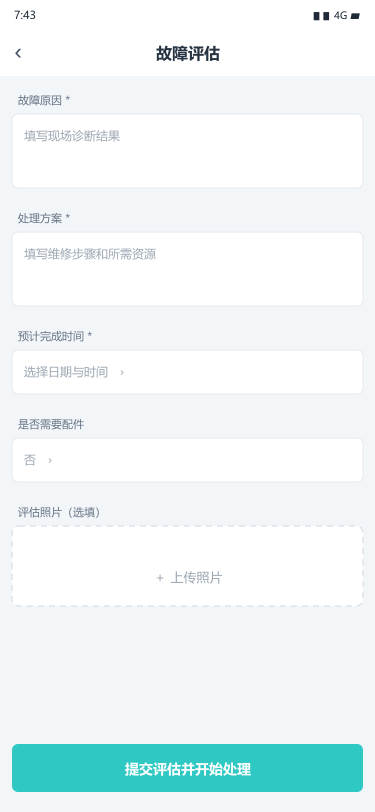

**使用者与目标**：到场后记录“为什么坏、怎么修、什么时候修完”，让调度和报修人获得可信预期。

**页面内容**：故障原因、处理方案、预计完成时间、是否需要配件、评估照片。

**交互逻辑**：选择需要配件时展开材料名称、数量和等待时间；预计完成时间超过 SLA 时直接提示，可继续提交但建议同时申请延期；提交后返回 M07 并在时间线新增“已评估”。

**规则**：原因、方案、预计时间必填；时间必须晚于当前；提交后可追加评估补充，但不能覆盖原始记录。

### 14.14 M17 延期申请

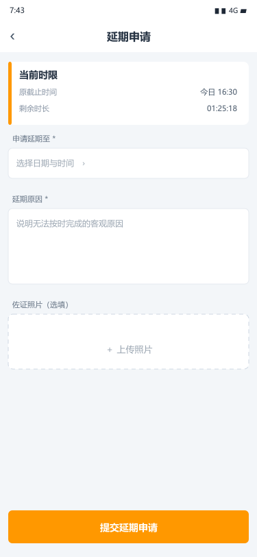

**使用者与入口**：维修人员在处理中发现无法按期完成时，从 M07 进入。

**页面区域**：原截止时间、倒计时、申请的新截止时间、延期原因、佐证附件和醒目说明。

**交互逻辑**：选择新时间并填写原因 → 提交 → 页面提示“等待审批，仍按原时限计时” → 返回 M07。已有待审批申请时入口改为“查看延期申请”，禁止重复提交。

**审批结果**：同意后 M07/M13 的预计完成时间同步更新；拒绝后展示拒绝原因，并允许在补充材料后重新申请。

### 14.15 M18 完工提交

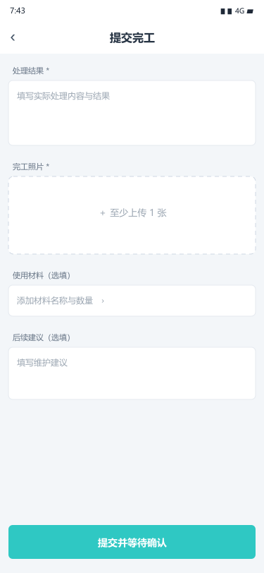

**使用者与入口**：维修人员完成处理后从 M07 进入。

**页面内容**：实际处理结果、完工照片、使用材料、后续建议、现场清理确认。

**使用步骤**：填写结果 → 上传至少一张完工照片 → 补充材料和建议 → 勾选现场已清理 → 提交 → 工单转“待确认” → 返回 M07 只读等待。

**规则**：处理结果和完工照片必填；提交后不可直接修改，只能由报修人退回后新增一轮处理记录；重复点击不重复生成完工记录。

### 14.16 M14 完工确认

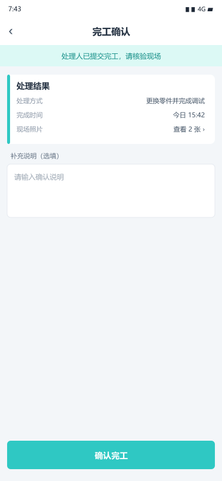

**使用者与入口**：报修人收到待确认消息后，从 M20 或 M13 进入。

**页面区域**：处理方式、完成时间、完工照片、现场核验项、补充说明，以及“退回处理/确认完工”双动作。

**确认路径**：查看处理结果和照片 → 现场核验 → 点击确认 → 二次确认 → 工单进入已完成 → 自动进入 M09 或提示稍后评价。

**退回路径**：点击退回 → 弹出原因输入 → 原因必填 → 提交后工单回到处理中，维修人员收到通知。退回按钮为次要危险动作，确认完工为主动作。

### 14.17 M08 评价列表

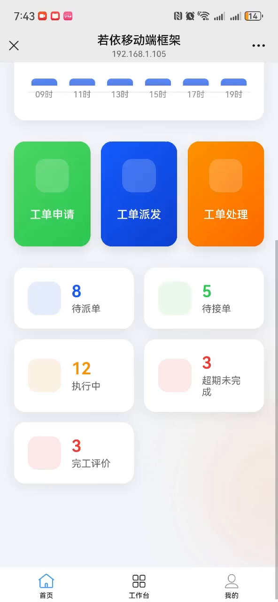

**使用者与入口**：报修人从工作台、消息或我的进入。页面以橙色作为评价主题色。

**页面区域**：待评价/已评价分段、工单卡片、去评价按钮。待评价显示完成时间和处理人员；已评价显示星级和评价摘要。

**交互逻辑**：点击“去评价”进入 M09；点击已评价卡片进入 M10。评价完成后卡片自动从待评价移动到已评价。

### 14.18 M09 评价表单

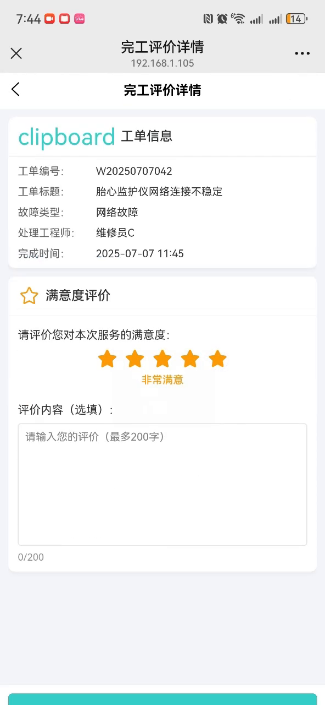

**使用者与目标**：报修人对一次已确认完成的服务给出反馈。

**页面区域**：只读工单信息、1–5 星选择、满意度文案、200 字评价内容、提交按钮。

**使用步骤**：选择星级 → 可选填写评价内容 → 点击提交 → 二次确认 → 成功进入 M10。

**规则**：星级必选，文字可选；低于 3 星时建议填写原因，可配置为必填；每个工单只能评价一次；提交中按钮禁用。

### 14.19 M10 评价详情

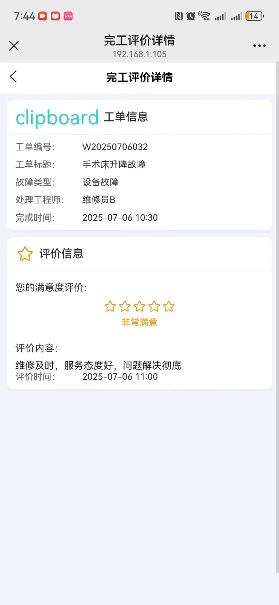

**使用者与目标**：报修人和有权限的管理员查看最终评价，确认业务已经闭环。

**页面区域**：工单编号、标题、故障类型、维修人员、完成时间、星级、满意度、评价内容和评价时间。

**交互逻辑**：页面只读，不提供再次编辑；返回 M08 已评价分段。管理员在 PC 查看时，手机号和评价人信息按权限脱敏。

### 14.20 M11 我的

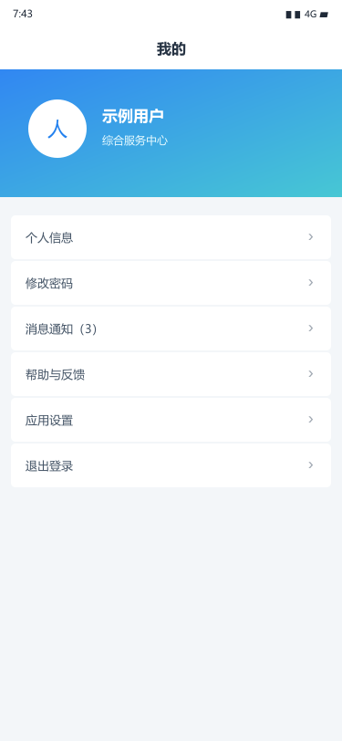

**使用者与目标**：所有用户管理个人资料并进入个人业务记录。

**页面区域**：头像、姓名、组织、个人信息、修改密码、消息通知、帮助、设置和退出登录。

**交互逻辑**：消息行显示未读数；退出登录前二次确认，清除本地令牌但不删除服务端业务数据；无权限菜单不展示。

### 14.21 M20 消息中心

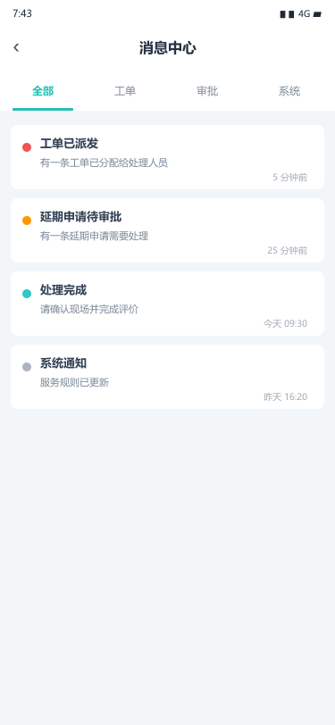

**使用者与入口**：所有角色从首页消息图标或“我的”进入。

**页面区域**：顶部返回和“全部已读”，全部/工单/审批/系统分段，分类未读数量、未读点、消息标题、摘要和时间。

**交互逻辑**：首次进入加载“全部”分类，下拉刷新第一页，上拉按时间继续加载；切换分类时各自保留未读数量。点击消息先打开对应业务详情，打开成功后标记已读；左滑可标记已读，但不删除审计消息；“全部已读”只影响当前分类，位于“全部”分类时影响全部消息。管理员的延期审批消息进入对应工单详情，集中审批仍在 PC 端 P11 完成。

**状态反馈**：未读消息使用强调标题和圆点，已读消息降低标题权重；标记已读后当前分类和总未读数同时减少，重复点击不会重复扣减。请求期间禁止重复加载，分页结果按消息编号去重。

**空与失败**：无消息时说明“暂无消息”；加载失败保留已有消息并提供重试；业务详情已失效或用户无权查看时停留在消息列表并说明原因，不提前标记已读。历史消息不提供删除入口，避免业务通知与审计记录断开。

### 14.22 M21 通用空状态

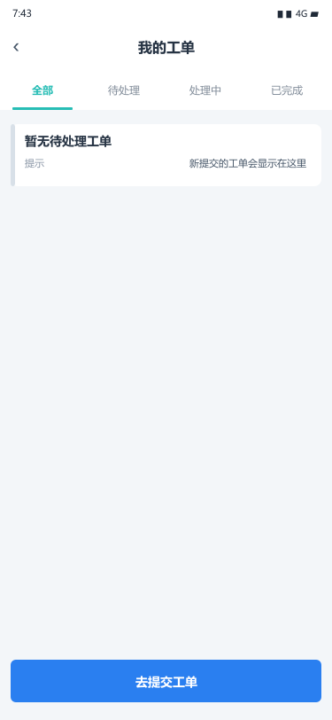

**适用范围**：所有列表无数据、搜索无结果、筛选后为空等场景。

**使用规则**：必须说明“为什么没有内容”，并提供一个与当前角色最相关的主动作。首次没有工单可显示“去提交工单”；搜索无结果应显示“清除筛选”；无权限导致为空时不能伪装成无数据，应明确提示权限问题。

### 14.23 M22 用户注册

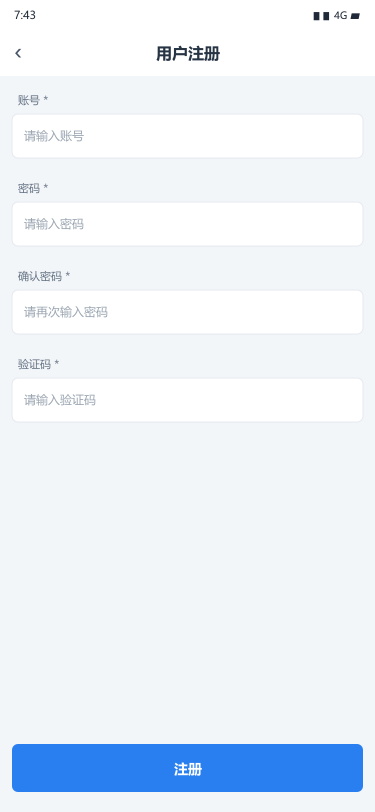

**使用者与入口**：尚未创建账号的用户从 M00 登录页进入；仅在系统开放自主注册时展示入口。

**页面区域**：账号、密码、确认密码、验证码、注册按钮，以及返回登录页的导航。密码输入默认隐藏，验证码支持刷新。

**使用步骤**：填写账号 → 输入密码和确认密码 → 输入验证码 → 点击“注册” → 注册成功提示 → 返回 M00，并自动带入注册账号。

**校验与异常**：账号必填并校验长度与可用字符；账号已存在时明确提示更换；两次密码必须一致，密码强度遵循安全策略；验证码错误时只清空验证码；网络失败保留账号，密码字段按安全策略处理。提交期间按钮禁用，防止重复创建。

**离开页面**：注册成功或点击返回均进入 M00；未保存内容返回时提示确认。

### 14.24 M23 修改头像

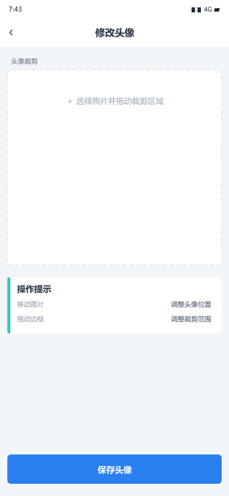

**使用者与入口**：已登录用户从 M11“我的”点击头像，或从 M24 个人信息页进入。

**页面区域**：头像裁剪区、选择照片入口、移动和缩放提示、保存按钮。裁剪框固定为方形，保存后按圆形头像展示。

**使用步骤**：选择拍照或相册 → 调整图片位置和缩放 → 预览裁剪结果 → 点击“保存头像” → 上传成功后返回 M11/M24 并刷新头像。

**校验与异常**：只允许受支持的图片格式和大小；读取或上传失败时说明原因并允许重新选择；上传期间禁止重复提交；用户取消选择时保持原头像不变。

### 14.25 M24 个人信息

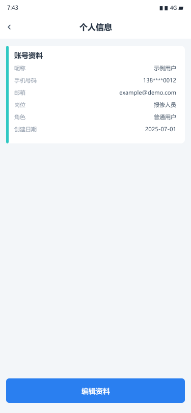

**使用者与入口**：已登录用户从 M11“个人信息”进入，用于核对账号和联系资料。

**页面区域**：昵称、手机号、邮箱、岗位、角色、创建日期，以及“编辑资料”按钮。手机号默认掩码展示；账号、岗位、角色和创建日期为只读信息。

**交互逻辑**：点击头像进入 M23；点击“编辑资料”进入 M25；页面重新获得焦点时刷新资料，以显示刚保存的变更。

**权限与异常**：普通用户不能自行修改岗位、角色和账号；资料加载失败时保留页面结构并提供重试，不展示空白或错误值。

### 14.26 M25 编辑资料

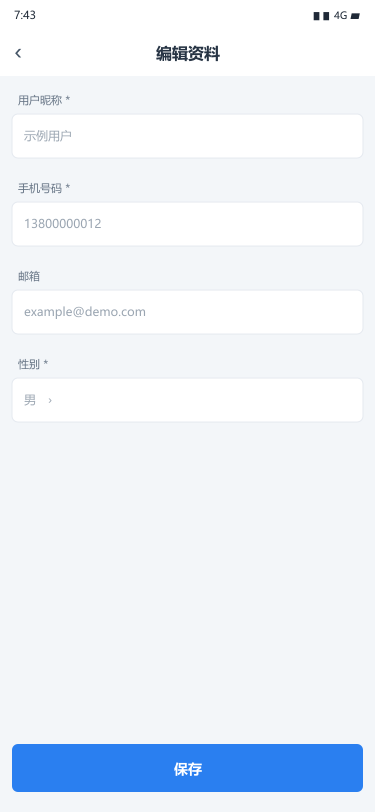

**使用者与入口**：已登录用户从 M24 点击“编辑资料”进入。

**页面区域**：用户昵称、手机号码、邮箱、性别和保存按钮；进入时带入当前值。

**使用步骤**：修改可编辑字段 → 点击“保存” → 校验通过后提交 → 成功返回 M24，并同步刷新 M11 的昵称和资料摘要。

**校验与异常**：昵称、手机号和性别必填；手机号、邮箱按格式校验；手机号已被使用时明确提示；没有任何变更时保存按钮禁用；网络失败保留输入，重复点击只产生一次更新。

**退出规则**：存在未保存修改时，返回操作提示“放弃修改/继续编辑”。

### 14.27 M26 修改密码

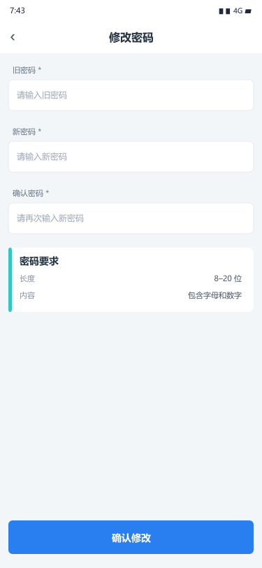

**使用者与入口**：已登录用户从 M11 或 M27 进入。

**页面区域**：旧密码、新密码、确认密码、密码要求说明和“确认修改”按钮；三个密码字段默认隐藏，可分别切换可见性。

**使用步骤**：输入旧密码 → 输入符合规则的新密码 → 再次确认 → 点击“确认修改” → 二次确认 → 修改成功后清除登录状态并进入 M00。

**校验与异常**：旧密码必须正确；新密码为 8–20 位并包含字母和数字，不能与旧密码相同；两次新密码必须一致；错误提示对应到具体字段。提交失败不记录明文密码，连续失败达到安全阈值时限制重试并提示剩余等待时间。

### 14.28 M27 应用设置

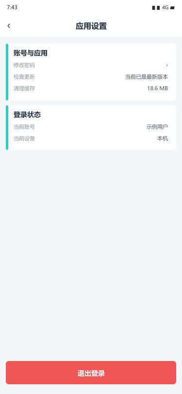

**使用者与入口**：已登录用户从 M11“设置”进入。

**页面区域**：修改密码、检查更新、清理缓存、当前账号、当前设备和退出登录。

**交互逻辑**：修改密码进入 M26；检查更新展示当前版本和更新结果；清理缓存先显示可释放空间并确认，完成后刷新容量；退出登录二次确认后清除本机令牌和敏感缓存，进入 M00。

**状态与异常**：检查更新和清理缓存期间显示进度并禁止重复触发；网络不可用时说明无法检查更新；清理缓存不删除未提交草稿和业务数据；退出失败仍清除本机登录状态，并在后台记录服务端令牌失效重试。

### 14.29 M28 常见问题

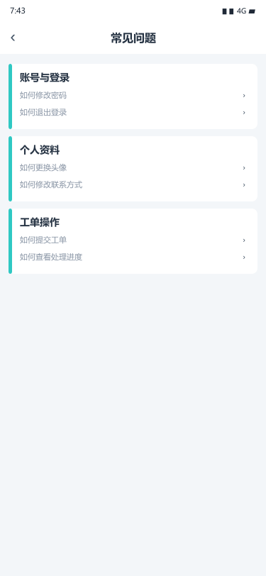

**使用者与入口**：所有用户可从 M11 进入；登录页也可提供无需登录的基础帮助入口。

**页面区域**：账号与登录、个人资料、工单操作等主题分组，每个条目显示问题标题和进入箭头。

**交互逻辑**：点击问题进入 M31 文本内容页；返回后保持原滚动位置；可按需要增加关键词搜索，搜索结果仍按问题条目进入正文。

**空与异常**：帮助内容加载失败时展示重试和服务联系方式；没有匹配结果时提供“清除搜索”；需要在线处理的问题可跳转 M30 受信任网页或调用客服联系方式。

### 14.30 M29 关于

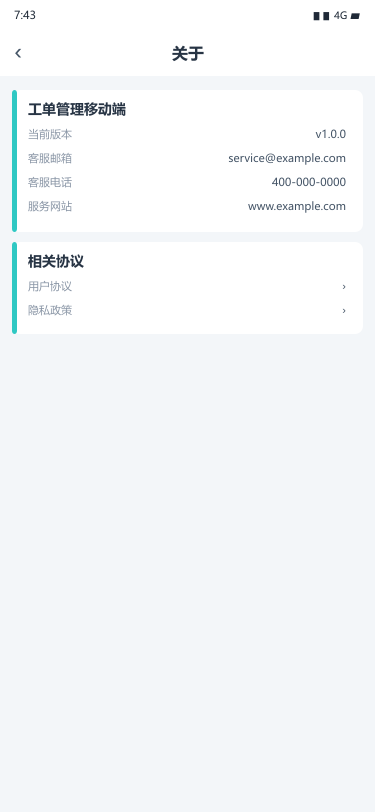

**使用者与入口**：用户从 M11 或 M27 进入，用于查看应用和服务信息。

**页面区域**：应用名称、当前版本、客服邮箱、客服电话、服务网站、用户协议和隐私政策。

**交互逻辑**：点击客服电话先确认再调用系统拨号；点击邮箱调用系统邮件应用；网站、用户协议和隐私政策进入 M30。复制联系方式时给出成功反馈。

**安全与异常**：协议和网站只加载配置的受信任地址；当前版本读取失败时显示“未知”并允许检查更新；联系方式缺失时不展示不可用入口。

### 14.31 M30 网页内容

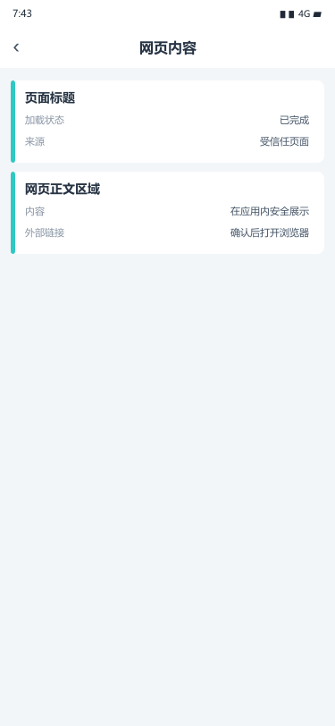

**适用范围与入口**：用于用户协议、隐私政策、服务网站和需要在线展示的帮助内容，由 M28/M29 或其他受控入口打开。

**页面区域**：导航标题、加载进度、网页正文区域、加载失败提示和返回按钮。标题优先使用业务配置，网页标题仅作为补充。

**交互逻辑**：应用内打开受信任地址；点击外部链接时显示目标域名并确认后调用系统浏览器；返回优先执行网页历史后退，无历史时退出本页。

**安全与异常**：仅允许 HTTPS 和域名白名单；拦截未知协议、文件下载和非授权跳转；超时或断网时提供重试；页面关闭后释放网页资源，不保留表单敏感信息。

### 14.32 M31 文本内容

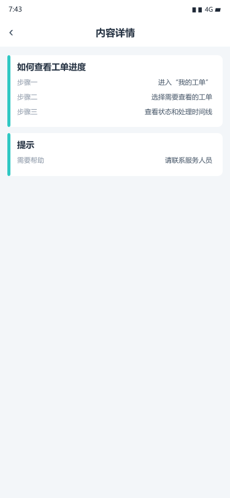

**适用范围与入口**：用于常见问题答案、操作说明、系统公告等结构化纯文本内容，通常从 M28 或消息入口进入。

**页面区域**：标题、分步骤正文、提示信息和服务联系入口；正文支持段落、编号、重点提示和可访问的链接样式。

**交互逻辑**：按页面顺序阅读并返回上一页；电话、邮箱或站内页面链接按其目标执行，外部网页统一交由 M30；长内容返回后恢复阅读位置。

**空与异常**：内容不存在时说明“内容已下线”并返回帮助列表；加载失败提供重试；正文中的脚本和不受支持标签不执行，避免不可信内容影响应用。

## 15. PC 管理端逐页 UI 与 UX 使用说明

### 15.1 P01 运营驾驶舱

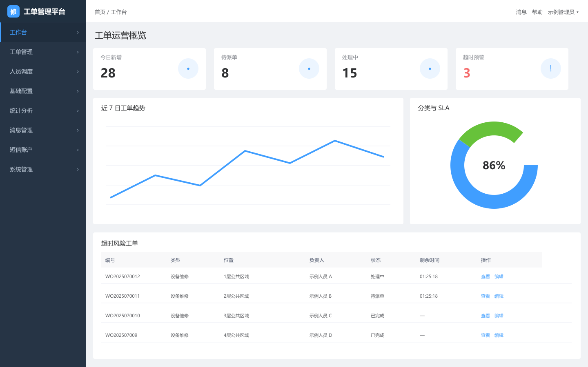

**使用者与目标**：调度主管和管理人员登录后的业务首页，用于判断当天压力、风险和人员效率。

**页面区域**：今日新增、待派单、处理中、超时预警指标卡；工单趋势；分类占比；超时风险工单列表。

**交互逻辑**：点击指标卡进入 P02 并自动带入状态；点击图表日期点过滤下方列表；时间范围默认今日，可切换周/月；超时工单点击进入 P03。

**口径提示**：每个指标提供悬停说明，明确统计范围和更新时间；数据刷新失败时保留上次时间戳，不显示假 0。

### 15.2 P02 工单列表

**使用者与目标**：管理员查询、筛选、派单和跟踪全量工单。

**页面区域**：工单号、状态、类型、时间等筛选条件；状态分段；表格；分页；新增和导出按钮。

**交互逻辑**：筛选条件写入 URL，进入详情再返回时完整恢复；点击编号进入 P03；待派单显示“派单”，已派显示“改派/催办”，关闭工单只显示“查看”；导出前显示当前筛选范围和预计条数。

**权限**：不同部门管理员只看到数据范围内的工单；无操作权限时不显示按钮，但仍由后端再次校验。

### 15.3 P03 工单详情

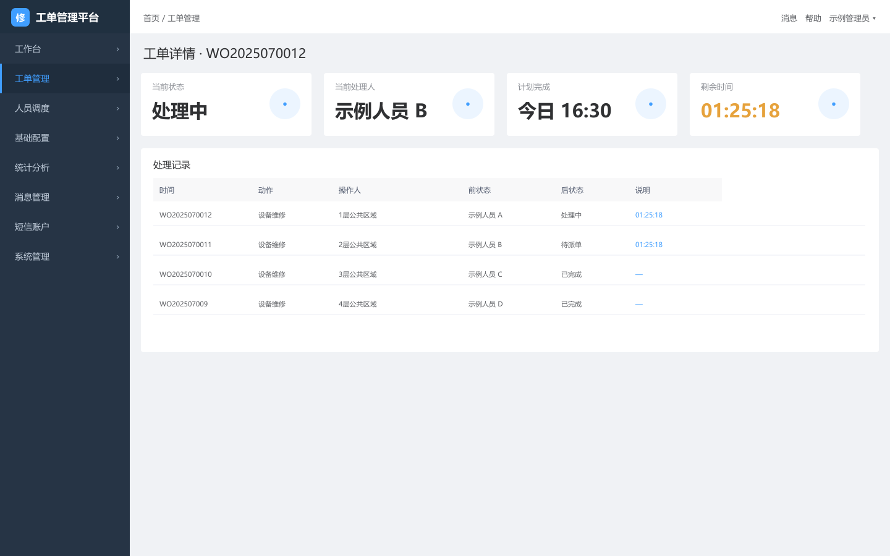

**使用者与目标**：管理员在一个页面完成诊断、跟踪和异常处理。

**页面区域**：基本信息、当前状态、SLA 卡、附件、当前处理人、完整时间线，以及催办/改派/延期审批等动作。

**交互逻辑**：时间线可展开每个动作的说明和附件；SLA 低于阈值显示橙色，已超时显示红色；改派打开 P04；延期申请出现审批卡，审批时展示旧/新截止时间。

**审计要求**：页面不提供修改历史动作的入口；所有管理动作必须填写原因并进入时间线。

### 15.4 P04 派单/改派抽屉

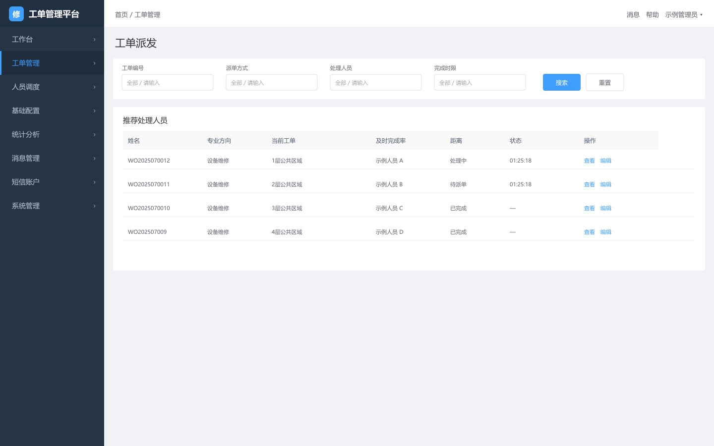

**使用者与入口**：管理员从 P02 或 P03 点击派单/改派后，在当前页面右侧打开，保持列表或详情上下文。

**页面区域**：工单摘要、派单方式、处理人员、人员推荐、完成时限、备注和确认按钮。

**交互逻辑**：选择人员后展示其状态、当前负载和同类工单表现；改派时额外显示原处理人和改派原因；提交前二次确认；成功关闭抽屉并局部刷新原页面。

**冲突**：其他管理员已处理时，抽屉停止提交并刷新工单状态，不允许覆盖。

### 15.5 P05 维修人员状态

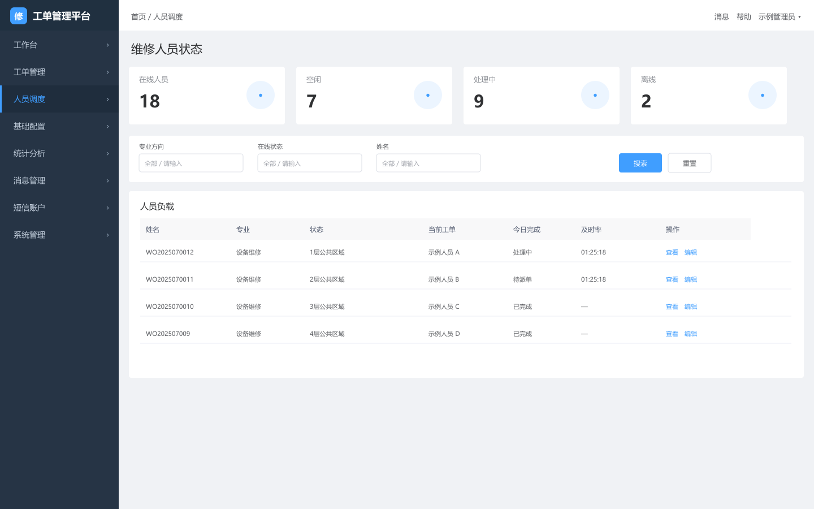

**使用者与目标**：调度员查看人员在线状态、专业、负载和服务表现，为派单提供依据。

**页面区域**：在线/空闲/处理中/离线统计，专业和状态筛选，人员卡片/列表，联系与派单动作。

**交互逻辑**：点击当前工单数打开该人员在办工单；点击派单进入工单选择或从 P04 返回；状态长时间未更新时显示“心跳过期”。

### 15.6 P06 分类与 SLA

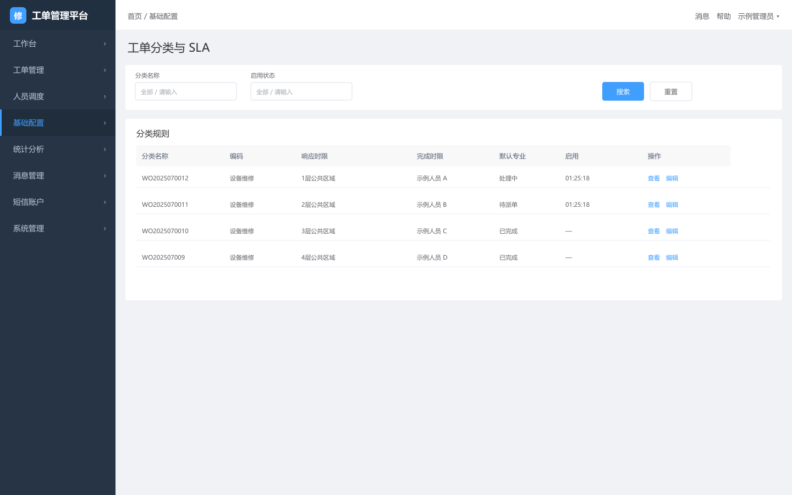

**使用者与目标**：系统管理员维护报修分类、响应时限、完成时限、默认专业和预警规则。

**交互逻辑**：新增/编辑规则时预览“某类普通工单提交于 10:00，将在何时预警和超时”；停用分类前提示仍有多少历史工单引用；修改规则只影响新工单。

**规则**：分类编码创建后不可随意更改；响应时限不能大于完成时限；规则生效时间不能与同分类、同紧急度已有规则重叠。

### 15.7 P07 报修人员管理

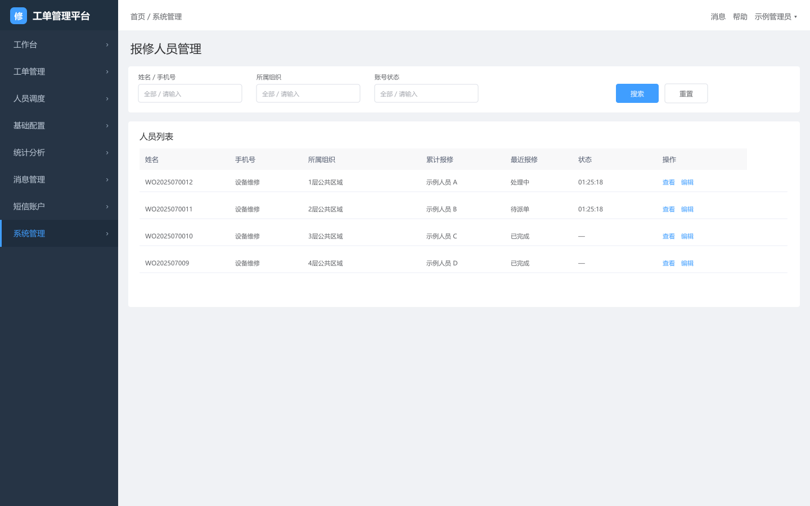

**使用者与目标**：账号管理员维护报修人员身份、组织和账号状态，并查看报修概况。

**页面区域**：姓名/手机号/组织/状态筛选，人员列表，新增、导入、编辑、重置密码和详情。

**交互逻辑**：复用若依用户管理流程；详情增加累计报修、处理中、最近报修和评价情况；停用账号前提示其未完成工单，但不删除历史记录。

### 15.8 P08 维修绩效分析

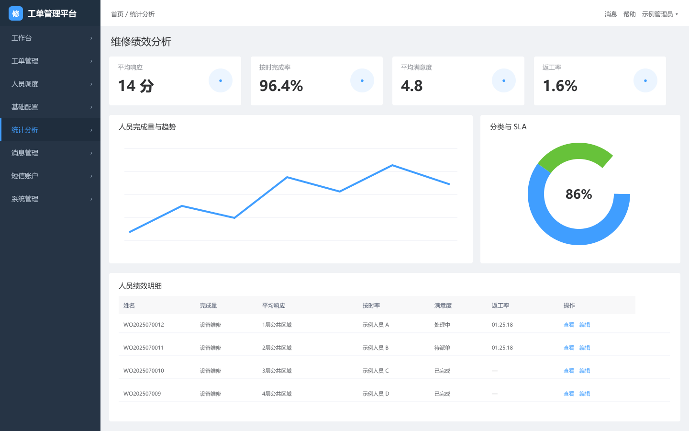

**使用者与目标**：主管按时间、组织、专业和人员评估服务效率与质量。

**指标**：完成量、平均响应时长、平均到场时长、按时完成率、满意度、返工率。每个指标明确分母、排除条件和统计时间。

**交互逻辑**：图表和明细共用筛选条件；点击人员柱状图过滤明细；导出内容与当前筛选一致；样本量过小时同时显示数量，避免只看百分比误判。

### 15.9 P09 消息模板与发送记录

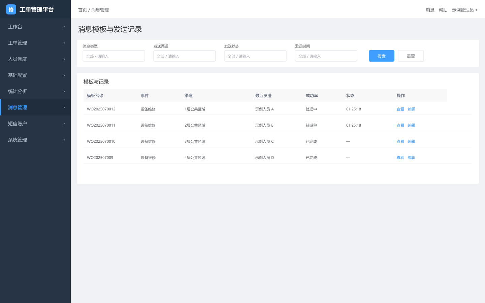

**使用者与目标**：管理员配置派单、接单、超时、延期、完工和评价通知，并追踪发送结果。

**页面区域**：模板分类树，模板编辑，变量说明，预览，发送记录，失败重试。

**交互逻辑**：保存前使用示例数据预览最终文本；不允许使用未知变量；模板停用时明确影响哪些事件；发送记录可按工单号追踪到业务详情。

### 15.10 P10 短信账户

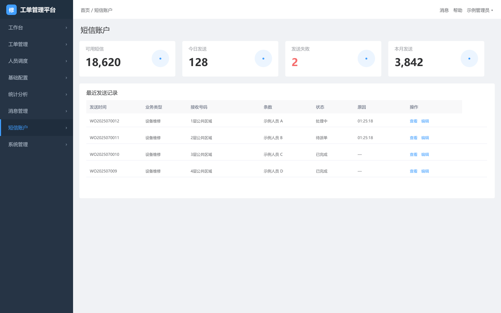

**使用者与目标**：授权管理员查看余额、失败率、供应商配置状态和发送明细。

**页面区域**：可用短信数、今日发送/失败、本月发送，余额预警和失败重试开关，供应商配置掩码，最近发送记录。

**安全与交互**：访问密钥永不明文回显；修改密钥需重新输入并二次确认；余额低于阈值时在 P01 和消息中心提醒；刷新余额失败时展示上次成功更新时间。

### 15.11 P11 延期审批

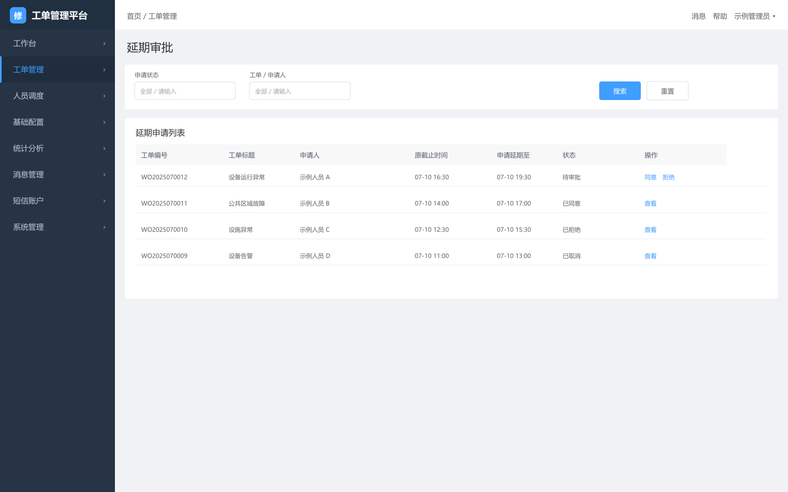

**使用者与目标**：调度管理员集中处理维修人员提交的延期申请，明确比较原截止时间、新截止时间和申请理由。

**页面区域**：申请状态筛选、工单或申请人关键字、延期申请表格、同意和拒绝动作、拒绝原因对话框及分页。

**交互逻辑**：默认显示待审批申请；查询条件同步到页面地址。点击同意先进行二次确认，成功后该行立即变为“已同意”；点击拒绝必须填写原因，未达到 2 个字符不能提交。申请已被其他管理员处理或工单已完工时，页面提示状态已变化并刷新列表。

**状态反馈**：待审批使用警示色，已同意使用成功色，已拒绝使用错误色，因工单完工自动取消的申请使用中性色。历史记录只读，不再显示审批按钮。

### 15.12 P12 SLA 规则

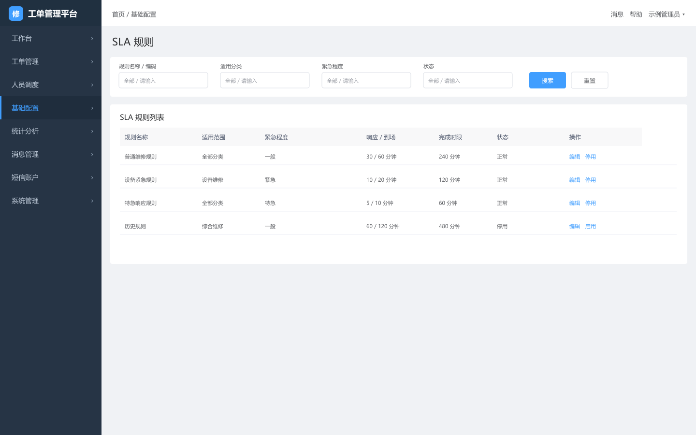

**使用者与目标**：授权管理员维护新工单使用的 SLA 匹配规则，不改变历史工单已保存的截止时间。

**页面区域**：规则名称或编码、适用分类、紧急程度和状态筛选，规则列表，新增/编辑对话框，以及启用/停用动作。

**交互逻辑**：新增时填写编码、名称、适用范围、紧急程度、优先级、生效区间、响应/到场/完成时限、预警提前量和延期许可；页面根据填写值预览截止时间。编辑时编码锁定。启用和停用都需确认；启用前如果有效期与同范围、同紧急度、同优先级规则重叠，页面展示后端返回的冲突原因并保留表单。

**历史规则**：已被工单引用的规则仍可编辑或停用，列表显示引用数量。保存只改变后续新建工单的匹配结果，已有工单继续使用创建时快照。

## 16. 跨页面 UX 规则

### 16.1 页面主动作唯一

每个状态只突出一个最需要完成的主动作：待派单突出“派单”，已接单突出“到场确认”，处理中突出“提交完工”，待确认突出“确认完工”。催办、电话、取消等保持次要层级，防止用户不知道下一步。

### 16.2 返回与现场保留

- 移动端从列表进入详情后返回，保留原分段和滚动位置。
- PC 从筛选列表进入详情后返回，保留 URL 查询条件、页码和排序。
- 表单因网络失败或误返回时提示保存草稿，避免用户重新输入。

### 16.3 消息与页面状态一致

消息只是入口，不是状态事实。用户从旧消息进入时，以最新详情状态为准；如果动作已被完成，页面展示最新结果并隐藏过期按钮。

### 16.4 多人并发

派单、接单、延期审批和完工确认可能被多人同时操作。先成功者生效；后提交者看到“状态已变化”，系统刷新页面并解释是谁在何时完成了该动作。

## 17. 客户验收场景

客户验收时不只逐页看图，应按以下脚本走完整闭环：

1. **正常闭环**：M03 提交 → M04/M05 派单 → M06/M07 接单 → M15 到场 → M16 评估 → M18 完工 → M14 确认 → M09 评价 → M10 查看。
2. **退回闭环**：完工后 M14 退回 → M07 显示原因 → 再次完工 → 再次确认。
3. **延期闭环**：M17 申请 → P11 审批 → M13/M07 同步新截止时间和审批记录。
4. **改派闭环**：P03/P04 改派 → 原人员工单移除 → 新人员收到消息 → M13 出现改派节点。
5. **超时闭环**：临近超时 → M01/P01 预警 → 催办或改派 → P08 正确统计。
6. **异常恢复**：上传失败、网络失败、重复提交、状态冲突、短信失败分别验证页面反馈和数据不重复。
7. **账户闭环**：M00 注册入口 → M22 注册 → M00 登录 → M11 → M24 查看资料 → M25 修改资料 → M23 修改头像。
8. **安全设置闭环**：M11 → M27 → M26 修改密码 → M00 重新登录；再次登录确认新密码生效、旧密码失效。
9. **帮助与协议闭环**：M11 → M28 → M31 阅读帮助；M11/M27 → M29 → M30 阅读协议并返回原页面。

只有上述九类场景都能从入口走到明确终态，并在页面状态、时间线、通知和统计中相互对应，产品才算真正闭环。
