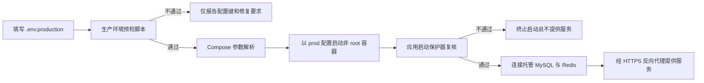

# F05 安全配置与生产参数清理节点验收清单

## 交付范围

本节点完成后端生产参数外置与启动保护、接口暴露面收口、跨域白名单、异常响应与操作日志脱敏、容器非 root 运行、生产 Compose、PC 构建参数和微信小程序生产地址校验。生产环境只部署后端应用容器，MySQL 与 Redis 使用托管服务，不建设中间件主从切换和监控平台。

本节点不包含真实托管 MySQL/Redis 连通、HTTPS 证书和反向代理部署、Docker 实机启动、微信开发者工具发行、生产数据库迁移与业务联调。这些项目进入后续全链路联调和部署演练。

## 生产启动闭环

预检脚本和应用启动保护器形成两层校验。脚本用于部署前快速发现问题，应用保护器负责最终兜底；任意一层发现缺失变量、模板占位符、弱密钥或不安全开关时都不能进入生产服务状态。

## 生产参数约束

| 配置项 | 落地要求 | 失败处理 |
|---|---|---|
| `DB_URL` | 由部署环境提供托管 MySQL JDBC 地址 | 缺失时阻断启动 |
| `DB_USERNAME` | 使用独立应用账户，禁止 `root` | 使用 root 或缺失时阻断启动 |
| `DB_PASSWORD` | 由部署凭据管理方式注入 | 缺失或保留模板占位符时阻断启动 |
| `REDIS_HOST`、`REDIS_PASSWORD` | 指向托管 Redis 并启用认证 | 缺失时阻断启动 |
| `TOKEN_SECRET` | 至少 32 位随机值，不允许示例或默认文案 | 不满足时阻断启动，错误信息不回显密钥 |
| `WORKORDER_UPLOAD_PATH` | 使用容器内绝对路径并挂载独立数据卷 | 相对路径或缺失时阻断启动 |
| `CORS_ALLOWED_ORIGINS` | 只允许明确的 HTTPS 前端来源 | 通配符、HTTP 或缺失时阻断启动 |
| Swagger、Druid、DevTools | 生产配置固定关闭 | 任一入口开启时阻断启动 |
| 应用日志级别 | 生产使用 INFO/WARN，禁止 DEBUG/TRACE | 使用调试级别时阻断启动 |

`.env` 和 `.env.production` 已纳入 Git 忽略规则，`.env.example` 只保留变量清单和占位符。生产凭据不得写入 Dockerfile、Compose、YAML、前端产物、日志、截图或工单内容。

## 接口与数据安全

- Spring Security 保留登录、注册、验证码、必要静态资源和头像公共读取；工单附件及其他 `/profile/**` 资源不再整体匿名开放。
- Swagger 与 Druid 路径按配置开关控制，生产环境固定拒绝访问。
- PC 浏览器跨域从全通配调整为明确来源、方法和请求头白名单；微信小程序原生请求继续按小程序合法域名规则访问 HTTPS 接口。
- 未知运行时异常和系统异常统一返回“系统异常，请联系管理员”，不再向客户端返回 SQL、路径、堆栈和异常原文。
- 文件上传和验证码失败使用受控提示，不回显底层库异常。
- 操作日志同时过滤请求与响应中的密码、令牌、密钥、手机号、地址、位置、工单描述、可能原因和评价内容。
- 操作失败日志只记录异常类名，不保存可能包含用户输入或数据库信息的异常消息。
- Logback 只保留一个根日志链路，生产默认写入 `/var/log/workorder`，按天滚动、限制保存天数和总容量。

## 容器与托管服务

| 项目 | 已完成结果 |
|---|---|
| 应用镜像 | 运行阶段使用固定 UID/GID 的 `workorder` 非 root 用户 |
| 文件权限 | 上传目录与日志目录只授权应用用户，分别挂载独立数据卷 |
| 根文件系统 | 生产容器只读，`/tmp` 使用受限临时文件系统 |
| Linux 权限 | 删除全部 capabilities，并启用 `no-new-privileges` |
| 端口 | 默认只绑定宿主机 `127.0.0.1:8080`，由受控反向代理转发 |
| 数据库 | 生产 Compose 不创建 MySQL，连接托管 MySQL 的独立应用账户 |
| 缓存 | 生产 Compose 不创建 Redis，连接带密码的托管 Redis |
| 本地环境 | 本地 Compose 保留 MySQL、Redis 和可选后端，端口默认只绑定回环地址 |

## 前端生产参数

### PC 端

- 开发代理目标改由 `DEV_PROXY_TARGET` 注入，只在开发环境生效。
- 生产接口继续使用同域相对路径 `/prod-api`，构建产物不包含本机或内网后端地址。
- 移除 `disableHostCheck`，避免开发服务器接受任意 Host。

### 微信小程序

- 生产发行必须配置后端、隐私政策和用户服务协议的公开 HTTPS 地址。
- 生产校验拒绝空值、示例域名、`localhost`、内网 IPv4/IPv6 和 HTTP 地址。
- 本地开发环境允许显式使用 `http://localhost:8080` 等调试地址，不阻断微信开发者工具联调。
- 配置校验只处理地址合法性，不替代微信公众平台的 request 合法域名、备案、HTTPS 证书和隐私接口审核。

## 自动化验证

| 验证项 | 结果 |
|---|---|
| 后端 Maven 全量测试 | 31 个测试套件、93 个测试通过，0 失败、0 错误、0 跳过 |
| 后端 Maven 全量打包 | 通过 |
| 生产配置保护测试 | 安全配置通过；root、模板密码、示例密钥、Swagger 和通配跨域均被拒绝；错误不回显密钥 |
| 异常响应测试 | 运行时异常中的内部消息不会返回客户端 |
| 操作日志脱敏测试 | 手机号、令牌和工单描述不会进入序列化日志 |
| 生产环境预检脚本 | 合法参数通过；root、短密钥、相对路径和通配跨域被拒绝 |
| PC `npm run build:prod` | 通过，仅保留既有资源体积和 Browserslist 数据陈旧警告 |
| 微信小程序生产配置校验 | 公开 HTTPS 地址组合通过 |
| Compose YAML 解析 | 本地与生产两个文件均通过 |
| Docker 镜像和容器实机启动 | 当前机器未安装 Docker CLI，待部署环境执行 |

## 部署验证步骤

1. 复制生产变量清单，生成不提交仓库的 `.env.production`，逐项替换占位符。
2. 执行 `check-production-env.ps1 -EnvFile .env.production`，确保预检通过。
3. 执行生产 Compose `config`，确认变量解析后再构建镜像。
4. 在托管 MySQL 按 01 至 13 的顺序执行脚本，使用非 root 应用账户验证读写权限。
5. 验证托管 Redis 密码、网络白名单、数据库索引和连接超时。
6. 启动容器，确认应用启动保护通过，上传卷和日志卷可写，根文件系统保持只读。
7. 通过 HTTPS 反向代理验证 PC 登录、接口调用、文件上传下载、跨域拒绝、Swagger 与 Druid 拒绝访问。
8. 在微信公众平台配置 request 合法域名，再使用微信开发者工具和真机完成登录与工单闭环。

## 节点结论

F05 的代码、生产配置约束、容器模板、前端参数校验和自动化验证已经完成。节点状态为“工程完成、部署验证待执行”；Docker 实机、托管服务、HTTPS 域名和微信小程序发行验证必须在后续环境中完成，不以静态解析替代真实部署验收。
