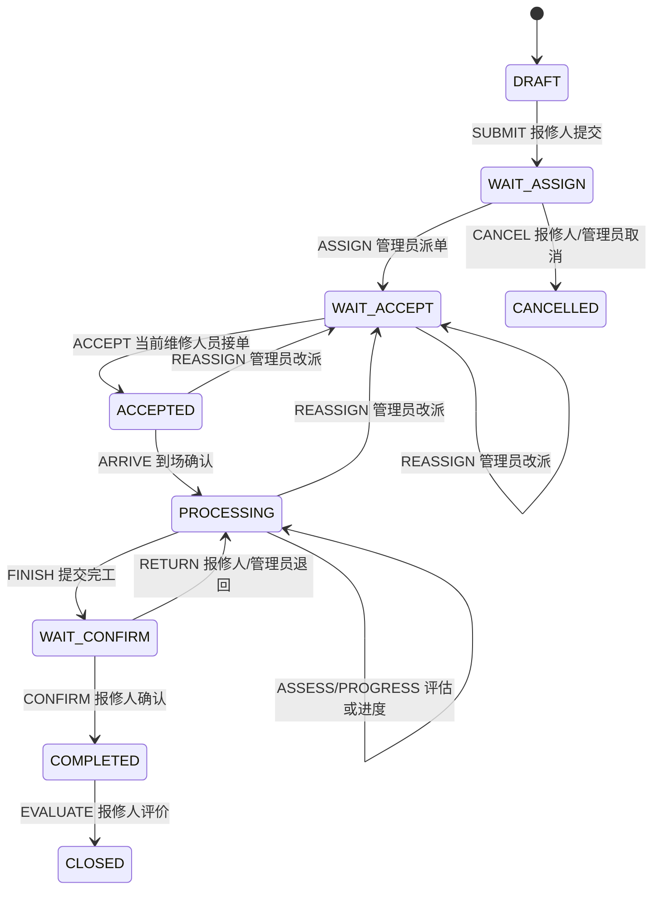

# 医院后勤工单系统 M0 范围冻结与验收清单

> 文档版本：V1.0  
> 基线状态：M0 冻结基线  
> 冻结生效日：2026-09-22  
> 第一版交付日：2026-10-07  
> 适用范围：微信小程序、PC 管理端、后台服务、数据库及第一版联调验收

## 1. 文档目的与基线规则

本文档用于锁定 2026-10-07 第一版（M1）的交付边界、角色权限、工单状态、页面与接口完成定义、验收证据和变更流程。M1 的目标不是交付全部规划功能，而是使用真实接口和真实数据库完成一张工单从报修到评价的可演示、可验证闭环。

本基线依据以下文档形成：

1. `docs/01-技术方案/技术实现方案.md`；
2. `docs/02-产品方案/产品设计方案.md`；
3. `docs/04-项目计划/项目开发计划与甘特图.md`。

基线解释规则如下：

- 本文档决定功能是否属于 2026-10-07 第一版；完整产品方案中的功能不因已设计原型而自动进入 M1。
- 已纳入 M1 的功能，状态、权限、接口和安全规则以技术方案为准，页面交互以产品方案为准。
- 本文档与上述文档出现第一版范围冲突时，以本文档为准；实现细节冲突由产品、技术负责人共同确认并按第 11 章留痕。
- 未列入“必须完成”的事项默认不属于 M1，不得以口头约定直接加入。

## 2. M0 冻结结论

### 2.1 第一版成功定义

2026-10-07 交付同时满足以下条件，才可认定 M1 达成：

1. 后端、移动端和 PC 端连接测试环境真实服务与真实数据库，核心路径不存在 Mock、随机数据、模拟成功、示例上传地址或生产回退到 Mock 的逻辑。
2. 报修人、调度管理员、维修人员三角色能够完成“提交 → 派单 → 接单 → 到场 → 处理 → 完工 → 确认 → 评价”的真实闭环。
3. 完工退回后能够再次处理、再次完工和再次确认；派单后能够按规则改派。
4. 角色数据范围、动作权限、后端状态机、幂等、乐观锁和操作日志生效，前端不能绕过后端直接决定状态迁移。
5. 本文档列出的 M1 页面与接口全部达到完成定义，验收清单中的必验项全部通过。

### 2.2 第一版必须完成

| 交付域 | 冻结范围 | M1 结果 |
|---|---|---|
| 数据与基础 | 工单业务表、附件、派单/处理/评价/动作日志相关表；字典、菜单、三角色权限和初始化数据 | 可初始化、可重复部署，核心数据真实落库 |
| 后端核心 | 创建、查询、详情、附件、取消、派单/改派、接单、到场、评估、进度、完工、确认、退回、评价、人员状态、分类配置 | 同一状态机执行，权限、幂等、并发和审计规则一致 |
| 微信小程序 | 登录、首页核心入口、报修、我的工单、进度、移动派单、维修处理、完工确认、评价 | 以 UniApp `mp-weixin` 交付，三角色可在真机完成各自核心动作 |
| PC 端 | 工单列表、详情、派单/改派、人员状态、基础分类配置 | 调度管理员可完成工单调度和基础维护 |
| 联调测试 | 正常闭环、退回闭环、改派、取消、重复提交、越权和状态冲突 | 使用固定测试账号和真实数据完成并留存证据 |

### 2.3 第一版非目标

以下事项不属于 2026-10-07 M1 验收，按项目计划在 M1 后完成；除非通过第 11 章变更审批，不得以这些事项未完成阻断 M1，也不得挤占核心闭环工期：

- 延期申请与审批、SLA 预警、超时扫描、自动关闭及 SLA 规则编辑。
- 完整站内消息、通知任务重试和真实短信验证；M1 可不以消息送达作为业务动作成功条件。
- PC 运营驾驶舱、绩效统计、报修人员管理、消息模板、发送记录和短信账户。
- 移动端工作台、独立人员状态页、消息中心、注册、个人资料、设置、帮助、协议及全部通用异常展示页。
- 原生 iOS/Android App 和生产 H5 入口；微信手机号快捷登录、OpenID 绑定、微信支付与订阅消息。
- 压测、安全专项、生产参数清理、备份恢复、部署/回滚演练和生产发布资料。
- PC 工单导出、催办及其他不影响核心状态闭环的增强动作。
- 拆分微服务、引入工作流引擎、引入消息中间件或改造若依用户、角色、部门、菜单、字典基础模型。
- 绑定特定短信供应商、对象存储品牌或扩建中间件主从、集中监控平台。

边界说明：第一版可保留 SLA 截止时间、预警/超时/延期标志等数据结构，但不以自动计算、扫描、审批和运营展示作为 M1 完成条件；`P06` 在 M1 仅验收分类配置，不验收 SLA 规则编辑。

## 3. 三角色权限冻结

权限由“菜单/接口权限 + 数据范围 + 当前状态/归属”共同决定。前端按钮隐藏只负责交互提示，后端必须再次鉴权；工单详情返回的 `allowedActions` 是页面动作展示的唯一依据。

| 角色 | 可见数据范围 | M1 允许动作 | 明确禁止 |
|---|---|---|---|
| 报修人 | 仅本人创建的工单及其附件、时间线、处理结果和评价 | 提交、查询、查看进度；待派单时取消；待确认时确认或退回；已完成时评价 | 查看他人工单；派单/改派；接单、到场、处理；代替管理员配置 |
| 维修人员 | 仅当前分配给本人或本人已处理且仍有查看权限的工单 | 查看本人任务；接单、到场、评估、更新进度、提交完工；更新本人空闲/忙碌/离线状态 | 修改他人工单；越过接单/到场步骤直接完工；代替报修人确认或评价；修改历史记录 |
| 调度管理员 | 仅授权院区/部门数据范围内的工单、人员状态和基础分类 | 查询工单池和详情；派单、改派；取消待派单工单；在待确认环节按规则退回；查看人员负载；维护基础分类 | 越权查看未授权部门数据；篡改动作日志、历史处理记录或评价；绕过状态机强制改状态 |

权限验收至少覆盖：合法角色成功、同角色越权数据被拒绝、错误角色动作被拒绝、过期按钮不可提交、直接调用接口不能绕过限制。

## 4. 核心状态与动作链路冻结

### 4.1 主状态

| 状态码 | 中文名称 | M1 含义 | 下一责任人 |
|---|---|---|---|
| `DRAFT` | 草稿 | 未提交的内部状态，不进入调度池 | 报修人 |
| `WAIT_ASSIGN` | 待派单 | 已提交，等待指定维修人员 | 调度管理员 |
| `WAIT_ACCEPT` | 待接单 | 已派单，等待当前维修人员接单 | 维修人员 |
| `ACCEPTED` | 已接单 | 已接单，尚未确认到场 | 维修人员 |
| `PROCESSING` | 处理中 | 已到场，正在评估、更新进度或返工 | 维修人员 |
| `WAIT_CONFIRM` | 待确认 | 已提交完工，等待核验 | 报修人 |
| `COMPLETED` | 已完成 | 已确认完工，等待评价 | 报修人 |
| `CLOSED` | 已关闭 | 已评价，业务闭环，只读 | 无 |
| `CANCELLED` | 已取消 | 派单前取消，业务终止，只读 | 无 |

`overdue_flag`、`warning_flag`、`delay_pending_flag` 与主状态正交，不得新增“处理中且超时”等组合主状态。M1 不验收这些标志的自动任务，但状态模型不得与后续实现冲突。

### 4.2 状态图

### 4.3 动作与前置条件

| 动作 | 源状态 | 目标状态 | 执行角色 | M1 必要条件 |
|---|---|---|---|---|
| `SUBMIT` | `DRAFT`/无 | `WAIT_ASSIGN` | 报修人 | 类型、位置、联系电话、说明必填；携带幂等键 |
| `CANCEL` | `WAIT_ASSIGN` | `CANCELLED` | 报修人/管理员 | 报修人只能取消本人未派单工单；记录原因和操作人 |
| `ASSIGN` | `WAIT_ASSIGN` | `WAIT_ACCEPT` | 调度管理员 | 维修人员有效且可接单；写独立派单记录 |
| `REASSIGN` | `WAIT_ACCEPT`/`ACCEPTED`/`PROCESSING` | `WAIT_ACCEPT` | 调度管理员 | 必填改派原因；保留原处理记录，更新当前处理人 |
| `ACCEPT` | `WAIT_ACCEPT` | `ACCEPTED` | 当前维修人员 | 当前处理人匹配且版本有效 |
| `ARRIVE` | `ACCEPTED` | `PROCESSING` | 当前维修人员 | 到场照片必填；记录到场时间 |
| `ASSESS` | `PROCESSING` | `PROCESSING` | 当前维修人员 | 原因、方案、预计时间必填 |
| `PROGRESS` | `PROCESSING` | `PROCESSING` | 当前维修人员 | 进度内容或附件至少一项 |
| `FINISH` | `PROCESSING` | `WAIT_CONFIRM` | 当前维修人员 | 处理结果、完工照片必填 |
| `RETURN` | `WAIT_CONFIRM` | `PROCESSING` | 报修人/管理员 | 退回原因必填；既有完工记录不可覆盖 |
| `CONFIRM` | `WAIT_CONFIRM` | `COMPLETED` | 工单创建人 | 仅本人可确认，版本有效 |
| `EVALUATE` | `COMPLETED` | `CLOSED` | 工单创建人 | 1–5 星；限一次；重复提交不得重复评价 |

所有成功动作必须在同一业务事务内提交工单变化、动作日志及必要的关联记录。非法状态、权限不足和版本冲突必须分别返回明确业务错误，不得以“操作成功”掩盖失败。

## 5. M1 接口范围

统一业务前缀为 `/workorder`；列表使用 `pageNum/pageSize`；响应沿用若依 `AjaxResult`/`TableDataInfo`。登录、字典和通用文件传输能力复用现有基础接口，不在本文档另行重定义路径，但必须满足本文档的数据权限和附件验收要求。

### 5.1 冻结接口清单

| 分组 | 方法与路径 | M1 用途 |
|---|---|---|
| 报修人 | `POST /workorder/orders` | 创建并提交，Header 携带 `Idempotency-Key` |
| 报修人 | `GET /workorder/orders/my` | 本人工单分页列表 |
| 通用详情 | `GET /workorder/orders/{id}` | 数据范围内的详情、时间线和 `allowedActions` |
| 通用附件 | `POST /workorder/attachments` | 上传临时附件并返回受控附件标识 |
| 通用附件 | `GET /workorder/attachments/{id}` | 经工单数据范围校验后预览或下载附件 |
| 报修人/管理员 | `POST /workorder/orders/{id}/cancel` | 取消待派单工单 |
| 报修人 | `POST /workorder/orders/{id}/confirm` | 确认完工 |
| 报修人/管理员 | `POST /workorder/orders/{id}/return` | 退回处理 |
| 报修人 | `POST /workorder/orders/{id}/evaluation` | 提交一次性评价 |
| 报修人/管理员 | `GET /workorder/orders/{id}/evaluation` | 查看数据范围内的评价详情 |
| 维修人员 | `GET /workorder/engineer/orders` | 当前维修人员工单分页列表 |
| 维修人员 | `POST /workorder/orders/{id}/accept` | 接单 |
| 维修人员 | `POST /workorder/orders/{id}/arrive` | 到场确认 |
| 维修人员 | `POST /workorder/orders/{id}/assessment` | 提交故障评估 |
| 维修人员 | `POST /workorder/orders/{id}/progress` | 更新处理进度 |
| 维修人员 | `POST /workorder/orders/{id}/finish` | 提交完工 |
| 维修人员 | `PUT /workorder/engineer/status` | 更新本人工作状态 |
| 调度管理员 | `GET /workorder/admin/orders` | 授权范围内工单池，多条件分页 |
| 调度管理员 | `POST /workorder/orders/{id}/assign` | 派单 |
| 调度管理员 | `POST /workorder/orders/{id}/reassign` | 改派 |
| 调度管理员 | `GET /workorder/admin/engineers` | 人员状态与负载 |
| 调度管理员 | `CRUD /workorder/categories` | 基础分类查询与维护 |

延期、驾驶舱、绩效、SLA 规则、通知模板/任务和短信账户接口不属于 M1，具体包括但不限于 `/delay-requests/**`、`/admin/dashboard`、`/admin/performance`、`/sla-rules`、`/notification-templates`、`/notification-tasks`、`/sms/account`。

### 5.2 接口完成定义（Definition of Done）

每个 M1 接口必须同时满足以下条件，才可标记“完成”：

- 已部署到联调环境并连接真实数据库；请求和响应中无硬编码业务数据。
- 接口文档包含方法、路径、请求字段、响应示例、权限标识、数据范围、允许源状态、错误码和幂等要求。
- 参数、必填证据和状态前置条件在后端校验；前端校验不能替代后端校验。
- 查询接口在模块内校验数据范围；动作接口同时校验角色、归属、状态和版本。
- 命令接口携带并正确处理幂等键；同一用户、同一命令、同一幂等键重放返回首次结果，不重复写业务数据和日志。
- 状态更新使用乐观锁；并发冲突不覆盖先成功结果，返回 `WO_VERSION_CONFLICT` 或等价明确错误。
- 非法状态返回 `WO_STATE_CONFLICT`，权限不足返回 `WO_FORBIDDEN`；前端可据此给出可理解提示。
- 成功动作可在动作日志中查询到工单、动作、前后状态、操作人、时间、来源和原因。
- 附件上传后与工单或过程记录正确绑定；查看/下载经过业务鉴权，不暴露公开原始存储地址。
- 已完成接口至少通过正常、参数错误、越权、非法状态、重复提交和并发冲突测试，并留存测试证据。

## 6. M1 页面范围

### 6.1 移动端页面

| 页面编号 | 页面 | M1 必须能力 | 边界说明 |
|---|---|---|---|
| M00 | 登录 | 真实登录、错误反馈、登录态进入对应角色入口 | 注册不在 M1 |
| M01 | 首页看板 | 展示真实核心待办/数量和角色化快捷入口 | 不验收 SLA 预警与完整运营指标 |
| M03 | 工单提交 | 类型、位置、电话、说明、附件、幂等提交；成功进入详情 | 不得模拟上传或提交成功 |
| M12 | 我的工单 | 本人工单分页、状态展示、搜索/刷新、进入详情 | 仅本人数据 |
| M13 | 工单进度 | 状态、处理人、附件、完整时间线及当前允许动作 | 延期节点仅在后续能力上线后展示 |
| M04 | 派单列表 | 待派/已派真实列表、筛选、进入详情 | 仅调度管理员可见 |
| M05 | 派单详情 | 查看工单与附件，选择有效维修人员并二次确认派单 | M1 使用内嵌人员选择器，不要求独立 M19 |
| M06 | 处理列表 | 当前维修人员待处理/执行中/已完成工单 | 不得看到他人任务 |
| M07 | 处理详情 | 根据 `allowedActions` 展示接单、到场、评估、进度、完工/返工入口 | 不包含延期申请入口 |
| M15 | 到场确认 | 到场照片、位置/时间信息和防重复提交 | 到场照片必填 |
| M16 | 故障评估 | 故障原因、处理方案、预计完成时间 | 延期提示不作为 M1 验收项 |
| M18 | 完工提交 | 结果、完工照片、材料/建议信息和现场清理确认 | 成功后进入待确认 |
| M14 | 完工确认 | 查看完工证据，确认或填写原因退回 | 双动作均需真实生效 |
| M08 | 评价列表 | 待评价/已评价真实列表和入口 | 无重复评价入口 |
| M09 | 评价表单 | 1–5 星、文本、一次性提交 | 重放不产生第二条评价 |
| M10 | 评价详情 | 只读展示真实评价及完成信息 | 不提供再次编辑 |

### 6.2 PC 管理端页面

| 页面编号 | 页面 | M1 必须能力 | 边界说明 |
|---|---|---|---|
| P02 | 工单列表 | 授权范围分页、筛选、状态、进入详情；按状态显示派单/改派 | 导出不属于 M1 |
| P03 | 工单详情 | 基本信息、当前状态、附件、处理人、完整时间线和改派入口 | 催办、延期审批、SLA 预警不属于 M1 |
| P04 | 派单/改派抽屉 | 人员状态/负载、派单或改派、原因、二次确认、冲突刷新 | 提交成功局部刷新原页面 |
| P05 | 维修人员状态 | 真实在线/空闲/忙碌/离线状态、负载和筛选 | 绩效指标不作为 M1 门槛 |
| P06 | 分类与 SLA | 仅验收分类查询、新增、编辑、启停及引用保护 | SLA 规则编辑顺延至 M1 后 |

### 6.3 页面完成定义（Definition of Done）

每个 M1 页面必须同时满足以下条件，才可标记“完成”：

- 页面已接入冻结清单中的真实接口和真实数据，删除对应 Mock、随机数、`setTimeout` 模拟成功及示例地址。
- 页面状态名称、颜色和后端状态码映射一致；动作按钮完全依据后端 `allowedActions` 和前端权限指令展示。
- 列表具备加载、分页/刷新、空数据、请求失败和返回现场保留；PC 筛选条件写入 URL 并可恢复。
- 表单具备必填/格式校验、提交中禁用、重复点击保护、成功反馈、失败保留输入和可重试能力。
- 409 或业务状态/版本冲突时停止覆盖提交，刷新最新详情并提示“工单已被其他操作更新”或等价明确文案。
- 权限不足时不展示不可执行动作；直接访问无权页面时给出说明并返回可访问入口。
- 附件支持上传进度、单项失败重试、预览和鉴权访问；到场和完工必填证据不可绕过。
- 移动端返回列表保留分段、筛选和滚动位置；PC 从详情返回保留查询、页码和排序。
- 页面在约定基准尺寸可用：移动端 375px（适配 320–430px），PC 1440×900（最低 1280px）。
- 移动端能够构建为 `mp-weixin`，开发者工具开启合法域名校验后无阻断错误，并在 iOS、Android 真机验证安全区、导航、输入、上传和权限拒绝恢复。
- 产品、开发、测试使用真实测试账号完成页面冒烟并留存截图或录屏；不存在阻断主流程的 P0/P1 缺陷。

## 7. 数据、审计与质量底线

- Redis 只用于缓存/限流，不作为工单状态事实源；数据库是状态事实源。
- 工单主表必须有版本号并以状态 + 版本条件更新，禁止“先查后无条件覆盖”。
- 派单、改派、到场、评估、进度、完工、退回、确认、评价分别留痕；返工不得覆盖首次完工记录。
- 动作日志不可由页面编辑或物理删除，至少记录动作人、时间、前后状态和原因。
- 手机号、地址、故障说明按敏感数据处理；日志不得打印 JWT、密钥和完整敏感请求体。
- 附件访问必须经过工单数据权限校验；无权用户即使持有附件标识也不能访问。
- M1 核心页面和接口不得保留生产 Mock 回退；业务失败不得伪装为成功。

## 8. M0 验收清单

下列事项全部确认后，M0 可关闭：

| 编号 | 检查项 | 通过标准 | 结果 |
|---|---|---|---|
| M0-01 | 第一版范围 | 第 2、5、6 章已由产品、技术、测试共同评审 | □通过 □不通过 |
| M0-02 | 非目标 | 第 2.3 节已确认，未将 M1 后能力作为 10 月 7 日隐含门槛 | □通过 □不通过 |
| M0-03 | 三角色权限 | 数据范围、允许动作和禁止动作无未决冲突 | □通过 □不通过 |
| M0-04 | 状态机 | 主状态、动作、前置条件和退回/改派分支已锁定 | □通过 □不通过 |
| M0-05 | 接口清单 | M1 接口路径、调用方和完成定义可用于联调排期 | □通过 □不通过 |
| M0-06 | 页面清单 | 移动端与 PC 页面编号、能力和延期项已锁定 | □通过 □不通过 |
| M0-07 | 验收环境 | 三角色测试账号、测试数据库、附件存储和基础字典责任人已明确 | □通过 □不通过 |
| M0-08 | 变更规则 | 所有参与方接受第 11 章，不再以口头方式增加 M1 范围 | □通过 □不通过 |
| M0-09 | 小程序发布基线 | `mp-weixin` 构建链路、AppID 责任人、合法域名、隐私指引、真机范围和提审材料已锁定 | □通过 □不通过 |

## 9. 2026-10-07 第一版验收清单

### 9.1 环境与数据

| 编号 | 验收项 | 通过标准 | 证据 | 结果 |
|---|---|---|---|---|
| A-01 | 环境可用 | 微信小程序体验版、PC、后端、MySQL 和附件存储可访问，版本号可追溯 | 小程序构建号/部署记录 | □通过 □不通过 |
| A-02 | 初始化 | 业务表、字典、菜单、权限和基础分类脚本可在干净环境执行 | 脚本日志 | □通过 □不通过 |
| A-03 | 真实数据 | 核心页面全部读取真实数据库，无 Mock 与模拟成功 | 检查记录 | □通过 □不通过 |
| A-04 | 测试账号 | 报修人、维修人员、调度管理员账号及数据范围互相隔离 | 账号清单/截图 | □通过 □不通过 |

### 9.2 核心业务闭环

| 编号 | 验收项 | 通过标准 | 证据 | 结果 |
|---|---|---|---|---|
| B-01 | 正常闭环 | M03 提交 → M04/M05 或 P02/P04 派单 → M06/M07 接单 → M15 到场 → M16/M07 处理 → M18 完工 → M14 确认 → M09 评价 → M10 查看，最终状态 `CLOSED` | 录屏、工单号、数据库记录 | □通过 □不通过 |
| B-02 | 退回闭环 | `WAIT_CONFIRM` 退回至 `PROCESSING`，显示退回原因；再次完工与确认成功，首次完工记录保留 | 录屏/时间线 | □通过 □不通过 |
| B-03 | 改派 | 在允许状态改派，原因必填；当前处理人更新，原派单历史保留，新人员可接单 | 录屏/派单记录 | □通过 □不通过 |
| B-04 | 取消 | 本人或管理员可取消待派单工单；派单后报修人不能取消 | 接口记录/截图 | □通过 □不通过 |
| B-05 | 评价唯一 | 仅创建人可对已完成工单评价一次；重复提交不新增评价 | 接口与数据库记录 | □通过 □不通过 |

### 9.3 权限、并发与审计

| 编号 | 验收项 | 通过标准 | 证据 | 结果 |
|---|---|---|---|---|
| C-01 | 报修人数据范围 | 无法查看、确认、退回或评价他人工单及附件 | 测试报告 | □通过 □不通过 |
| C-02 | 维修人员数据范围 | 非当前处理人无法执行接单、到场、处理和完工 | 测试报告 | □通过 □不通过 |
| C-03 | 管理员数据范围 | 只能查看和操作授权组织范围内工单 | 测试报告 | □通过 □不通过 |
| C-04 | 幂等 | 创建、派单、完工、确认、评价重复提交均不产生重复业务记录 | 接口测试/数据库记录 | □通过 □不通过 |
| C-05 | 并发冲突 | 两个并发状态命令仅一个成功，后提交者收到冲突并刷新最新状态 | 并发测试记录 | □通过 □不通过 |
| C-06 | 非法迁移 | 跳过必要步骤或使用过期状态提交均被后端拒绝 | 接口测试记录 | □通过 □不通过 |
| C-07 | 操作审计 | 所有核心动作可查到动作人、时间、前后状态和原因 | 日志/数据库截图 | □通过 □不通过 |
| C-08 | 附件鉴权 | 无权用户不能通过附件标识或地址读取附件 | 安全测试记录 | □通过 □不通过 |

### 9.4 页面与接口完成度

| 编号 | 验收项 | 通过标准 | 证据 | 结果 |
|---|---|---|---|---|
| D-01 | 微信小程序页面 | 第 6.1 节 16 个页面全部达到第 6.3 节完成定义，并通过开发者工具和 iOS/Android 真机冒烟 | 页面清单/真机录屏 | □通过 □不通过 |
| D-02 | PC 页面 | P02–P06 按各自 M1 边界达到第 6.3 节完成定义 | 页面清单/录屏 | □通过 □不通过 |
| D-03 | 接口契约 | 第 5.1 节接口全部达到第 5.2 节完成定义 | 接口文档/测试报告 | □通过 □不通过 |
| D-04 | 状态一致 | 移动端、PC、接口响应、数据库和时间线对同一工单状态一致 | 对照记录 | □通过 □不通过 |
| D-05 | 错误恢复 | 参数错误、网络失败、上传失败、重复点击和状态冲突均有明确反馈且数据不重复 | 异常测试录屏 | □通过 □不通过 |
| D-06 | Mock 清理 | 无随机数、模拟成功、示例地址和核心流程 Mock 回退 | 代码检查/构建记录 | □通过 □不通过 |

### 9.5 M1 放行规则

M1 仅在以下条件全部满足时放行：

1. A、B、C、D 类必验项全部通过；
2. 无未关闭 P0、P1 缺陷；P2 缺陷已有负责人、处理计划且不影响核心闭环；
3. 正常闭环、退回闭环和权限/并发用例均有可追溯证据；
4. 产品负责人、技术负责人和测试负责人共同签署验收结论。

任何一项必验项不通过，结论只能为“有条件不通过”或“不通过”，不得以演示页面、口头承诺或后续补测代替。

## 10. 交付物清单

2026-10-07 验收时至少提交：

- 可追溯的后端、微信小程序 `mp-weixin` 和 PC 端构建版本及部署记录；
- M1 数据库增量脚本、字典/菜单/权限及初始化数据脚本；
- M1 接口文档、错误码、权限和状态说明；
- 页面与接口完成清单，标明负责人、联调状态和验收结果；
- 核心闭环、权限、幂等、并发和附件鉴权测试报告；
- 已知问题清单及 P2 遗留项处理计划；
- 本文档第 9 章签署后的验收记录。

## 11. 变更控制

### 11.1 冻结后变更原则

- 2026-09-22 起，任何新增页面、接口、状态、角色动作、必填字段或 M1 验收门槛均视为范围变更。
- 2026-09-25 后原则上不增加核心流程之外的新需求；新需求默认进入 M1 后版本。
- 缺陷修复不属于范围新增；但改变已冻结业务规则、状态流或验收口径的“缺陷”必须按变更处理。
- 不允许以群聊、口头通知、原型临时改图或代码已实现为由跳过审批。

### 11.2 变更申请最小内容

每项变更必须形成唯一编号的变更单，至少包含：

| 字段 | 要求 |
|---|---|
| 变更编号 | 建议格式 `M0-CR-YYYYMMDD-序号` |
| 变更内容 | 说明新增、删除或修改的页面、接口、状态、字段和验收项 |
| 业务原因 | 说明不变更的业务影响及是否阻断核心闭环 |
| 影响分析 | 后端、移动端、PC、数据库、测试、排期、风险和已有数据影响 |
| 范围置换 | 说明等量移出项；没有置换时明确里程碑顺延建议 |
| 决策 | 接受、拒绝或移至 M1 后，并记录生效日期 |
| 签署 | 产品负责人、技术负责人、测试负责人；影响日期时增加项目负责人 |

### 11.3 审批与落基线

1. 提出人登记变更单，不直接修改 M1 承诺。
2. 技术与测试在一个工作日内给出影响评估；涉及状态或权限时必须补充迁移与回归范围。
3. 产品、技术、测试共同决策；任何一方认为会破坏核心闭环或无法按期验证时，默认顺延至 M1 后。
4. 批准后同步更新本文档相关章节、接口文档、页面清单、测试用例和项目计划，并记录版本号和变更摘要。
5. 未批准或未完成基线更新的需求不得进入 M1 验收环境。

### 11.4 变更记录

| 版本 | 日期 | 变更编号 | 变更摘要 | 决策人 |
|---|---|---|---|---|
| V1.0 | 2026-09-22 | 初始基线 | 冻结 2026-10-07 第一版范围、权限、状态、页面、接口和验收口径 | 待签署 |

## 12. 签署确认

| 角色 | 姓名 | 结论 | 日期 | 备注 |
|---|---|---|---|---|
| 产品负责人 |  | □同意 □不同意 |  |  |
| 技术负责人 |  | □同意 □不同意 |  |  |
| 测试负责人 |  | □同意 □不同意 |  |  |
| 项目负责人 |  | □同意 □不同意 |  |  |

签署即表示各方接受本文档作为 2026-10-07 第一版的唯一范围与验收基线；后续调整必须按第 11 章执行。

## 13. 当前工程执行记录

| 工作项 | 当前状态 | 已形成证据 | 关闭条件 |
|---|---|---|---|
| M1 范围、状态和三角色权限 | 技术基线完成 | 本文档第 2–7 章 | 产品、技术、测试完成第 12 章签署 |
| 后端模块与状态机 | 工程基线完成 | `ruoyi-workorder` 模块、状态枚举、迁移规则和领域测试 | 后续接口必须只通过该状态机执行迁移 |
| 数据库初始化 | 静态复核完成 | `03`–`07` 初始化脚本、9 张核心表、字典、菜单、角色与种子数据 | 在干净 MySQL 8 环境执行并留存日志 |
| 微信小程序平台基线 | 约束与首批兼容修复完成 | 小程序适配基线、全平台启动登录、H5 DOM 隔离、上传登录跳转修复 | `mp-weixin` 构建、开发者工具和真机验证通过 |
| 后端构建 | 已通过 | 全量 Maven `clean package` 与状态机测试报告 | 持续集成复现相同结果 |
| M0 业务验收 | 待签署 | 第 8 章检查项 | M0-01 至 M0-09 全部通过并签署 |
