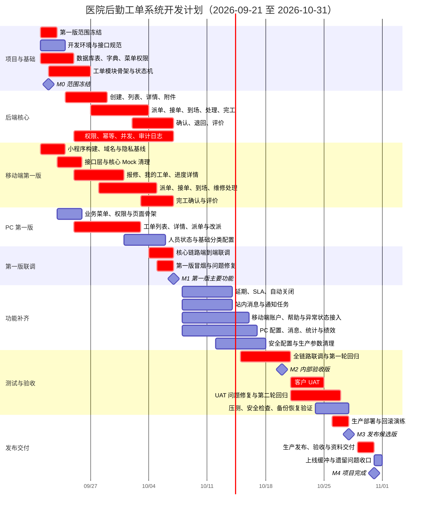

# 医院后勤工单系统项目开发计划与甘特图

> 计划周期：2026-09-21 至 2026-10-31  
> 第一版里程碑：2026-10-07  
> 项目完成里程碑：2026-10-31

## 1. 排期前提

- 以当前综合可上线完成度约 15%–20% 为起点。
- 采用并行开发，最低人员配置为：后端 2 人、移动端 1 人、PC 端 1 人、测试/产品 1 人。
- 9 月 22 日前冻结第一版范围；9 月 25 日后不增加核心流程之外的新需求。
- 10 月 1–7 日按连续七天研发节奏执行，并在 10 月 7 日输出可演示、可使用真实数据的第一版。
- 移动端正式交付为微信小程序 `mp-weixin`；H5 仅用于开发预览，第一版必须提供体验版和真机录屏。
- 一期生产环境采用 APP、MySQL、单实例 Redis、文件/日志/备份 4 台服务器，不建设中间件主从和监控平台。

## 2. 里程碑

| 里程碑 | 日期 | 交付结果 |
|---|---|---|
| M0 范围冻结 | 09-22 | 第一版页面、接口、状态和验收口径锁定，详见 [M0 范围冻结与验收清单](M0-范围冻结与验收清单.md) |
| M1 第一版主要功能 | 10-07 | 核心工单真实闭环、移动端主要页面、PC 基础工单管理可演示 |
| M2 内部验收版 | 10-20 | 全部计划页面接入、SLA/通知/统计完成，完成首轮回归 |
| M3 发布候选版 | 10-28 | 用户验收问题关闭，压测、备份恢复和部署演练通过 |
| M4 项目完成 | 10-31 | 生产部署、验收资料、运维资料和最终版本交付 |

## 3. 项目甘特图

## 4. 第一版范围（10 月 7 日）

第一版必须使用真实接口和真实数据库，不以 Mock 页面作为完成标准。

### 4.1 必须完成

- 数据库业务表、字典、菜单、角色权限和初始化数据。
- 工单创建、列表、详情和附件上传。
- 派单、接单、到场、处理、完工、确认、退回和评价主状态链路。
- 报修人、调度管理员、维修人员三角色的数据权限和动作权限。
- 微信小程序：登录、首页、报修、我的工单、进度、派单、维修处理、完工确认和评价；体验版在 iOS/Android 真机可完成主流程。
- PC 端：工单列表、工单详情、派单/改派、人员状态和基础分类配置。
- 幂等提交、乐观锁、工单操作日志和核心错误提示。
- 主链路端到端冒烟测试，可完成一张工单从报修到评价的真实闭环。

### 4.2 第一版后完成

- 延期审批、SLA 预警、自动关闭。
- 完整站内消息、通知重试和短信验证。
- PC 驾驶舱、绩效统计、消息模板和短信账户。
- 移动端账户辅助页、帮助内容和全部异常状态。
- 压测、安全检查、生产参数、备份恢复和发布演练。

## 5. 周计划

| 周期 | 主要目标 | 周末交付 |
|---|---|---|
| 09-21～09-27 | 范围冻结、数据库、模块骨架、创建/查询接口、三端接口骨架 | 数据可落库，报修和详情开始联调 |
| 09-28～10-07 | 派单、维修、完工、确认、评价并行开发和联调 | 10 月 7 日第一版核心闭环 |
| 10-08～10-14 | 延期、SLA、消息、配置、统计和辅助页面 | 功能范围基本完整 |
| 10-15～10-20 | 全链路联调、回归、安全配置清理 | 10 月 20 日内部验收版 |
| 10-21～10-28 | 客户 UAT、缺陷修复、压测和部署演练 | 10 月 28 日发布候选版 |
| 10-29～10-31 | 生产发布、验收、资料交付和缓冲 | 10 月 31 日项目完成 |

## 6. 关键路径

关键路径为：

`数据库与状态机 → 工单核心接口 → 移动端/PC 核心页面 → 主链路联调 → 第一版 → 功能补齐 → 全量回归 → UAT → 生产发布`

以下事项延迟会直接影响 10 月 7 日第一版：

1. 工单状态和角色权限在 9 月 22 日后仍频繁变更。
2. 数据库表和核心接口在 9 月 24 日前不能稳定。
3. 前端继续保留 Mock，或微信小程序合法域名、隐私权限和真机构建链路未就绪。
4. 派单、接单、完工、确认接口未按同一状态机联调。
5. 产品验收人员不能在 10 月 5–7 日及时确认问题。

## 7. 每日协作规则

- 每日上午确认当日接口和页面交付项，下午完成联调，问题不过夜。
- 后端接口必须同时提供请求、响应、错误码、权限和允许动作说明。
- 页面接入真实接口后立即删除对应 Mock，不保留生产回退逻辑。
- 每日构建一次后端、PC 端和微信小程序 `mp-weixin` 集成包，主流程至少冒烟一次。
- P0 阻断问题当日修复；P1 问题进入当前里程碑；P2 优化项排到第一版之后。
- 10 月 21 日开始只接收缺陷和上线阻断问题，原则上不增加新功能。

## 8. 完成标准

10 月 31 日完成必须同时满足：

- 产品方案中的 32 个移动端页面和 10 个 PC 页面完成真实数据接入或明确的只读内容交付。
- 报修、派单、接单、到场、处理、延期、完工、确认、评价完整闭环通过。
- 页面不存在随机数、模拟成功、示例上传地址和生产 Mock。
- 权限、幂等、并发状态冲突、附件鉴权和操作审计通过测试。
- 120 并发和 50 QPS 基线压测通过。
- 生产配置、日志归档、数据库备份与恢复验证通过。
- 发布包、数据库脚本、配置清单、接口文档、测试报告、部署手册和验收记录齐全。

## 9. 当前节点执行状态

| 节点工作 | 状态 | 结果 |
|---|---|---|
| 第一版范围冻结 | 技术基线完成、业务签署待完成 | 页面、接口、角色、状态、非目标和验收口径已形成 M0 清单 |
| 数据库表、字典、菜单权限 | 工程完成、实库验证待执行 | 9 张核心表与 `03`–`07` 初始化脚本已落地并完成静态复核 |
| 工单模块骨架与状态机 | 工程完成 | `ruoyi-workorder` 已接入聚合构建，状态机领域测试通过 |
| 微信小程序构建基线 | 进行中 | 目标锁定为 `mp-weixin`，平台约束和首批兼容修复已落地；等待开发者工具与真机验证 |
| M1-B01 创建、查询与附件 | 工程完成、联调待执行 | 创建、我的工单、详情、分类和私有附件已接入真实接口；后端测试与打包通过，待 MySQL 8、三角色接口和小程序真机验证 |
| M1-B02 派单、接单、到场、处理与完工 | 工程完成、联调待执行 | 后端命令链路、PC 派单与小程序处理链路已接入真实接口；19 个后端测试、全量打包、PC 生产构建和小程序静态校验通过，待 MySQL 8 三角色联调及小程序正式构建与真机验证 |
| M1-B03 取消、确认、退回与评价 | 工程完成、联调待执行 | 四个状态命令、评价唯一写入与查询、PC 管理员退回及小程序确认评价闭环已落地；28 个后端测试、全量打包、PC 生产构建和小程序静态校验通过，待 MySQL 8 三角色联调及小程序正式构建与真机验证 |
| M1-B04/C01 权限审计与核心 Mock 清理 | 工程完成、联调待执行 | 移动派单/改派及首页统计已接入真实接口，评价查询权限已收紧，幂等、乐观锁、审计和角色授权契约测试已补齐；35 个后端测试、全量打包、PC 生产构建和小程序静态校验通过，待 MySQL 8 三角色联调及小程序正式构建与真机验证 |
| M0 关闭 | 待完成 | 需完成干净 MySQL 8 初始化、微信小程序构建/真机验证和三方签署 |
