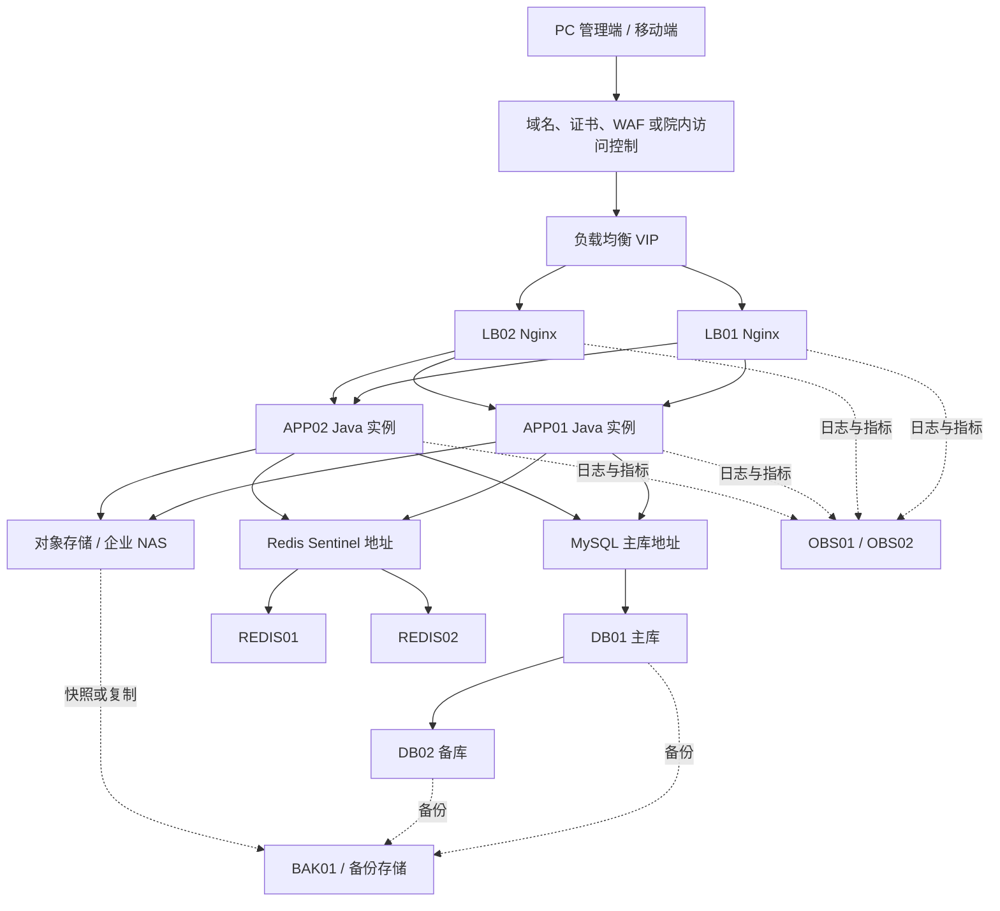

# 医院后勤工单系统生产环境服务器资源配置

> 版本：V1.0  
> 日期：2026-09-15  
> 适用规模：约 400 名注册用户，日常并发 40–80，短时峰值 120

## 1. 配置结论

生产环境采用虚拟机或云主机部署，不要求 Kubernetes。核心链路使用双实例和独立数据层：

- 入口层：2 个 Nginx 实例，通过 VIP、云负载均衡或硬件负载均衡提供统一入口。
- 应用层：2 个无状态 Java 实例，PC 静态资源由入口层托管，移动端共用同一组业务接口。
- 数据库：MySQL 8.0 主备部署，业务写入主库，备库用于容灾和备份读取。
- 缓存：2 个 Redis 数据实例，使用 3 个 Sentinel 进程完成故障发现和主从切换。
- 文件：附件存入独立对象存储或企业级 NAS，不落在应用实例本地磁盘。
- 日志监控：Prometheus、Alertmanager、Grafana、Loki 独立部署，业务故障不影响监控数据采集。
- 备份：数据库、对象存储、配置和审计数据进入独立备份节点或备份存储。

本配置支持单个入口节点或单个应用节点故障时业务继续访问；数据库故障通过主备切换恢复。目标可用性为 99.9%，容量按当前规模的 2–3 倍请求增长保留余量。

## 2. 容量口径

### 2.1 用户与请求

| 项目 | 配置口径 |
|---|---:|
| 注册用户 | 400 人 |
| 日活用户 | 200–300 人 |
| 日常并发 | 40–80 人 |
| 短时峰值并发 | 120 人 |
| 持续业务请求 | 50 QPS |
| 5 分钟突发请求 | 100 QPS |
| 同时上传附件 | 20 路 |
| 单接口性能 | 列表 P95 < 500 ms，详情 P95 < 400 ms，状态命令 P95 < 600 ms |

这里的 QPS 包含登录、列表刷新、详情、状态操作、首页统计和消息轮询，不包含图片静态下载流量。移动端应使用消息推送或合理轮询间隔，禁止所有客户端按秒刷新。

如果“400 人使用”指 400 人在同一时段持续操作，而不是 400 个注册账号，则采用高并发档：APP 扩展为 4 个 4 vCPU / 8 GB 实例，MySQL 提升为 2 个 8 vCPU / 32 GB 实例，Redis 提升为 2 个 4 vCPU / 8 GB 实例；压测口径提高到持续 150 QPS、突发 300 QPS。入口、对象存储和日志节点先保持不变，根据带宽和磁盘告警再扩容。

### 2.2 数据增长

| 数据 | 估算口径 | 首年配置 |
|---|---|---:|
| 工单结构化数据 | 100 单/日，含日志、消息、评价和状态记录 | 小于 50 GB |
| 工单附件 | 100 单/日 × 6 个附件 × 平均 2 MB | 约 440 GB/年 |
| 应用与访问日志 | 原始日志 2–3 GB/日 | 90 天热数据约 300–500 GB |
| 数据库备份 | 每日备份、周/月归档、Binlog | 预留 500 GB–1 TB |
| 附件存储 | 包含版本、缩略图和 30% 余量 | 初始 2 TB 可用容量 |

附件量取决于工单日均数量和照片清晰度。对象存储达到 70% 使用率时扩容，不等待磁盘写满。

## 3. 生产部署拓扑



网络至少划分为接入区、应用区、数据区和运维区。数据库、Redis、对象存储管理口和监控管理口不得暴露到客户端网络。

## 4. 推荐服务器资源清单

### 4.1 标准生产配置

| 节点 | 数量 | 单节点配置 | 磁盘 | 主要部署内容 | 高可用方式 |
|---|---:|---|---|---|---|
| LB01/LB02 | 2 | 2 vCPU / 4 GB | 80 GB SSD | Nginx、Keepalived、Redis Sentinel、采集代理 | VIP 或上层负载均衡 |
| APP01/APP02 | 2 | 4 vCPU / 8 GB | 120 GB SSD | Java 后端实例、采集代理 | 无状态双实例 |
| DB01/DB02 | 2 | 4 vCPU / 16 GB | 500 GB 企业级 SSD/NVMe | MySQL 8.0、数据库监控代理 | 主备复制、受控切换 |
| REDIS01/REDIS02 | 2 | 2 vCPU / 4 GB | 80 GB SSD | Redis 7、Sentinel、监控代理 | 主从复制、3 Sentinel 投票 |
| OBS01/OBS02 | 2 | 4 vCPU / 8 GB | 500 GB SSD | Prometheus、Alertmanager、Grafana、Loki | 双采集实例、共享日志存储 |
| BAK01 | 1 | 4 vCPU / 8 GB | 4 TB 备份盘 | 数据库备份、配置备份、恢复校验 | 独立故障域、可复制到异地 |
| 对象存储 | 1 套 | 托管服务或企业存储 | 初始 2 TB 可用 | 工单图片、附件、导出文件 | 多副本、版本控制、快照 |

服务器合计（不含对象存储底层节点）：36 vCPU、88 GB 内存、约 6.6 TB 本地磁盘。虚拟化平台应避免 DB01/DB02、APP01/APP02 分别落在同一物理宿主机。

生产虚拟机内存必须全额预留。数据库和 Redis 节点的 CPU 超配比例不高于 1:2，避免宿主机争用造成数据库延迟抖动。

### 4.2 磁盘要求

| 节点 | 系统盘 | 数据盘要求 |
|---|---|---|
| LB | 40–80 GB SSD | 只保留 7 天本地访问日志缓存 |
| APP | 80–120 GB SSD | 只保留临时文件、Heap Dump 和 7 天日志缓存 |
| DB | 独立系统盘优先 | 数据、Binlog、备份临时区分盘；持续 IOPS 不低于 5,000 |
| Redis | 60–80 GB SSD | AOF/RDB 持久化盘，延迟稳定，不使用网络低速盘 |
| OBS | 500 GB SSD/节点 | 日志索引和指标需要稳定随机读写 |
| BAK | 4 TB 起 | 可使用容量型磁盘，必须支持校验、快照或异地复制 |

数据库磁盘必须使用企业级 SSD 或云高性能盘，不得与大量附件共用同一卷。

### 4.3 网络与软件基线

- 节点间使用 1 Gbps 以上内网；数据库、对象存储和备份链路条件允许时使用 10 Gbps。
- 客户端入口带宽初始不低于 100 Mbps；若附件主要经公网或跨院区传输，建议 200 Mbps 起。
- APP 到 MySQL/Redis 的网络往返延迟应低于 1 ms，且不跨公网。
- 操作系统使用统一的 64 位 Linux LTS 版本，所有节点统一时区、NTP、DNS 和软件源。
- Java 保持当前工程兼容的 Java 8 维护版本；Nginx、MySQL 8.0、Redis 7 和可观测性软件使用已完成兼容测试的维护版本。
- 文件系统使用 XFS 或 ext4；进程文件句柄上限不少于 65,535。
- Redis 关闭透明大页并避免交换；MySQL 数据盘启用磁盘监控和定期文件系统检查。

### 4.4 对象存储落地方式

优先顺序如下：

1. 使用已有云对象存储或院内企业级对象存储，申请 2 TB 可用容量，启用多副本、版本控制和生命周期。
2. 使用双控制器企业 NAS，通过受控网关提供对象接口或文件接口。
3. 自建 MinIO 时使用 4 个存储节点，每节点 4 vCPU、8 GB 内存、100 GB 系统盘和至少 2 块 1 TB 数据盘；节点分布到不同宿主机。该资源不计入上表服务器合计。

单机目录、Docker 本地卷和 APP01/APP02 共享挂载目录均不能作为最终附件存储。

## 5. 节点部署与运行参数

### 5.1 入口层

- Nginx 双实例对外只开放 HTTPS，HTTP 强制跳转 HTTPS。
- PC 前端静态资源部署到两个入口节点，发布包版本保持一致。
- `/api/` 转发到 APP01/APP02，使用最少连接或轮询策略。
- 连接超时 5 秒，后端响应超时 30 秒；附件上传接口按实际大小单独配置 120 秒。
- `client_max_body_size` 配置为 100 MB，与业务附件规则保持一致。
- 对登录、验证码、导出和短信测试接口设置 IP/账号限流。
- 静态资源启用 Gzip/Brotli、强缓存和文件指纹；HTML 使用短缓存或不缓存。
- 健康检查失败的应用实例自动摘除，恢复后再加入。

建议连接参数：

| 参数 | 建议值 |
|---|---:|
| worker_processes | auto |
| worker_connections | 4096/worker |
| keepalive_timeout | 65 秒 |
| upstream keepalive | 64 |
| 普通接口限流 | 单账号 10 请求/秒，允许短时突发 20 |
| 登录接口限流 | 单 IP 5 次/分钟，账号失败策略仍由应用控制 |

### 5.2 Java 应用层

每个应用实例分配 8 GB 内存，其中 Java Heap 固定 4 GB，其余留给 Metaspace、直接内存、线程栈、文件缓存和采集代理。

推荐 JVM 参数：

```text
-Xms4g -Xmx4g
-XX:+UseG1GC
-XX:MaxGCPauseMillis=200
-XX:+HeapDumpOnOutOfMemoryError
-XX:HeapDumpPath=/data/dump
-Djava.security.egd=file:/dev/urandom
-Duser.timezone=Asia/Shanghai
```

Tomcat 参数：

| 参数 | 当前值 | 生产建议 |
|---|---:|---:|
| 最大工作线程 | 800 | 200/实例 |
| 最小空闲线程 | 100 | 20/实例 |
| 等待队列 | 1000 | 300/实例 |
| 连接超时 | 未明确 | 20 秒 |

400 人规模不需要 800 个业务线程。线程数过大会增加上下文切换和数据库连接争用，应用总吞吐应由接口耗时、数据库连接数和外部调用隔离共同控制。

应用部署要求：

- APP01/APP02 使用相同发布包和配置模板，仅实例标识不同。
- JWT、验证码、幂等键和临时状态进入 Redis，应用实例不保存本地会话。
- 工单附件通过对象存储适配器上传，不写入 `WORKORDER_UPLOAD_PATH` 本地持久目录。
- 短信发送、通知重试和导出任务使用独立线程池，不能占满 Tomcat 请求线程。
- 增加健康检查、数据库连接状态、Redis 状态和磁盘可写检查。
- 启用优雅停机，发布时先从负载均衡摘除，再等待在途请求完成。

### 5.3 数据库连接池

APP01/APP02 每实例建议：

| Druid 参数 | 建议值 |
|---|---:|
| initialSize | 5 |
| minIdle | 10 |
| maxActive | 30 |
| maxWait | 3,000 ms |
| connectTimeout | 5,000 ms |
| socketTimeout | 15,000 ms |
| validationQuery | `SELECT 1` |
| testWhileIdle | true |

两个应用实例最多占用 60 个业务连接。MySQL `max_connections` 建议 200，为运维、备份、监控和临时任务保留连接。连接池等待超过 3 秒应快速失败并告警，不能排队 60 秒拖垮请求线程。

## 6. MySQL 配置

### 6.1 版本与拓扑

- 使用 MySQL 8.0 的当前维护小版本，主备版本完全一致。
- DB01 为主库，DB02 为热备库，使用 GTID、ROW Binlog 和复制延迟监控。
- 应用只配置数据库访问地址，不直接写死 DB01 IP；切换通过数据库代理、DNS 或配置中心完成。
- 备库默认只读，不直接承担业务报表，避免报表负载影响复制。
- 自动切换必须经过故障确认和防脑裂控制；没有成熟高可用平台时采用告警加受控人工切换。

### 6.2 关键参数

| 参数 | 建议值 |
|---|---|
| innodb_buffer_pool_size | 10 GB 左右（16 GB 内存节点） |
| max_connections | 200 |
| binlog_format | ROW |
| sync_binlog | 1 |
| innodb_flush_log_at_trx_commit | 1 |
| slow_query_log | ON |
| long_query_time | 1 秒 |
| binlog_expire_logs_seconds | 30 天 |
| character_set_server | utf8mb4 |
| collation_server | utf8mb4_unicode_ci 或项目统一规则 |
| time_zone | `+08:00` |

数据库账号至少拆分为应用账号、只读查询账号、备份账号和运维账号。应用账号不能拥有 `DROP USER`、`GRANT`、全库 `SUPER` 等管理权限。

### 6.3 索引与归档

- 工单列表索引围绕 `status`、`reporter_id`、`assignee_id`、`dept_id`、`create_time` 和工单号建立。
- 状态流转、通知任务和操作日志按时间字段建立组合索引，避免 SLA 扫描全表。
- 大附件只保存对象键、摘要、大小和业务关联，不写入 BLOB。
- 操作日志和消息记录超过年度保留周期后按月归档；归档前完成客户审计要求确认。
- 每月检查慢 SQL、无效索引、表增长和碎片，不在高峰期执行大表 DDL。

## 7. Redis 配置

### 7.1 拓扑

- REDIS01/REDIS02 组成一主一从。
- Sentinel 至少运行 3 个独立进程，可分布在 LB01、LB02 和 OBS01，避免两个投票者同时故障。
- 应用通过 Sentinel 服务名连接，不写死主节点地址。
- Redis 只保存可重建的缓存、令牌、验证码、限流计数和短期幂等数据；工单事实状态仍以 MySQL 为准。

### 7.2 参数

| 参数 | 建议值 |
|---|---|
| maxmemory | 2.5 GB/节点 |
| maxmemory-policy | noeviction |
| appendonly | yes |
| appendfsync | everysec |
| save | 保留合理 RDB 周期 |
| tcp-keepalive | 60 秒 |
| timeout | 0，由客户端池控制 |

所有临时键必须设置 TTL。内存达到 70% 告警、85% 严重告警；`noeviction` 可以避免令牌、锁和幂等键被静默淘汰，容量不足时通过扩容和清理无 TTL 键处理。

每个应用实例 Redis 连接池建议 `min-idle=4`、`max-idle=16`、`max-active=32`、`max-wait=1s`。

## 8. 附件与导出文件

- 上传文件先进行后缀、MIME、文件头、大小和病毒扫描校验。
- 对象键使用环境、业务日期、工单 ID 和随机文件 ID 组成，不使用原始文件名作为唯一键。
- 数据库只保存对象键、文件名、大小、摘要、上传人、上传阶段和时间。
- 下载前进行工单数据权限校验，再签发 5–10 分钟有效的临时地址。
- 对象存储启用服务端加密、版本控制、生命周期和删除保护。
- 临时上传对象 24 小时未绑定业务记录时自动清理；已绑定附件按业务保留规则处理。
- 导出文件默认 24 小时过期，下载次数和导出操作进入审计记录。

当附件经应用转发时，Nginx、Spring `max-file-size`、`max-request-size` 和接口超时必须一致。更推荐客户端获取上传凭证后直传对象存储，应用只完成授权和元数据确认。

## 9. 日志、指标与告警

### 9.1 可观测性部署

| 模块 | 部署位置 | 用途 |
|---|---|---|
| Prometheus | OBS01/OBS02 | 采集主机、JVM、MySQL、Redis、Nginx 和业务指标 |
| Alertmanager | OBS01/OBS02 | 告警分组、抑制、通知和升级 |
| Grafana | OBS01/OBS02 | 运维看板、业务看板和日志关联 |
| Loki | OBS01/OBS02 | 集中存储和检索应用、访问、错误日志 |
| Promtail/采集代理 | 所有业务节点 | 采集文件或容器标准输出并补充实例标签 |
| Exporter/Micrometer | 对应节点/应用 | 暴露系统和应用指标 |

应用增加 `traceId` 并贯穿 Nginx、Controller、工单模块、数据库慢查询和通知任务。日志使用结构化 JSON，至少包含时间、级别、实例、traceId、用户 ID、工单 ID、动作、结果、耗时和错误码。

日志中禁止出现密码、JWT、验证码、密钥、完整手机号、完整身份证号、附件临时签名地址和完整请求体。手机号只保留必要掩码。

### 9.2 保留周期

| 数据 | 在线检索 | 归档 |
|---|---:|---:|
| 应用 INFO/ERROR 日志 | 90 天 | 需要时保留 180 天 |
| Nginx 访问与安全日志 | 180 天 | 1 年 |
| 登录、权限和关键操作审计 | 180 天 | 至少 1 年 |
| Prometheus 明细指标 | 30 天 | 关键指标降采样保留 180 天 |
| Heap Dump | 故障处理完成后删除 | 不长期归档，严格限制访问 |

最终审计保留时间以医院信息安全和等保要求为准。审计日志不能依靠普通应用日志代替，关键业务动作仍写入业务审计表。

### 9.3 告警阈值

| 告警项 | 警告 | 严重 |
|---|---:|---:|
| 节点 CPU | 15 分钟 > 70% | 10 分钟 > 85% |
| 内存 | > 80% | > 90% |
| 磁盘使用率 | > 70% | > 85% |
| 应用 5xx | 5 分钟 > 1% | 5 分钟 > 3% |
| 普通接口 P95 | > 800 ms | > 1.5 秒 |
| 应用存活实例 | 少于 2 个 | 0 个 |
| Druid 连接使用率 | > 70% | > 90% |
| MySQL 复制延迟 | > 5 秒 | > 30 秒或中断 |
| MySQL 慢查询 | > 10 条/5 分钟 | 持续增长并影响 P95 |
| Redis 内存 | > 70% | > 85% |
| Redis 主从 | 延迟异常 | 复制中断或无主节点 |
| 通知待发送队列 | 超过正常值 3 倍 | 最老任务等待 > 10 分钟 |
| SLA 扫描任务 | 单次失败 | 连续 2 次失败 |
| 备份 | 延迟或耗时异常 | 当日备份失败/校验失败 |

严重告警必须电话或即时通信通知值班人员；普通警告进入运维群和工单系统。告警应包含环境、实例、开始时间、影响和处理入口。

## 10. 备份与容灾

### 10.1 目标

| 范围 | RPO | RTO |
|---|---:|---:|
| 应用实例 | 0，发布包可重建 | 10 分钟以内 |
| MySQL | 5 分钟以内 | 30 分钟以内 |
| Redis | 允许丢失少量可重建缓存 | 15 分钟以内 |
| 工单附件 | 24 小时以内，推荐接近 0 | 4 小时以内 |
| 监控日志 | 允许丢失 15 分钟采集数据 | 4 小时以内 |

### 10.2 备份策略

- MySQL 每日全量备份，保留最近 7 天；每周备份保留 8 周；每月备份保留 12 个月。
- Binlog 连续归档并保留 30 天，支持按时间点恢复。
- 对象存储启用版本控制，每日快照或跨存储复制；误删除保护不少于 30 天。
- Nginx、应用配置、数据库脚本、监控规则和发布清单每日备份，配置不得包含明文密钥。
- 备份文件使用独立账号、传输加密和静态加密，业务应用无权删除备份。
- 每月自动执行备份完整性校验，每季度完成一次实际恢复演练并记录恢复时间。
- 至少保留一份异地或不同存储故障域的备份，防止主机房或存储整体故障。

数据库切换和恢复必须有书面操作步骤：冻结写入、确认复制位点、提升备库、切换访问地址、校验核心表、恢复业务、重建备库。

## 11. 网络与安全配置

### 11.1 网络分区

| 区域 | 节点 | 访问规则 |
|---|---|---|
| 接入区 | LB01/LB02 | 接收客户端 HTTPS，只能访问应用接口 |
| 应用区 | APP01/APP02 | 可访问 MySQL、Redis、对象存储和必要外部短信接口 |
| 数据区 | DB、Redis、对象存储 | 仅允许应用和运维授权地址访问 |
| 运维区 | OBS、BAK、堡垒机 | 仅运维人员、监控采集和备份流量访问 |

### 11.2 端口矩阵

| 来源 | 目标 | 端口 | 说明 |
|---|---|---:|---|
| 客户端 | LB VIP | 443 | 唯一业务入口 |
| LB | APP | 8080 | 后端接口，仅内网 |
| APP | MySQL | 3306 | 应用数据库连接 |
| APP | Redis | 6379 | 缓存连接，内网加密或受控专网 |
| APP | 对象存储 | 443/9000 | 上传、下载和元数据 |
| Redis/Sentinel | Redis/Sentinel | 6379/26379 | 主从复制与故障发现 |
| 监控节点 | 各节点 | 监控端口 | 只允许 OBS 网段主动采集 |
| 运维终端 | 堡垒机/节点 | 22 | 禁止从普通办公网直接 SSH |
| 所有节点 | NTP/DNS | 123/53 | 统一时间和解析 |

数据库、Redis、Grafana、Prometheus、Loki、Druid 控制台和 Swagger 不对客户端网段开放。

### 11.3 安全基线

- TLS 1.2 及以上，证书到期前 30 天告警。
- 所有生产密码和密钥进入密钥管理系统或受控环境变量，不写入仓库和镜像。
- MySQL root 禁止远程登录；Redis启用强认证和 ACL；对象存储按桶和操作最小授权。
- 生产关闭 Swagger、Druid 管理页匿名访问、DevTools 和 Debug 日志。
- 操作系统关闭无关服务，禁止密码直接 SSH，使用密钥、堡垒机和最小 sudo 权限。
- 容器或 Java 进程使用非 root 账号运行，发布目录和上传临时目录权限分离。
- 每月安装安全补丁；紧急高危漏洞按变更流程加急处置。
- 登录、导出、权限变更、配置变更、派单、改派、关闭和删除动作进入审计。
- 服务器、数据库和对象存储时间必须同步，时钟偏差超过 1 秒告警。

## 12. 发布与故障处理

### 12.1 发布顺序

1. 完成数据库备份和变更校验。
2. 执行向前兼容的数据库变更。
3. 从负载均衡摘除 APP01，发布并完成健康检查。
4. 将 APP01 加回，观察错误率和核心流程。
5. 按同样方式发布 APP02。
6. 发布两个 LB 节点的 PC 静态资源并校验版本。
7. 完成登录、工单创建、派单、接单、完工、确认和评价冒烟测试。

数据库变更优先采用新增字段、表和索引。回滚应用时保留兼容字段，不在紧急回滚中直接删除生产数据。

### 12.2 故障处理顺序

- 单应用故障：负载均衡摘除故障实例，确认另一实例容量，修复后重新加入。
- 数据库主库故障：确认备库复制位点和数据一致性，提升备库并切换访问地址。
- Redis 主节点故障：Sentinel 选主；应用自动重连；确认令牌、限流和幂等数据影响。
- 对象存储故障：暂停附件提交但保留工单草稿，核心查询和状态查看继续可用。
- 日志平台故障：业务继续运行，节点本地至少缓存 7 天日志，平台恢复后补采。
- 短信供应商故障：工单事务正常完成，通知任务进入重试和失败告警。

## 13. 生产配置整改清单

当前工程配置不能直接作为生产配置，至少完成以下修改：

| 当前项 | 生产要求 |
|---|---|
| MySQL/Redis 端口直接映射 | 只在数据区开放，不映射到客户端网络 |
| 数据库 root 和示例密码 | 使用独立最小权限账号和密钥管理 |
| 固定本地上传目录 | 切换为对象存储适配器 |
| `SWAGGER_ENABLED=true` | 生产设为 false |
| Druid 管理页和弱口令 | 生产关闭，或只允许运维网段并使用强认证 |
| `com.ruoyi: debug` | 生产使用 INFO，敏感模块按需提高级别 |
| DevTools 开启 | 生产关闭 |
| Tomcat 800/100 线程 | 调整为 200/20，并结合连接池压测 |
| Druid `maxWait=60000` | 调整为 3000 ms，快速失败并告警 |
| Redis 连接池 `max-active=8` | 每实例调整为 32，并设置 1 秒等待上限 |
| JWT 示例密钥 | 使用至少 256 位随机密钥并定期轮换 |
| Docker Compose 单机 MySQL/Redis | 仅用于开发；生产采用独立主备数据节点 |
| 单请求总上传 20 MB | 与实际多附件规则统一，优先采用对象存储直传 |

## 14. 上线压测与验收

### 14.1 压测场景

| 场景 | 压力 | 持续时间 |
|---|---:|---:|
| 登录、首页、列表、详情混合 | 120 并发、50 QPS | 30 分钟 |
| 短时业务高峰 | 120 并发、100 QPS | 5 分钟 |
| 状态命令 | 20 并发持续派单/接单/完工 | 15 分钟 |
| 附件上传 | 20 并发，每文件 5–10 MB | 15 分钟 |
| 首页统计 | 50 并发，验证缓存命中 | 15 分钟 |
| SLA 与通知任务 | 模拟 10 万工单记录 | 完成一轮任务扫描 |

### 14.2 通过标准

- 达到技术方案中的 P95 性能目标，5xx 错误率低于 0.5%。
- APP01 停止后用户请求由 APP02 承接，不出现连续业务中断。
- 数据库主备切换在 30 分钟内完成，核心工单数据无重复和越级状态。
- Redis 主从切换后应用可自动恢复，MySQL 中的业务事实不受影响。
- 20 路并发上传不挤占状态命令线程，上传失败可重试且不产生孤儿附件。
- 日志可以按 traceId 关联入口、应用、数据库和通知任务。
- 备份恢复抽样通过，可恢复指定时间点的工单和附件元数据。
- 所有严重告警能到达值班人员并包含可执行处理入口。

## 15. 扩容规则

### 15.1 应用层

满足任一条件时增加 1 个 4 vCPU / 8 GB 应用实例：

- 两个应用实例 CPU 连续 15 分钟超过 60%。
- 普通接口 P95 连续 10 分钟超过目标且数据库无明显瓶颈。
- 高峰并发超过 120 或持续请求超过 50 QPS。
- 发布或单机故障期间剩余实例 CPU 超过 75%。

扩容只需注册到负载均衡，应用代码不依赖本地会话和本地附件。

### 15.2 数据层与存储

- MySQL 数据盘达到 70%、复制延迟持续超过 5 秒或缓冲池命中率下降时先优化 SQL/索引，再提升 CPU、内存和 IOPS。
- 报表查询明显影响主库时增加只读副本，并通过报表数据访问适配器使用，不让业务写链路感知拓扑。
- Redis 内存达到 70% 时检查无 TTL 键和大 Key；业务规模超过单实例能力后再评估 Redis Cluster。
- 对象存储或备份存储达到 70% 时扩容；附件下载带宽持续超过链路 60% 时增加 CDN、院内缓存或出口带宽。
- Loki 存储达到 70% 时扩容对象存储或缩短非审计日志在线周期，不能停止错误日志采集。

## 16. 精简配置适用条件

预算受限且能接受数据库切换依赖人工、监控短时不可用时，可采用以下下限：

- 2 个 4 vCPU / 8 GB 节点同时运行 Nginx 和 Java 应用。
- 2 个 4 vCPU / 16 GB MySQL 节点。
- 2 个 2 vCPU / 4 GB Redis 节点，Sentinel 分布到应用和监控节点。
- 1 个 8 vCPU / 16 GB / 1 TB 监控日志节点。
- 1 套 2 TB 对象存储和 1 套独立备份存储。

精简配置不能把 MySQL、Redis、附件和应用合并到同一台服务器，也不能取消独立备份。标准生产配置仍是本项目的验收基线。

## 17. 最终交付与运维资料

上线前应一并交付：

- 服务器和虚拟 IP 清单、主机名、用途、配置和责任人。
- 网络拓扑、端口矩阵、域名、证书和防火墙规则。
- 生产环境变量模板和密钥引用清单。
- MySQL 主备、Redis Sentinel、对象存储、日志监控和备份配置。
- 应用部署、回滚、扩容、数据库切换和备份恢复操作手册。
- Grafana 看板、Alertmanager 告警规则和值班联系人。
- 压测报告、故障演练记录、恢复演练记录和上线验收单。

以上资源不包含开发和测试环境。测试环境建议使用生产单节点规格的 30%–50%，但数据库和对象存储必须与生产完全隔离。
